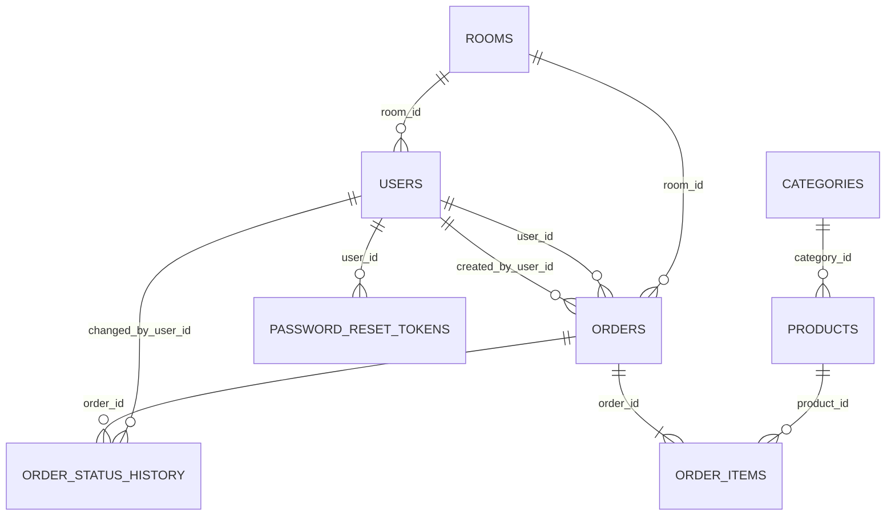
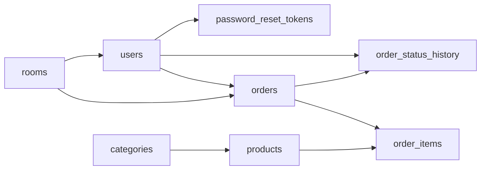
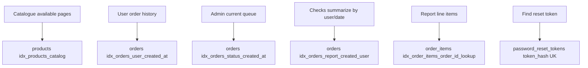
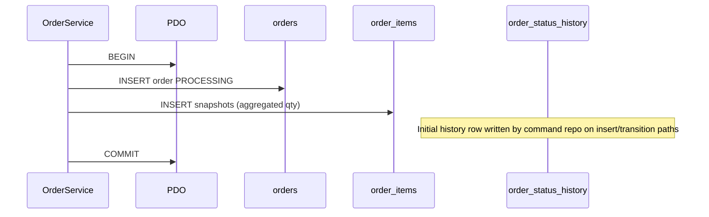
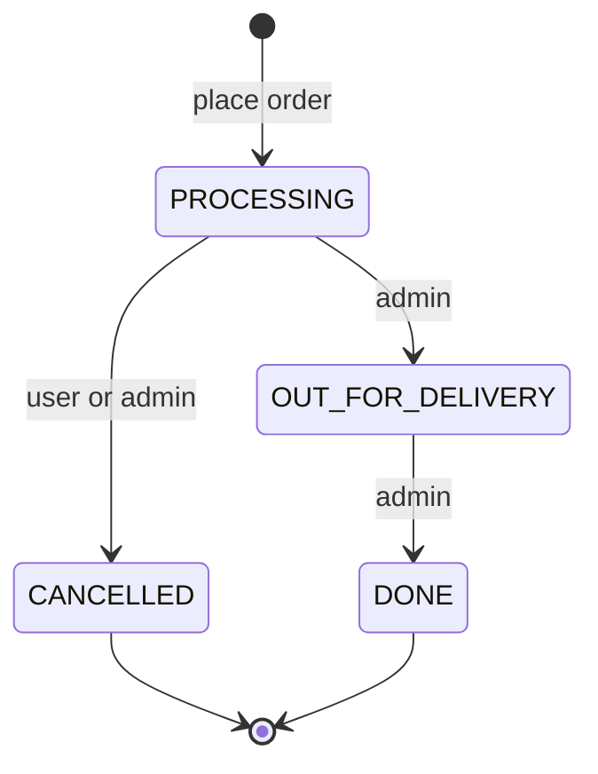

# Database & schema guide

**Version:** 1.0  
**Date:** 5 September 2026  
**Branch snapshot:** `main`  
**Sources of truth:** `database/migrations/*.sql`, [docs/diagrams/erd.mmd](diagrams/erd.mmd), [docs/diagrams/erd.svg](diagrams/erd.svg)  
**Companions:** [Architecture atlas](system-through-day-5-architecture-guide.md) · [Request lifecycle atlas](request-lifecycle-and-codebase-atlas.md) · [Seeding](database/seeding.md)

This guide explains **what each table stores**, **how tables relate**, **constraints that encode business rules**, **indexes used by hot queries**, and **how PHP code maps onto the schema**.

---

## Table of contents

1. [Engine & conventions](#1-engine--conventions)
2. [Entity-relationship overview](#2-entity-relationship-overview)
3. [Migration order](#3-migration-order)
4. [Table reference](#4-table-reference)
5. [Constraints that encode domain rules](#5-constraints-that-encode-domain-rules)
6. [Indexes & query paths](#6-indexes--query-paths)
7. [How application layers touch the schema](#7-how-application-layers-touch-the-schema)
8. [Soft delete & deactivation patterns](#8-soft-delete--deactivation-patterns)
9. [Money & snapshots](#9-money--snapshots)
10. [Order status & history](#10-order-status--history)
11. [Operational CLI](#11-operational-cli)
12. [Demo seed snapshot](#12-demo-seed-snapshot)

---

## 1. Engine & conventions

| Topic | Choice |
|-------|--------|
| RDBMS | MySQL 8.x (course target 8.4) |
| Engine | InnoDB (all tables) |
| Charset | `utf8mb4` / `utf8mb4_0900_ai_ci` (emails/tokens use ascii collations where noted) |
| Keys | `BIGINT UNSIGNED` surrogates |
| Time | `DATETIME` (app timezone `Africa/Cairo` in config; DB stores wall values as written) |
| Booleans | `TINYINT(1)` with `CHECK (… IN (0, 1))` |
| Migrations | Ordered SQL files + checksums via `Migrator` (`schema_migrations` table) |

There is **no** ORM. Repositories issue prepared statements through PDO.

---

## 2. Entity-relationship overview

**Figure 1 — Logical ER (compact)**



Canonical diagram with columns: [erd.svg](diagrams/erd.svg) / [erd.mmd](diagrams/erd.mmd).

**Figure 2 — Dependency order (create tables)**



---

## 3. Migration order

| File | Creates / alters |
|------|------------------|
| `001_create_rooms_table.sql` | `rooms` |
| `002_create_users_table.sql` | `users` |
| `003_create_password_reset_tokens_table.sql` | `password_reset_tokens` |
| `004_create_categories_table.sql` | `categories` |
| `005_create_products_table.sql` | `products` |
| `006_create_orders_table.sql` | `orders` |
| `007_create_order_items_table.sql` | `order_items` |
| `008_create_order_status_history_table.sql` | `order_status_history` |
| `008_report_query_indexes.sql` | Adds `idx_order_items_order_id_lookup` on `order_items(order_id)` |

Two files share prefix `008_`; both are applied by filename sort. The second only adds an index (Day 5 report tuning).

---

## 4. Table reference

### 4.1 `rooms`

Delivery / meeting locations used on users (default room) and every order.

| Column | Type | Notes |
|--------|------|-------|
| `id` | BIGINT PK | |
| `name` | VARCHAR(100) UK | Unique room name |
| `is_active` | TINYINT(1) | Soft deactivation for admin Rooms CRUD |
| `created_at` / `updated_at` | DATETIME | |

**Used by:** `PdoRoomRepository`, user forms (select), place-order room select, admin `/admin/rooms`.

### 4.2 `users`

| Column | Type | Notes |
|--------|------|-------|
| `id` | BIGINT PK | |
| `name` | VARCHAR(120) | |
| `email` | VARCHAR(254) ascii UK | Stored normalized lowercase/trim (CHECK) |
| `password_hash` | VARCHAR(255) | `password_hash()` output |
| `role` | ENUM(`USER`,`ADMIN`) | Maps to `Role` enum |
| `room_id` | BIGINT NULL FK → rooms | `ON DELETE SET NULL` |
| `extension` | VARCHAR(20) NULL | Desk/phone extension |
| `profile_image_path` | VARCHAR(255) NULL | Relative path under uploads |
| `is_active` | TINYINT(1) | Inactive users cannot authenticate |
| timestamps | DATETIME | |

**Indexes:** `room_id`; `(role, is_active)`.

### 4.3 `password_reset_tokens`

| Column | Type | Notes |
|--------|------|-------|
| `id` | BIGINT PK | |
| `user_id` | BIGINT FK → users | `ON DELETE CASCADE` |
| `token_hash` | CHAR(64) ascii_bin UK | SHA-256 of raw token (raw never stored) |
| `expires_at` | DATETIME | Must be `> created_at` |
| `used_at` | DATETIME NULL | Single-use |
| `created_at` | DATETIME | |

### 4.4 `categories`

| Column | Type | Notes |
|--------|------|-------|
| `id` | BIGINT PK | |
| `name` | VARCHAR(120) UK | Trimmed, non-empty |
| `is_active` | TINYINT(1) | |
| timestamps | DATETIME | |

**Index:** `(is_active, name)` for admin lists / catalogue filters.

### 4.5 `products`

| Column | Type | Notes |
|--------|------|-------|
| `id` | BIGINT PK | |
| `category_id` | BIGINT FK → categories | `ON DELETE RESTRICT` |
| `name` | VARCHAR(150) | Trimmed |
| `price` | DECIMAL(10,2) | Must be `> 0` |
| `image_path` | VARCHAR(255) NULL | |
| `is_available` | TINYINT(1) | Catalogue visibility |
| `deleted_at` | DATETIME NULL | Soft delete; if set, must have `is_available = 0` |
| timestamps | DATETIME | |

**Indexes:** `category_id`; composite catalogue `(is_available, deleted_at, category_id, name)`.

### 4.6 `orders`

| Column | Type | Notes |
|--------|------|-------|
| `id` | BIGINT PK | |
| `user_id` | BIGINT FK → users | Customer who receives the order |
| `created_by_user_id` | BIGINT FK → users | Actor (self or admin on-behalf) |
| `room_id` | BIGINT FK → rooms | Delivery room snapshot FK (room row must exist) |
| `status` | ENUM | `PROCESSING`, `OUT_FOR_DELIVERY`, `DONE`, `CANCELLED` |
| `notes` | TEXT NULL | |
| `total_amount` | DECIMAL(10,2) | Sum of line totals; `> 0` |
| `cancelled_at` | DATETIME NULL | Required iff status is `CANCELLED` |
| timestamps | DATETIME | |

**Indexes:** `(user_id, created_at)`, `created_by_user_id`, `room_id`, `(status, created_at)`, `(created_at, user_id)` for checks.

### 4.7 `order_items`

Line items with **immutable price/name snapshots** ([ADR 0004](adr/0004-order-pricing-snapshots.md)).

| Column | Type | Notes |
|--------|------|-------|
| `id` | BIGINT PK | |
| `order_id` | BIGINT FK → orders | `ON DELETE CASCADE` |
| `product_id` | BIGINT FK → products | Reference only; pricing not re-read |
| `product_name_snapshot` | VARCHAR(150) | Frozen name |
| `unit_price_snapshot` | DECIMAL(10,2) | Frozen unit price |
| `quantity` | INT UNSIGNED | `> 0` |
| `line_total` | DECIMAL(10,2) | CHECK equals `unit_price_snapshot * quantity` |

**Unique:** `(order_id, product_id)` — one row per product per order (quantities aggregated in `OrderService`).

### 4.8 `order_status_history`

Append-only audit of transitions ([ADR 0005](adr/0005-order-state-machine.md)).

| Column | Type | Notes |
|--------|------|-------|
| `id` | BIGINT PK | |
| `order_id` | BIGINT FK → orders | CASCADE delete |
| `from_status` | ENUM NULL | NULL only for initial Processing |
| `to_status` | ENUM | |
| `changed_by_user_id` | BIGINT FK → users | |
| `changed_at` | DATETIME | |

DB CHECK mirrors allowed edges: Processing→OutForDelivery|Cancelled; OutForDelivery→Done; initial NULL→Processing.

---

## 5. Constraints that encode domain rules

| Rule | Where enforced |
|------|----------------|
| Email normalized | `chk_users_email_normalized` |
| Positive product/order money | CHECKs on `price`, `total_amount`, snapshots |
| Cancelled iff `cancelled_at` set | `chk_orders_cancellation_state` |
| Soft-deleted product unavailable | `chk_products_deleted_unavailable` |
| Line total = unit × qty | `chk_order_items_line_total_matches` |
| Legal status edges | `chk_order_status_history_transition` **and** `OrderTransitionMatrix` in PHP |
| Unique room/category names | UNIQUE keys |
| One line per product per order | `uq_order_items_order_product` |

PHP still validates first (friendly errors); DB CHECKs are a safety net.

---

## 6. Indexes & query paths

**Figure 3 — Hot query → index**



| Feature | Primary repository | Typical filter |
|---------|-------------------|----------------|
| Catalogue | `PdoProductRepository` | `is_available=1`, `deleted_at IS NULL` |
| Place order | `PdoProductRepository::findAvailableByIds` + command repo | Product ids from POST |
| History | `PdoOrderQueryRepository` | `user_id` + date range |
| Queue | `listCurrentQueue` | status in Processing / OutForDelivery |
| Checks | `PdoReportRepository` | `created_at` range, optional `user_id`, cancel flag |
| Login | `PdoAuthUserRepository` | email + `is_active` |

---

## 7. How application layers touch the schema

**Figure 4 — Write path for a new order**



| Concern | Tables | Classes |
|---------|--------|---------|
| Auth | `users` | `PdoAuthUserRepository`, `AuthService` |
| Reset | `password_reset_tokens`, `users` | `PdoPasswordResetTokenRepository`, `PasswordResetService` |
| Rooms CRUD | `rooms` | `PdoRoomRepository`, `RoomService` |
| Users CRUD | `users`, `rooms` | `PdoAdminUserRepository`, `UserService` |
| Categories | `categories` | `PdoCategoryRepository`, `CategoryService` |
| Products | `products`, `categories` | `PdoProductRepository`, `ProductService` |
| Orders write | `orders`, `order_items`, history | `PdoOrderCommandRepository`, `OrderService`, `OrderStatusService` |
| Orders read | `orders`, `order_items`, joins | `PdoOrderQueryRepository`, `UserOrderQueryService` |
| Checks | `orders`, `order_items`, `users` | `PdoReportRepository`, `ReportQueryService`, `ReportExportService` |

Filesystem paths in `profile_image_path` / `image_path` are **not** DB BLOBs; bytes live under `storage/uploads/` and are served via `/media/{kind}/{filename}`.

---

## 8. Soft delete & deactivation patterns

| Entity | Pattern | Effect |
|--------|---------|--------|
| Room | `is_active = 0` | Hidden from assignment lists; existing FKs remain |
| User | `is_active = 0` | Cannot log in; orders retained |
| Category | `is_active = 0` | Hidden from product forms / filters |
| Product | `deleted_at` set + `is_available = 0` | Gone from catalogue; historical `order_items.product_id` kept |

Hard deletes of products/orders are avoided so snapshots and history stay consistent.

---

## 9. Money & snapshots

- UI and DB use `DECIMAL(10,2)`.
- Domain `Money` works in **integer cents** in PHP to avoid float drift, then persists decimal strings.
- After place-order, changing a product price **does not** change past `unit_price_snapshot` / `line_total` / `orders.total_amount`.

---

## 10. Order status & history

**Figure 5 — Allowed transitions**



| Actor | Action | Service |
|-------|--------|---------|
| Customer | Cancel while Processing | `OrderStatusService::cancel` |
| Admin | Advance / cancel via queue | `OrderStatusService::transition` |
| Anyone placing | Initial Processing | `OrderService` + command repo |

Both PHP matrix and MySQL CHECK reject illegal edges.

---

## 11. Operational CLI

| Script | Purpose |
|--------|---------|
| `php database/migrate.php` | Apply pending migrations |
| `php database/seed.php` | Run seeders (idempotent-ish upserts where coded) |
| `php database/verify.php` | Smoke-check schema/data |
| `php database/rebuild.php` | Local reset helper |

Migrator records applied files + checksums so edited SQL files are detected.

---

## 12. Demo seed snapshot

From [database/seeding.md](database/seeding.md) / seeders:

| Seeder | Typical content |
|--------|-----------------|
| `RoomsSeeder` | 3 rooms |
| `CategoriesSeeder` | 3 categories |
| `ProductsSeeder` | 4 products with SVG assets |
| `UsersSeeder` | `admin@example.test`, `user@example.test` (shared demo password in README) |

---

## Appendix — Column cheat sheet

```
rooms(id, name, is_active, created_at, updated_at)
users(id, name, email, password_hash, role, room_id, extension, profile_image_path, is_active, …)
password_reset_tokens(id, user_id, token_hash, expires_at, used_at, created_at)
categories(id, name, is_active, …)
products(id, category_id, name, price, image_path, is_available, deleted_at, …)
orders(id, user_id, created_by_user_id, room_id, status, notes, total_amount, cancelled_at, …)
order_items(id, order_id, product_id, product_name_snapshot, unit_price_snapshot, quantity, line_total)
order_status_history(id, order_id, from_status, to_status, changed_by_user_id, changed_at)
```

---

*End of database & schema guide*
