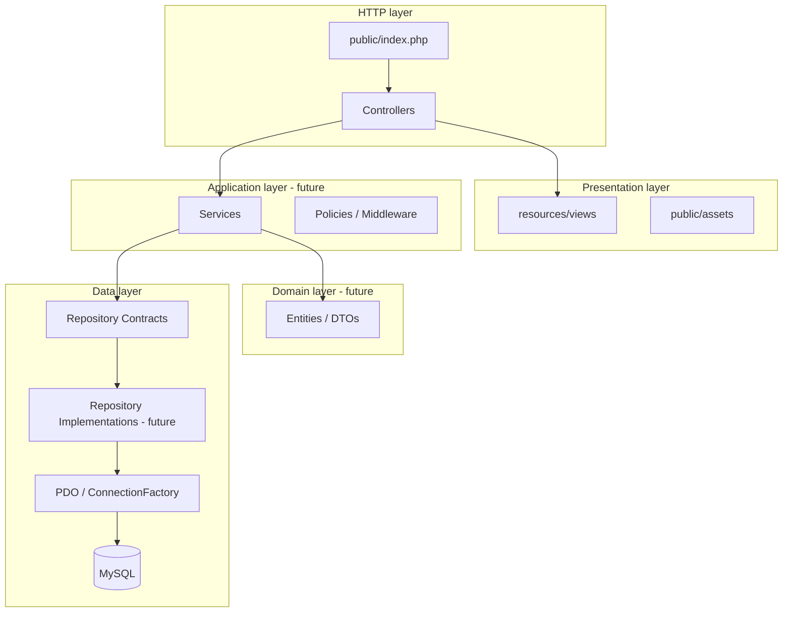
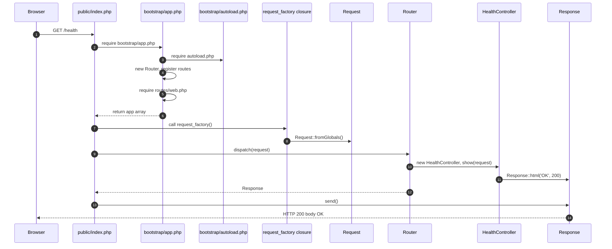
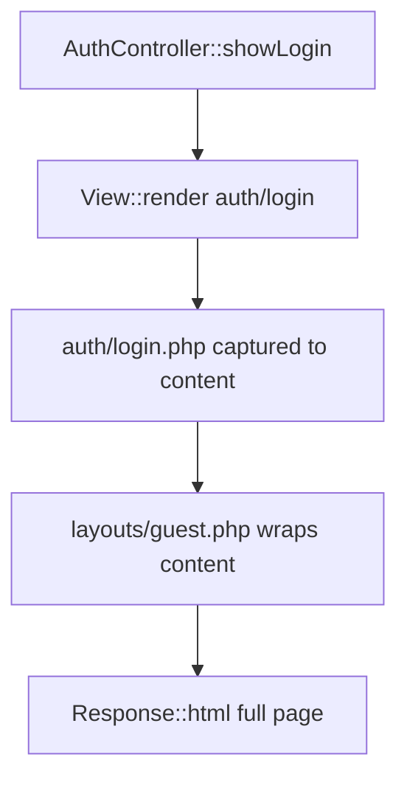
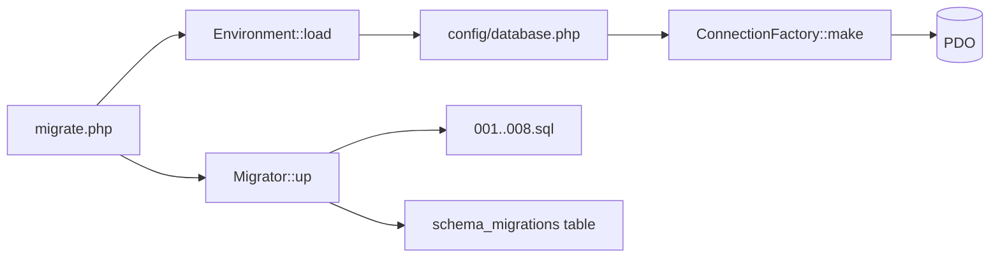
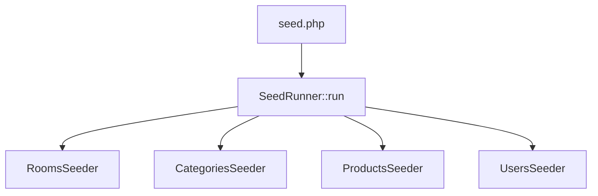

# Cafeteria Management System — Day 1 Foundation Guide

**Version:** 1.0  
**Date:** 31 August 2026  
**Audience:** Beginners on the team (BEG1/BEG2/BEG3) and reviewers  
**Scope:** Everything delivered in Day 1 (P0 phase) on `main`  
**Related issues:** [Master #1](https://github.com/M9nx/Cafeteria/issues/1) · [Phase P0 #2](https://github.com/M9nx/Cafeteria/issues/2) (closed)

> This document is the **full** explanation of what Day 1 built, how each part works, and how data moves through files, classes, and methods. It is not a summary.

---

## Table of contents

1. [Glossary — terms you must know](#1-glossary--terms-you-must-know)
2. [What Day 1 set out to do](#2-what-day-1-set-out-to-do)
3. [Day 1 delivery review (all five packages)](#3-day-1-delivery-review-all-five-packages)
4. [Repository map after Day 1](#4-repository-map-after-day-1)
5. [Architecture layers explained](#5-architecture-layers-explained)
6. [HTTP request flow — A to Z](#6-http-request-flow--a-to-z)
7. [Class-by-class reference (HTTP stack)](#7-class-by-class-reference-http-stack)
8. [View layer flow — layouts, components, auth skeletons](#8-view-layer-flow--layouts-components-auth-skeletons)
9. [Database layer flow — migrations, seeds, rebuild](#9-database-layer-flow--migrations-seeds-rebuild)
10. [Configuration and environment](#10-configuration-and-environment)
11. [Composer, PSR-4, and autoloading](#11-composer-psr-4-and-autoloading)
12. [Repository contracts (interfaces)](#12-repository-contracts-interfaces)
13. [Testing and CI](#13-testing-and-ci)
14. [Governance and documentation delivered](#14-governance-and-documentation-delivered)
15. [What is NOT built yet (Day 2+)](#15-what-is-not-built-yet-day-2)
16. [How to run the project locally](#16-how-to-run-the-project-locally)
17. [Diagram index](#17-diagram-index)

---

## 1. Glossary — terms you must know

| Term | Plain-English meaning | In this project |
|------|----------------------|-----------------|
| **Front controller** | The single PHP file the web server always runs first | `public/index.php` |
| **Bootstrap** | Startup code that loads autoloading and creates the router | `bootstrap/app.php` |
| **Router** | Matches URL + HTTP method to a controller action | `app/Core/Routing/Router.php` |
| **Controller** | Thin HTTP adapter: receives request, returns response | `app/Controllers/*` |
| **Service** | Business logic / use cases (place order, cancel, etc.) | `app/Services/*` — **future** |
| **Repository** | Data access (SQL via PDO) | `app/Repositories/*` — **future impl** |
| **Repository contract** | Interface describing allowed DB operations | `app/Repositories/Contracts/*` — **exists now** |
| **View** | HTML template (presentation only) | `resources/views/*` |
| **Migration** | Versioned SQL file that changes database schema | `database/migrations/*.sql` |
| **Seeder** | Script that inserts deterministic demo data | `database/seeds/*` |
| **PDO** | PHP extension for talking to MySQL safely | Used via `ConnectionFactory` |
| **PSR-4** | Standard mapping: namespace → folder path | `Cafeteria\` → `app/` |
| **Composer** | PHP dependency manager + autoload generator | `composer.json`, `vendor/` |
| **MVC** | Model–View–Controller separation | Documented in `docs/architecture.md` |
| **Modular monolith** | One deployable app, split into modules | ADR 0001 |
| **CLI** | Command-line scripts (not browser) | `database/migrate.php`, etc. |
| **CI** | Automated checks on GitHub when you push | `.github/workflows/ci.yml` |

---

## 2. What Day 1 set out to do

Day 1 is phase **P0 — Foundation and Governance**. The exit gate (from issue #2) was:

> A protected repository with a runnable pure-PHP entry point, Composer autoloading, MySQL migrations, deterministic seeds, a Bootstrap UI shell, and an executable test plan.

Five team packages (5 hours each = 25 hours):

| WBS ID | Owner | Leaf issue | Merged PR |
|--------|-------|------------|-----------|
| P0-LEAD | Mounir Sabry | [#3](https://github.com/M9nx/Cafeteria/issues/3) | [#8](https://github.com/M9nx/Cafeteria/pull/8) |
| P0-INTR | Salma Fathy | [#4](https://github.com/M9nx/Cafeteria/issues/4) | [#10](https://github.com/M9nx/Cafeteria/pull/10) |
| P0-BEG3 | Hana Elsayed | [#7](https://github.com/M9nx/Cafeteria/issues/7) | [#9](https://github.com/M9nx/Cafeteria/pull/9) |
| P0-BEG2 | Basha Wahed | [#6](https://github.com/M9nx/Cafeteria/issues/6) | [#11](https://github.com/M9nx/Cafeteria/pull/11) |
| P0-BEG1 | Taghreed Mohamed | [#5](https://github.com/M9nx/Cafeteria/issues/5) | [#12](https://github.com/M9nx/Cafeteria/pull/12) |

Phase issue [#2](https://github.com/M9nx/Cafeteria/issues/2) is **closed**. Master issue [#1](https://github.com/M9nx/Cafeteria/issues/1) marks Day 1 as **COMPLETE**.

---

## 3. Day 1 delivery review (all five packages)

### 3.1 P0-LEAD — MVC foundation and governance

**Purpose:** Create the project skeleton so everyone builds on the same rules.

**Delivered:**

- **Governance:** `CONTRIBUTING.md`, `SECURITY.md`, `.gitignore`, GitHub issue/PR templates
- **Architecture docs:** `docs/scope.md`, `docs/architecture.md`, ADRs 0001 and 0002
- **HTTP entry:** `public/index.php` — only web-exposed PHP entry (security)
- **Bootstrap:** `bootstrap/app.php`, `bootstrap/autoload.php`
- **Core HTTP:** `Request`, `Response`
- **Routing:** `Route`, `Router`
- **Views engine:** `View` class (renderer, not templates yet)
- **Proof route:** `HealthController` + `GET /health` → returns `OK`
- **Route loader:** `routes/web.php` loads module route files when they exist
- **Storage dirs:** `storage/logs/`, `storage/uploads/` (gitignored contents)

**Why it matters:** Without this, every teammate would invent a different folder layout and request flow.

---

### 3.2 P0-INTR — Environment, database, CI

**Purpose:** Make the app connect to MySQL, run migrations, and pass CI.

**Delivered:**

- **Composer:** `composer.json`, `composer.lock`, PSR-4 autoload for `Cafeteria\`
- **Environment:** `.env.example`, `Environment.php`, `config/app.php`, `config/database.php`
- **PDO:** `ConnectionFactory.php` — one configured MySQL connection
- **Migrations:** `Migrator.php`, `database/migrate.php`, 8 SQL migration files
- **ERD:** `docs/diagrams/erd.mmd`, `erd.svg`
- **Repository contracts:** 7 interfaces under `app/Repositories/Contracts/`
- **Testing baseline:** `phpunit.xml`, `tests/` directories, `ConnectionTest.php`
- **CI:** `.github/workflows/ci.yml` — lint, migrate, test on PHP 8.4 + MySQL 8.4

**Database tables created (migrations 001–008):**

1. `rooms` — reference data for order room selector  
2. `users` — login, roles (`USER`/`ADMIN`), room FK  
3. `password_reset_tokens` — secure reset flow (Day 2+)  
4. `categories` — product grouping  
5. `products` — catalog with price, soft delete  
6. `orders` — customer, creator, room, status, total  
7. `order_items` — line items with price snapshots  
8. `order_status_history` — audit trail of status changes  

---

### 3.3 P0-BEG3 — Test and traceability foundation

**Purpose:** Define *how* the team will prove requirements later.

**Delivered (documentation under `docs/test-plan/`):**

- `requirements-traceability.md` — map brief requirements → tests  
- `acceptance-test-matrix.md` — Given/When/Then style criteria  
- `fixtures-and-demo-data.md` — what demo data tests need  
- `git-pr-workflow.md` — branch/PR evidence rules  

**Why it matters:** Day 2+ feature PRs must attach test evidence; this defines the format.

---

### 3.4 P0-BEG2 — Seeds and database rebuild

**Purpose:** Deterministic demo data for development and manual testing.

**Delivered:**

- `database/seed.php` — CLI entry  
- `database/seeds/SeedRunner.php` — transactional runner  
- `database/seeds/RoomsSeeder.php` — Room 101, Room 102, Reception  
- `database/seeds/CategoriesSeeder.php` — Hot Drinks, Cold Drinks, Snacks  
- `database/seeds/ProductsSeeder.php` — Tea, Coffee, Cola, Chips  
- `database/seeds/UsersSeeder.php` — `admin@example.test`, `user@example.test`  
- `database/verify.php` — counts, FK checks, password hash check  
- `database/rebuild.php` — dev/test only: drop all tables → migrate → seed → verify  
- `docs/database/seeding.md` — commands, credentials warning, idempotency  
- `public/assets/images/products/placeholder.svg` — product image placeholder  

**Demo credentials (development only):** see `docs/database/seeding.md`

---

### 3.5 P0-BEG1 — Bootstrap UI shell

**Purpose:** Shared HTML/CSS/JS presentation layer for auth and app pages.

**Delivered:**

- `resources/views/layouts/app.php` — authenticated shell (navbar, flash, content)  
- `resources/views/layouts/guest.php` — login/reset card shell  
- `resources/views/components/navbar.php` — role-aware nav (presentation only)  
- `resources/views/components/alerts.php` — escaped flash messages  
- `resources/views/components/form-errors.php` — validation summary  
- `resources/views/components/field-error.php` — single field error  
- `resources/views/auth/login.php` — login form skeleton  
- `resources/views/auth/forgot-password.php` — reset request skeleton  
- `resources/views/auth/reset-password.php` — reset form skeleton  
- `public/assets/css/app.css` — shared styles, visible focus rings  
- `public/assets/js/app.js` — dismiss alerts, focus helpers (no auth logic)  
- `docs/ui/view-contract.md` — variables, escaping rules  

**Important:** Views exist but `/login` is **not routed yet** — wiring comes in Day 2 (P1).

---

## 4. Repository map after Day 1

```text
Cafeteria/
├── public/                    ← ONLY folder exposed to the web server
│   ├── index.php              ← Front controller (HTTP entry)
│   └── assets/                ← CSS, JS, images (static files)
├── bootstrap/
│   ├── app.php                ← Creates router, loads routes
│   └── autoload.php           ← Manual PSR-4 autoload for web
├── app/
│   ├── Controllers/           ← HTTP handlers
│   ├── Core/                  ← Framework-like building blocks
│   │   ├── Config/            ← Environment loader
│   │   ├── Database/          ← PDO factory, migrator
│   │   ├── Http/              ← Request, Response
│   │   ├── Routing/           ← Route, Router
│   │   └── View/              ← View renderer
│   └── Repositories/
│       └── Contracts/         ← Interfaces only (no SQL yet)
├── resources/views/           ← PHP HTML templates
├── routes/
│   └── web.php                ← Loads module route files
├── config/                    ← app.php, database.php (reads .env)
├── database/
│   ├── migrate.php            ← CLI: run migrations
│   ├── seed.php               ← CLI: run seeders
│   ├── rebuild.php            ← CLI: dev reset pipeline
│   ├── verify.php             ← CLI: validate seeded data
│   ├── migrations/            ← 001–008 SQL files
│   └── seeds/                 ← Seeder classes
├── docs/                      ← Architecture, ADRs, test plan, UI contract
├── tests/                     ← PHPUnit
├── storage/                   ← Logs and private uploads (not in git)
├── vendor/                    ← Composer packages (not in git)
├── composer.json
├── composer.lock
└── .env                       ← Local secrets (not in git)
```

**Security rule (ADR 0002):** The web server document root must be `public/` only. Source code, `.env`, and `vendor/` must not be directly reachable by URL.

---

## 5. Architecture layers explained

The application follows **inward dependencies**: outer layers depend on inner abstractions, not the reverse.



### Responsibility rules (from `docs/architecture.md`)

| Layer | May do | Must NOT do |
|-------|--------|-------------|
| **Controller** | Authorize (via policy later), read input, call one service, pick view/redirect | SQL, price math, password hashing, big HTML blocks |
| **Service** | Business rules, transactions, orchestrate repositories | Raw HTML, direct `$_POST` access |
| **Repository** | Prepared statements, map rows to arrays/DTOs | HTML, session logic |
| **View** | Escape output, render prepared data | SQL, authorization decisions, repository calls |

---

## 6. HTTP request flow — A to Z

This section traces **every step** when you open `http://127.0.0.1:8000/health`.

### 6.1 High-level sequence



### 6.2 Step 1 — Web server sends request to `public/index.php`

When you run:

```bash
php -S 127.0.0.1:8000 -t public
```

PHP’s built-in server uses `public/` as document root. Any URL hits files under `public/` first. `index.php` is the front controller.

### 6.3 Step 2 — `public/index.php`

```php
$app = require dirname(__DIR__) . '/bootstrap/app.php';
$request = $app['request_factory']();
$router = $app['router'];
$router->dispatch($request)->send();
```

Line by line:

1. **`require bootstrap/app.php`** — runs bootstrap once; returns an array (mini application container).
2. **`$app['request_factory']()`** — calls a closure that builds a `Request` from PHP superglobals.
3. **`$app['router']`** — the shared `Router` instance with all routes registered.
4. **`dispatch($request)`** — finds matching route, runs controller, returns `Response`.
5. **`send()`** — outputs status, headers, and body to the browser.

### 6.4 Step 3 — `bootstrap/app.php`

```php
require __DIR__ . '/autoload.php';
$router = new Router();
$router->get('/health', [HealthController::class, 'show']);
// loads routes/web.php if present
return [
    'router' => $router,
    'request_factory' => static fn (): Request => Request::fromGlobals(),
];
```

This file is the **composition root** for the web app (where core objects are created).

### 6.5 Step 4 — `bootstrap/autoload.php`

Registers `spl_autoload_register` callback:

- Prefix: `Cafeteria\`
- Base directory: `app/`
- Example: class `Cafeteria\Core\Routing\Router` → file `app/Core/Routing/Router.php`

This mirrors Composer’s PSR-4 mapping but works without `vendor/` for the simple web path.

### 6.6 Step 5 — `routes/web.php`

```php
foreach (['auth.php', 'orders.php', 'admin.php', 'reports.php'] as $file) {
    if (is_file($path)) {
        require $path;
    }
}
```

Module route files do not exist yet. Only `/health` from bootstrap is registered. This pattern lets Day 2+ PRs add `routes/auth.php` without editing a monolithic routes file.

### 6.7 Step 6 — `Request::fromGlobals()`

Builds immutable `Request` object from:

- `$_SERVER['REQUEST_METHOD']` → GET, POST, …  
- `$_SERVER['REQUEST_URI']` → path only (no query string in path)  
- `$_GET`, `$_POST`, `$_FILES`  
- HTTP headers derived from `HTTP_*` keys in `$_SERVER`  

Methods like `$request->method()`, `$request->path()`, `$request->input('email')` give controllers safe access later.

### 6.8 Step 7 — `Router::dispatch()`

Algorithm:

1. Loop all registered `Route` objects.  
2. Compare request path to route pattern (exact or regex for `{id}` params).  
3. If no path match → **404** `Response::html('Not Found', 404)`.  
4. If path matches but wrong HTTP method → **405** Method Not Allowed.  
5. Run middleware callables (none on `/health` yet).  
6. Instantiate controller: `new HealthController()`.  
7. Call action method: `$controller->show($request)`.  
8. Return whatever `Response` the controller returns.

### 6.9 Step 8 — `HealthController::show()`

```php
public function show(Request $request): Response
{
    return Response::html('OK', 200);
}
```

Minimal proof that routing + controller + response pipeline works. No database, no view.

### 6.10 Step 9 — `Response::send()`

Sets `http_response_code`, sends headers, echoes body. Browser displays `OK`.

---

## 7. Class-by-class reference (HTTP stack)

### 7.1 `Cafeteria\Core\Routing\Route`

**File:** `app/Core/Routing/Route.php`

**Role:** Value object holding one route definition.

| Property / method | Meaning |
|-------------------|---------|
| `$method` | HTTP verb: GET, POST, … |
| `$pattern` | Path like `/health` or `/orders/{id}` |
| `$handler` | `[ControllerClass::class, 'methodName']` |
| `$middleware` | List of callables run before controller |
| `regex()` | Converts `{id}` patterns to regex for matching |

### 7.2 `Cafeteria\Core\Routing\Router`

**File:** `app/Core/Routing/Router.php`

| Method | Purpose |
|--------|---------|
| `get($path, $handler, $middleware = [])` | Register GET route |
| `post($path, $handler, $middleware = [])` | Register POST route |
| `add($method, $path, $handler, $middleware)` | Generic registration |
| `dispatch(Request $request): Response` | Match and execute |

### 7.3 `Cafeteria\Core\Http\Request`

**File:** `app/Core/Http/Request.php`

Wraps incoming HTTP data so controllers never touch superglobals directly.

### 7.4 `Cafeteria\Core\Http\Response`

**File:** `app/Core/Http/Response.php`

| Static factory | Use case |
|----------------|----------|
| `Response::html($content, $status)` | HTML page |
| `Response::redirect($url, $status)` | 302 redirect after POST |

Instance method `send()` writes to output.

### 7.5 `Cafeteria\Core\View\View`

**File:** `app/Core/View/View.php`

| Method | Purpose |
|--------|---------|
| `renderTemplate($template, $data, $layout)` | Render view + optional layout |
| `capture($file, $data)` | `extract` data, `require` template, return buffered HTML |
| `View::render(...)` | Static convenience wrapper |

**Template path rule:** `'auth/login'` → `resources/views/auth/login.php`

**Not used by `/health` yet** — will be used when auth controllers return HTML.

### 7.6 `Cafeteria\Controllers\HealthController`

**File:** `app/Controllers/HealthController.php`

Only controller on Day 1. Pattern for all future controllers:

```php
public function someAction(Request $request): Response
{
    // 1. (later) authorize
    // 2. (later) validate input
    // 3. (later) call service
    // 4. return Response (HTML or redirect)
}
```

---

## 8. View layer flow — layouts, components, auth skeletons

### 8.1 How rendering will work (Day 2+)



Example call (from `docs/ui/view-contract.md`):

```php
return View::render('auth/login', [
    'title' => 'Log in',
    'email' => $oldEmail,
    'errors' => ['email' => 'Invalid credentials.'],
], 'layouts/guest');
```

### 8.2 Layout: `layouts/app.php` (authenticated)

**Variables:**

| Variable | Required | Purpose |
|----------|----------|---------|
| `$title` | yes | Page `<title>` |
| `$content` | yes | Inner HTML (injected by `View`) |
| `$currentUser` | no | Object with `isAdmin(): bool` for navbar |
| `$flash` | no | `['type' => 'success', 'message' => '...']` |

Includes Bootstrap 5 CDN, `app.css`, navbar component, alerts, footer.

### 8.3 Layout: `layouts/guest.php` (login/reset)

Same `$title`, `$content`, `$flash` — **no navbar**. Centered card for auth forms.

### 8.4 Components

| File | Role |
|------|------|
| `components/navbar.php` | Shows user vs admin links based on `$currentUser->isAdmin()` — **presentation only**; server must already enforce auth |
| `components/alerts.php` | Renders escaped Bootstrap alert from `$flash` |
| `components/form-errors.php` | Summary list with `role="alert"` |
| `components/field-error.php` | One field message; ID `{fieldId}-error` for `aria-describedby` |

### 8.5 Escaping rule

All dynamic text in views uses:

```php
htmlspecialchars($value, ENT_QUOTES, 'UTF-8')
```

Views **never** call repositories or run SQL.

### 8.6 Auth skeletons

| View | Form action | Special rules |
|------|-------------|---------------|
| `auth/login.php` | `POST /login` | Repopulate email only; **never** password |
| `auth/forgot-password.php` | `POST /forgot-password` | Generic `$resultMessage` area |
| `auth/reset-password.php` | `POST /reset-password` | Hidden `token`, password + confirmation |

CSRF hidden field slots exist as placeholders until P1 implements tokens.

---

## 9. Database layer flow — migrations, seeds, rebuild

Database work runs from **CLI scripts**, not from browser requests.

### 9.1 Migration pipeline



**`Migrator::up()` logic:**

1. Ensure `schema_migrations` table exists.  
2. List `database/migrations/*.sql` sorted by filename.  
3. For each file: compute SHA-256 checksum.  
4. If already applied with same checksum → skip.  
5. If applied but checksum changed → **throw** (prevent silent edits).  
6. Else `PDO::exec($sql)`, insert ledger row.  

### 9.2 Seed pipeline



Order respects foreign keys: rooms → categories → products → users.

**Idempotency:** safe to run `php database/seed.php` twice (upserts / skip logic).

### 9.3 Rebuild pipeline (development only)

**File:** `database/rebuild.php`

Safety guards:

- Refuses `APP_ENV=production`  
- Refuses unless `DB_NAME` ends with `_dev` or `_test`  

Then:

1. `SET FOREIGN_KEY_CHECKS = 0`  
2. `DROP TABLE` every base table  
3. `SET FOREIGN_KEY_CHECKS = 1`  
4. Run `migrate.php` → `seed.php` → `verify.php` via `passthru`  

### 9.4 Verify script

**File:** `database/verify.php`

Checks minimum row counts, product→category FK integrity, positive prices, and `password_verify` for admin demo user.

### 9.5 Key database classes

| Class | File | Role |
|-------|------|------|
| `Environment` | `app/Core/Config/Environment.php` | Load `.env`, `get()`, `required()`, `bool()` |
| `ConnectionFactory` | `app/Core/Database/ConnectionFactory.php` | Build PDO with utf8mb4, exceptions, native prepares |
| `Migrator` | `app/Core/Database/Migrator.php` | Apply SQL migrations with checksum ledger |
| `SeedRunner` | `database/seeds/SeedRunner.php` | Transactional seeder orchestration |

---

## 10. Configuration and environment

### 10.1 `.env` (local only, not committed)

Copy from `.env.example`. Typical keys:

```env
APP_ENV=local
DB_NAME=cafeteria_dev
DB_USER=...
DB_PASSWORD=...
```

### 10.2 `config/app.php`

Returns array: app name, environment, debug flag, URL, timezone (`Africa/Cairo`), currency (`EGP`).

Calls `Environment::load()` before reading values.

### 10.3 `config/database.php`

Returns PDO settings array: host, port, database name, user, password, charset.

**Never** hardcode real passwords in this file — only read from environment.

### 10.4 Priority rule

`Environment.php` gives priority to real OS/CI variables over `.env` file values. This lets GitHub Actions inject test DB settings without committing secrets.

---

## 11. Composer, PSR-4, and autoloading

### 11.1 What Composer does here

| Artifact | Purpose |
|----------|---------|
| `composer.json` | Declares PHP 8.4, PHPUnit, PSR-4 map, scripts |
| `composer.lock` | Exact locked versions — **commit this** |
| `vendor/` | Downloaded packages — **do not commit** |

Scripts:

```bash
composer install   # create vendor/ from lock file
composer test        # phpunit
composer migrate     # php database/migrate.php
composer lint        # php -l on all PHP files
```

### 11.2 PSR-4 mapping

```json
"Cafeteria\\": "app/"
```

| Class | File |
|-------|------|
| `Cafeteria\Core\Http\Request` | `app/Core/Http/Request.php` |
| `Cafeteria\Controllers\HealthController` | `app/Controllers/HealthController.php` |

**Note:** `database/seeds/*` lives outside PSR-4; `seed.php` manually `require`s those files.

### 11.3 Two autoload paths

| Entry point | Autoload used |
|-------------|---------------|
| Web (`public/index.php`) | `bootstrap/autoload.php` |
| CLI (`migrate.php`, tests) | `vendor/autoload.php` |

Both resolve `Cafeteria\` classes from `app/`.

---

## 12. Repository contracts (interfaces)

**Location:** `app/Repositories/Contracts/`

These are **PHP interfaces** — contracts for future PDO repository classes.

| Interface | Purpose |
|-----------|---------|
| `AuthUserRepositoryInterface` | `findActiveByEmail()` for login |
| `AdminUserRepositoryInterface` | Admin user CRUD, pagination |
| `CategoryRepositoryInterface` | Category list/CRUD |
| `ProductRepositoryInterface` | Product CRUD, `findAvailableByIds()` |
| `OrderCommandRepositoryInterface` | Insert order, items, cancel, transition status |
| `OrderQueryRepositoryInterface` | Read orders for user/admin |
| `ReportRepositoryInterface` | Date/user report aggregates |

**They are NOT models.** They do not hold data. They describe methods that a repository class must implement.

**Day 2+ pattern:**

```php
class AuthService
{
    public function __construct(
        private AuthUserRepositoryInterface $users,
    ) {}

    public function login(string $email, string $password): bool
    {
        $user = $this->users->findActiveByEmail($email);
        // password_verify, session, etc.
    }
}
```

This is **dependency injection** + **programming to an interface**.

---

## 13. Testing and CI

### 13.1 PHPUnit layout

```text
tests/
├── Unit/           ← pure logic tests (empty .gitkeep)
├── Integration/    ← database tests
│   └── Database/ConnectionTest.php
└── Feature/        ← HTTP flow tests (future)
```

### 13.2 `ConnectionTest.php`

Proves CI can connect to MySQL test database (`DB_NAME` ending in `_test`). Skips locally if DB unreachable.

### 13.3 GitHub Actions CI

On every push/PR to `main` or feature branches:

1. `composer validate --strict`  
2. `composer install`  
3. `composer lint`  
4. `composer migrate` (against MySQL 8.4 service)  
5. `composer test`  

---

## 14. Governance and documentation delivered

| Document | Purpose |
|----------|---------|
| `CONTRIBUTING.md` | Branches, commits, PR rules, DoD |
| `SECURITY.md` | Secrets, CSRF, PDO, escaping baseline |
| `docs/scope.md` | In/out of scope for stable version |
| `docs/architecture.md` | Layer map, request flow |
| `docs/adr/0001-*.md` | Modular monolith MVC decision |
| `docs/adr/0002-*.md` | Public document root decision |
| `docs/test-plan/*` | Traceability and acceptance matrix |
| `docs/ui/view-contract.md` | View variables and escaping |
| `docs/database/seeding.md` | Seed/rebuild commands |

---

## 15. What is NOT built yet (Day 2+)

| Missing piece | Planned phase |
|---------------|---------------|
| `/login`, `/logout`, `/forgot-password` routes | P1 |
| `AuthController`, sessions, CSRF middleware | P1 |
| Repository **implementations** (PDO SQL) | P1–P3 |
| `app/Services/*` business logic | P1–P5 |
| Product/order/report screens | P2–P5 |
| Feature tests for HTTP flows | P1+ |

Day 1 = **foundation**. The house has plumbing and framing; furniture comes next.

---

## 16. How to run the project locally

### 16.1 Minimal (health check only)

```bash
cd Cafeteria
composer install
php -S 127.0.0.1:8000 -t public
```

Open: http://127.0.0.1:8000/health → should show `OK`

### 16.2 Full database setup

```sql
CREATE DATABASE cafeteria_dev
  CHARACTER SET utf8mb4
  COLLATE utf8mb4_0900_ai_ci;
```

```bash
cp .env.example .env
# edit DB credentials
composer migrate
php database/seed.php
php database/verify.php
```

### 16.3 Dev database reset

```bash
php database/rebuild.php   # only on _dev or _test DB names
```

### 16.4 Quality checks

```bash
composer lint
composer test
```

---

## 17. Diagram index

| Diagram | Section | Shows |
|---------|---------|-------|
| Layer dependency | §5 | MVC + repository direction |
| HTTP sequence | §6.1 | Full `/health` request chain |
| View render | §8.1 | Controller → View → layout |
| Migration | §9.1 | CLI migrate flow |
| Seed order | §9.2 | Seeder dependency chain |

---

## Appendix A — Day 1 merged pull requests

| PR | Title | Closes |
|----|-------|--------|
| [#8](https://github.com/M9nx/Cafeteria/pull/8) | P0-LEAD governance + MVC scaffold | #3 |
| [#9](https://github.com/M9nx/Cafeteria/pull/9) | P0-BEG3 test foundation docs | #7 |
| [#10](https://github.com/M9nx/Cafeteria/pull/10) | P0-INTR environment + database + CI | #4 |
| [#11](https://github.com/M9nx/Cafeteria/pull/11) | P0-BEG2 seeds + rebuild | #6 |
| [#12](https://github.com/M9nx/Cafeteria/pull/12) | P0-BEG1 Bootstrap UI shell | #5 |

---

## Appendix B — Export this document to PDF

**Recommended:** Open this file in VS Code / Cursor → Markdown Preview → Print → Save as PDF.

**Command line (if `pandoc` is installed):**

```bash
pandoc docs/day-1-foundation-guide.md -o docs/day-1-foundation-guide.pdf --toc -V geometry:margin=1in
```

**GitHub:** View the file on the repo — print from browser.

---

*End of Day 1 Foundation Guide*
