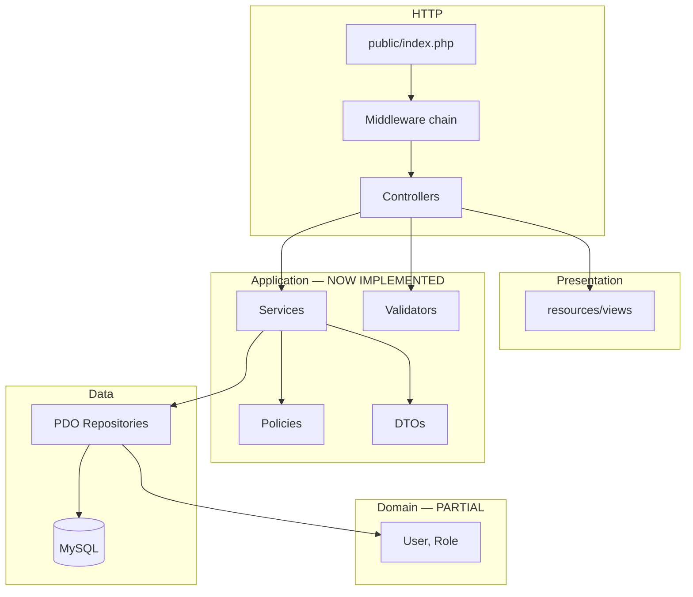
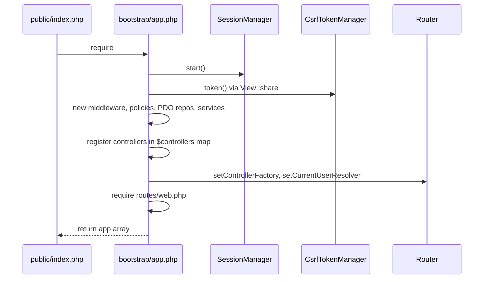
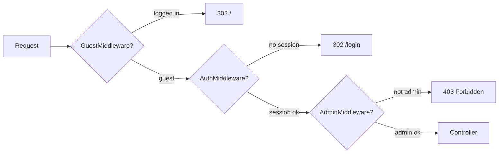
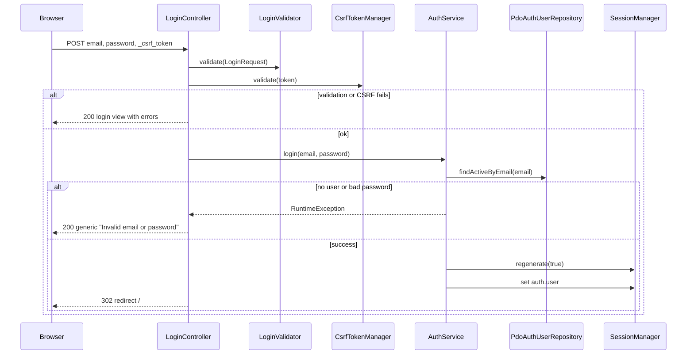
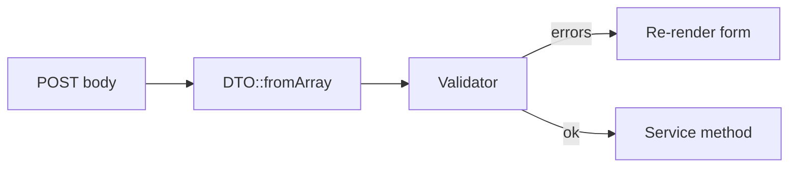

# Cafeteria Management System — Day 2 Authentication & Admin Guide

**Version:** 1.0  
**Date:** 2 September 2026  
**Audience:** Beginners on the team (BEG1/BEG2/BEG3) and reviewers  
**Scope:** Everything delivered in Day 2 (P1 phase) on `main`  
**Related issues:** [Master #1](https://github.com/M9nx/Cafeteria/issues/1) · [Phase P1 #13](https://github.com/M9nx/Cafeteria/issues/13) (closed)

> This document is the **full** explanation of what Day 2 built on top of Day 1, how authentication and admin management work, and how data moves through sessions, middleware, services, repositories, and views. It is not a summary.

---

## Table of contents

1. [Glossary — new Day 2 terms](#1-glossary--new-day-2-terms)
2. [What Day 2 set out to do](#2-what-day-2-set-out-to-do)
3. [Day 2 delivery review (all five packages)](#3-day-2-delivery-review-all-five-packages)
4. [Repository map after Day 2](#4-repository-map-after-day-2)
5. [Architecture after Day 2](#5-architecture-after-day-2)
6. [Bootstrap composition root](#6-bootstrap-composition-root)
7. [Session, CSRF, and middleware](#7-session-csrf-and-middleware)
8. [Authentication flow — login, logout, reset](#8-authentication-flow--login-logout-reset)
9. [Authorization — policies and admin gates](#9-authorization--policies-and-admin-gates)
10. [Admin CRUD — users and categories](#10-admin-crud--users-and-categories)
11. [View layer — auth screens and admin pages](#11-view-layer--auth-screens-and-admin-pages)
12. [DTOs and validators](#12-dtos-and-validators)
13. [Repository implementations added in P1](#13-repository-implementations-added-in-p1)
14. [Testing and CI after Day 2](#14-testing-and-ci-after-day-2)
15. [Security documentation delivered](#15-security-documentation-delivered)
16. [What is NOT built yet (Day 3+)](#16-what-is-not-built-yet-day-3)
17. [How to run and verify locally](#17-how-to-run-and-verify-locally)
18. [Diagram index](#18-diagram-index)

---

## 1. Glossary — new Day 2 terms

| Term | Plain-English meaning | In this project |
|------|----------------------|-----------------|
| **Session** | Server-side store that remembers who is logged in between requests | PHP session via `SessionManager` |
| **Session fixation** | Attacker forces victim to use a known session ID | Prevented by `regenerate(true)` after login |
| **CSRF** | Cross-Site Request Forgery — tricking a logged-in browser into submitting a form | Blocked by synchronizer token `_csrf_token` |
| **Middleware** | Code that runs **before** the controller on a route | `AuthMiddleware`, `AdminMiddleware`, `GuestMiddleware` |
| **Policy** | Class that answers “is this user allowed to do X?” | `AdminPolicy`, `OrderPolicy` |
| **DTO** | Data Transfer Object — typed input from HTTP, no SQL | `LoginRequest`, `CreateUserRequest`, … |
| **Validator** | Server-side field rules returning error arrays | `LoginValidator`, `UserValidator`, … |
| **Service** | Business use case orchestrator | `AuthService`, `PasswordResetService`, `UserService`, … |
| **POST/Redirect/GET (PRG)** | After POST, redirect so refresh does not resubmit | Used on login success, admin mutations |
| **Soft deactivation** | Mark record inactive instead of deleting | `is_active = 0` on users/categories |
| **Reset token** | One-time secret link for password change | 32-byte random hex; only SHA-256 hash stored |
| **Account enumeration** | Learning which emails exist from error messages | Avoided with generic login/forgot messages |
| **HttpTestCase** | PHPUnit helper that boots the app and simulates HTTP | `tests/Support/HttpTestCase.php` |
| **Feature test** | Test that exercises routes/controllers end-to-end | `tests/Feature/Auth/*` |

---

## 2. What Day 2 set out to do

Day 2 is phase **P1 — Authentication and Admin**. The exit gate (from issue [#13](https://github.com/M9nx/Cafeteria/issues/13)) was:

> Secure login/logout/reset foundations, session/CSRF/RBAC enforcement, and admin user/category backend management with complete auth-security tests.

Five team packages (5 hours each = 25 hours):

| WBS ID | Owner | Leaf issue | Merged PR |
|--------|-------|------------|-----------|
| P1-LEAD | Mounir Sabry | [#14](https://github.com/M9nx/Cafeteria/issues/14) | [#19](https://github.com/M9nx/Cafeteria/pull/19) |
| P1-INTR | Salma Fathy | [#15](https://github.com/M9nx/Cafeteria/issues/15) | [#20](https://github.com/M9nx/Cafeteria/pull/20) |
| P1-BEG2 | Basha Wahed | [#17](https://github.com/M9nx/Cafeteria/issues/17) | [#21](https://github.com/M9nx/Cafeteria/pull/21) |
| P1-BEG1 | Taghreed Mohamed | [#16](https://github.com/M9nx/Cafeteria/issues/16) | [#24](https://github.com/M9nx/Cafeteria/pull/24) |
| P1-BEG3 | Hana Elsayed | [#18](https://github.com/M9nx/Cafeteria/issues/18) | [#25](https://github.com/M9nx/Cafeteria/pull/25) |

Phase issue [#13](https://github.com/M9nx/Cafeteria/issues/13) is **closed**. All five leaf issues are **closed**.

**Dependency chain:**

```text
P0 (Day 1 foundation)
  └── P1-LEAD (#14) — session, CSRF, middleware, policies
        └── P1-INTR (#15) — auth services, routes, reset flow
              ├── P1-BEG1 (#16) — auth views wired to controllers
              └── P1-BEG3 (#18) — auth/security feature tests
        └── P1-BEG2 (#17) — admin user/category CRUD (also depends P1-LEAD)
```

---

## 3. Day 2 delivery review (all five packages)

### 3.1 P1-LEAD — Security policy and session/CSRF foundation

**Purpose:** Give every teammate one shared security contract before auth routes or admin screens ship.

**Delivered:**

| Area | Key files |
|------|-----------|
| Session config | `config/session.php` — name, lifetime, `httponly`, `samesite`, secure flag |
| Session wrapper | `app/Core/Session/SessionManager.php` — start, get/set, regenerate, destroy |
| Flash messages | `app/Core/Session/FlashBag.php` — one-request success/error feedback |
| CSRF | `app/Core/Auth/CsrfTokenManager.php` — generate, validate, rotate |
| Identity | `app/Core/Auth/AuthenticatedUser.php` — immutable signed-in user |
| Middleware | `AuthMiddleware`, `AdminMiddleware`, `GuestMiddleware` |
| Policies | `AdminPolicy`, `OrderPolicy` |
| Domain | `Role`, `User` under `app/Domain/Users/` |
| Reset contract | `PasswordResetTokenRepositoryInterface` |
| Docs | `docs/adr/0003-session-csrf-policy.md`, `docs/security/password-reset-architecture.md` |
| Wiring | `bootstrap/app.php` — session start, CSRF share, middleware instances |

**Why it matters:** Without this layer, each PR would invent different session keys, CSRF field names, and authorization checks.

---

### 3.2 P1-INTR — Authentication and password reset flow

**Purpose:** Wire login/logout/forgot/reset end-to-end with PDO repositories and services.

**Delivered:**

| Area | Key files |
|------|-----------|
| Auth repository | `PdoAuthUserRepository` — `findActiveByEmail()`, `updatePassword()` |
| Reset repository | `PdoPasswordResetTokenRepository` — create, find valid, mark used, invalidate |
| Services | `AuthService`, `PasswordResetService` |
| DTOs | `LoginRequest`, `ForgotPasswordRequest`, `ResetPasswordRequest` |
| Validators | `LoginValidator`, `PasswordResetValidator` |
| Controllers | `LoginController`, `LogoutController`, `ForgotPasswordController`, `ResetPasswordController` |
| Routes | `routes/auth.php` — all auth endpoints with guest/auth middleware |
| Mail config | `config/mail.php` — dev-safe reset link delivery notes |
| Bootstrap | Repositories, services, controllers registered in container array |

**Auth routes registered:**

| Method | Path | Middleware | Action |
|--------|------|------------|--------|
| GET | `/login` | guest | Show login form |
| POST | `/login` | guest | Authenticate |
| POST | `/logout` | auth | Destroy session |
| GET | `/forgot-password` | guest | Show forgot form |
| POST | `/forgot-password` | guest | Request reset |
| GET | `/reset-password` | guest | Show reset form (token in query) |
| POST | `/reset-password` | guest | Complete reset |

---

### 3.3 P1-BEG2 — Admin user and category CRUD

**Purpose:** Let admins manage users and categories from protected backend routes.

**Delivered:**

| Area | Key files |
|------|-----------|
| Repositories | `PdoCategoryRepository`, `PdoAdminUserRepository` |
| Services | `CategoryService`, `UserService` |
| DTOs | `CreateCategoryRequest`, `UpdateCategoryRequest`, `CreateUserRequest`, `UpdateUserRequest` |
| Validators | `CategoryValidator`, `UserValidator` |
| Upload safety | `SafeUploader` — MIME/size checks for profile images |
| Controllers | `CategoryController`, `UserController` |
| Routes | `routes/admin.php` — CRUD + deactivate for `/admin/categories` and `/admin/users` |
| Views | `resources/views/admin/categories/*`, `resources/views/admin/users/*` |
| Component | `resources/views/components/pagination.php` |

**Admin routes pattern:** GET list/create/edit, POST store/update/deactivate — all behind `$adminMiddleware`.

---

### 3.4 P1-BEG1 — Authentication views and form UX

**Purpose:** Connect Day 1 auth skeletons to real controller data, CSRF, and validation display.

**Delivered:**

- `resources/views/auth/login.php` — CSRF, sticky email, field errors, forgot link
- `resources/views/auth/forgot-password.php` — generic success flash area
- `resources/views/auth/reset-password.php` — hidden token, password + confirmation
- Shared components reused: `form-errors.php`, `field-error.php`, `alerts.php`
- Navbar logout form uses shared `$csrfField` from bootstrap `View::share`
- `docs/ui/view-contract.md` updated for auth variables

**Note:** Admin list/form views from P1-BEG2 may not yet use `layouts/app.php` everywhere — full shell integration is scheduled for P2-BEG2 (#30).

---

### 3.5 P1-BEG3 — Auth and security feature tests

**Purpose:** Prove Day 2 security requirements with automated tests and traceability docs.

**Delivered:**

| Area | Key files |
|------|-----------|
| HTTP test helper | `tests/Support/HttpTestCase.php` |
| Feature tests | `LoginTest`, `LogoutTest`, `CsrfProtectionTest`, `PasswordResetTest`, `AdminAuthorizationTest`, `InactiveUserLoginTest` |
| Policy tests | `OrderOwnershipPolicyTest` (Feature), `AdminPolicyTest` (Unit) |
| Test plan docs | `auth-threat-checklist.md`, `acceptance-matrix.md`, `security-regression.md` |
| CI fix | `composer seed` + seed step before tests (demo users required) |

**Test count after Day 2:** 40 PHPUnit tests (Unit + Integration + Feature).

---

## 4. Repository map after Day 2

New and materially changed areas compared to Day 1:

```text
Cafeteria/
├── app/
│   ├── Controllers/
│   │   ├── Auth/                    ← NEW: login, logout, forgot, reset
│   │   └── Admin/                   ← NEW: users, categories
│   ├── Core/
│   │   ├── Auth/                    ← NEW: session identity, CSRF, middleware
│   │   ├── Session/                 ← NEW: SessionManager, FlashBag
│   │   └── Upload/                  ← NEW: SafeUploader
│   ├── Domain/Users/                ← NEW: Role, User
│   ├── DTO/                         ← NEW: typed request objects
│   ├── Policies/                    ← NEW: AdminPolicy, OrderPolicy
│   ├── Repositories/Pdo/            ← NEW: auth, reset, category, admin user
│   ├── Services/                    ← NEW: Auth, PasswordReset, Category, User
│   └── Validation/                  ← NEW: login, reset, category, user validators
├── config/
│   ├── session.php                  ← NEW
│   └── mail.php                     ← NEW
├── docs/
│   ├── adr/0003-session-csrf-policy.md
│   ├── security/password-reset-architecture.md
│   └── test-plan/auth-threat-checklist.md
├── resources/views/
│   ├── auth/                        ← wired (was skeleton)
│   └── admin/                       ← NEW: users, categories
├── routes/
│   ├── auth.php                     ← NEW
│   └── admin.php                    ← NEW (was absent in Day 1)
└── tests/
    ├── Feature/Auth/                ← NEW
    ├── Support/HttpTestCase.php     ← NEW
    └── Unit/Policies/               ← NEW
```

---

## 5. Architecture after Day 2

Day 2 fills in the **application layer** that Day 1 reserved:



### Updated responsibility rules

| Layer | Day 2 responsibility |
|-------|------------------------|
| **Middleware** | Route-level gate: guest-only, must be logged in, must be admin |
| **Controller** | CSRF check, build DTO, call validator + service, return view or redirect |
| **Service** | Login logic, reset transactions, admin CRUD rules, call policies |
| **Policy** | Reusable authorization answers (`canAccessAdminPanel`, `canViewOrder`) |
| **Repository** | Prepared statements only; map rows to domain objects |
| **View** | Escape output; never decide authorization |

---

## 6. Bootstrap composition root

**File:** `bootstrap/app.php`

Day 2 turns bootstrap from “router + health route” into the **composition root** for the whole app.

### Startup sequence (every HTTP request)



### Key bootstrap decisions

1. **Session starts once** before routing — middleware and controllers share the same session.
2. **CSRF field is shared globally** — `View::share('csrfField', …)` so navbar logout and forms can render the token.
3. **Explicit constructor injection** — no service locator; each controller is constructed in the `$controllers` array.
4. **Controller factory** — `Router` resolves controllers from the map instead of `new Controller()` blindly.
5. **Current user resolver** — router can inject `AuthenticatedUser` into controller methods when type-hinted.

### Returned app container (excerpt)

```php
return [
    'session' => $session,
    'csrf' => $csrf,
    'middleware' => ['auth' => ..., 'admin' => ..., 'guest' => ...],
    'policies' => ['admin' => ..., 'order' => ...],
    'services' => ['auth' => ..., 'password_reset' => ..., ...],
    'router' => $router,
    'request_factory' => static fn (): Request => Request::fromGlobals(),
];
```

---

## 7. Session, CSRF, and middleware

### 7.1 SessionManager

**File:** `app/Core/Session/SessionManager.php`

| Method | When used |
|--------|-----------|
| `start()` | Once per request in bootstrap; sets cookie params from config |
| `regenerate(true)` | After successful login — **session fixation prevention** |
| `get/set/remove` | Read/write `$_SESSION` safely |
| `destroy()` | Logout and post-reset — clears session cookie and destroys store |

**Session identity key:** `auth.user` (constant `AuthMiddleware::SESSION_USER_KEY`)

Stored shape:

```php
[
    'id' => 1,
    'email' => 'admin@example.test',
    'name' => 'Demo Admin',
    'role' => 'ADMIN',  // or 'USER'
]
```

Mapped to `AuthenticatedUser` via `AuthenticatedUser::fromSession()`.

### 7.2 CsrfTokenManager

**File:** `app/Core/Auth/CsrfTokenManager.php`

| Method | Purpose |
|--------|---------|
| `token()` | Return existing session token or generate new one |
| `validate($token)` | Constant-time compare with `hash_equals` |
| `rotate()` | Force new token after sensitive actions (available for future use) |

**Form field name:** `_csrf_token` (`CsrfTokenManager::FIELD_NAME`)

Bootstrap calls `$csrf->token()` during startup so tests and first POST always have a token in session.

### 7.3 Middleware chain

Middleware is a **callable** `(Request): ?Response`:

- Returns `Response` → short-circuit (redirect or 403)
- Returns `null` → continue to next middleware / controller



| Middleware | File | Behavior |
|------------|------|----------|
| **GuestMiddleware** | `GuestMiddleware.php` | If already logged in → redirect `/` (keeps login page guest-only) |
| **AuthMiddleware** | `AuthMiddleware.php` | If no session → store safe intended path, redirect `/login` |
| **AdminMiddleware** | `AdminMiddleware.php` | If not admin → 403; if guest → redirect login |

**Route examples:**

```php
// routes/auth.php
$router->post('/logout', [LogoutController::class, 'logout'], [$authMiddleware]);

// routes/admin.php
$router->get('/admin/users', [UserController::class, 'index'], [$adminMiddleware]);
```

`AdminMiddleware` implicitly includes auth check: guest → login; user → 403; admin → proceed.

---

## 8. Authentication flow — login, logout, reset

### 8.1 Login flow (POST `/login`)



**Security properties:**

- Inactive users excluded in SQL (`is_active = 1`)
- Same error message for wrong email, wrong password, inactive account
- Password verified with `password_verify()` against bcrypt hash in DB
- Session ID regenerated after success

### 8.2 Logout flow (POST `/logout`)

1. Route protected by `AuthMiddleware` (must be signed in).
2. `LogoutController` validates CSRF — rejects with 403 if missing/invalid.
3. `AuthService::logout()` → `SessionManager::destroy()`.
4. Redirect to `/login`.

Navbar submits logout as **POST** (not GET) with CSRF hidden field.

### 8.3 Forgot password flow

1. User submits email on POST `/forgot-password`.
2. `PasswordResetService::requestReset()`:
   - Always behaves the same for unknown emails (returns `null`, no leak).
   - For known active user: generates `bin2hex(random_bytes(32))`, stores **SHA-256 hash** only.
   - Invalidates prior tokens for that user in a transaction.
   - Returns reset URL `{APP_URL}/reset-password?token=...` (logged in dev — not emailed in stable MVP).
3. Controller sets flash: *“If an account exists for this email, a password reset link has been sent.”*
4. PRG redirect back to GET `/forgot-password`.

### 8.4 Reset password flow

1. GET `/reset-password?token=...` shows form with hidden token.
2. POST validates CSRF + password rules (`PasswordResetValidator`).
3. `PasswordResetService::resetPassword()`:
   - Hashes submitted token with SHA-256, looks up valid row (`expires_at`, `used_at IS NULL`).
   - Transaction: update user password, mark token used.
   - Destroys session (forces re-login).
4. Redirect to `/login` on success; show safe error on invalid/expired/used token.

See `docs/security/password-reset-architecture.md` for TTL and threat notes.

---

## 9. Authorization — policies and admin gates

### 9.1 AdminPolicy

**File:** `app/Policies/AdminPolicy.php`

Centralizes admin capability checks used by services:

| Method | Meaning |
|--------|---------|
| `canAccessAdminPanel($user)` | User has `ADMIN` role |
| `canManageUsers($user)` | Admin user management |
| `canManageCategories($user)` | Admin category management |

Services call `$this->policy->canManageUsers($admin)` before repository work.

### 9.2 OrderPolicy (foundation for P2/P3)

**File:** `app/Policies/OrderPolicy.php`

| Method | Rule |
|--------|------|
| `canViewOrder($user, $orderUserId)` | Owner or admin |
| `canCancelOrder($user, $orderUserId, $status)` | Owner or admin, and status must be `PROCESSING` |

Day 2 tests cover **policy-level** ownership negatives. Full HTTP IDOR tests for order routes arrive in P2/P3.

### 9.3 Two layers of authorization

| Layer | Enforced by | Example |
|-------|-------------|---------|
| **Route-level** | Middleware | `/admin/*` requires admin |
| **Object-level** | Policy in service | “Can this admin deactivate this user?” |

Controllers should not embed role checks inline — they delegate to services that use policies.

---

## 10. Admin CRUD — users and categories

### 10.1 Category management

**Service:** `CategoryService`  
**Repository:** `PdoCategoryRepository`  
**Controller:** `CategoryController`

Typical flow for POST `/admin/categories`:

1. `AdminMiddleware` ensures admin session.
2. Controller validates CSRF.
3. Builds `CreateCategoryRequest` from POST body.
4. `CategoryService::create($currentUser, $request)`:
   - Calls `AdminPolicy` authorization.
   - Runs `CategoryValidator`.
   - Inserts via repository.
5. Flash success, redirect to index (PRG).

Deactivation sets category inactive (soft) rather than hard delete when referenced.

### 10.2 User management

**Service:** `UserService`  
**Repository:** `PdoAdminUserRepository`  
**Controller:** `UserController`

Additional rules vs categories:

- Passwords hashed with `password_hash()` on create/update
- Unique email enforcement (repository/DB constraint)
- Room FK + extension validation
- Optional profile image via `SafeUploader` → `storage/uploads/profiles/`
- Deactivation sets `is_active = 0`

### 10.3 SafeUploader

**File:** `app/Core/Upload/SafeUploader.php`

- Whitelist MIME types (e.g. JPEG, PNG, WebP)
- Max file size cap
- Randomized safe filename — no user-controlled paths

---

## 11. View layer — auth screens and admin pages

### 11.1 Layouts

| Layout | Used for | Navbar |
|--------|----------|--------|
| `layouts/guest.php` | Login, forgot, reset | No |
| `layouts/app.php` | Authenticated pages (future home, admin shell) | Yes |

Auth screens use **guest** layout. Some admin CRUD views may render without full app layout until P2-BEG2 integration.

### 11.2 Auth view variables

| View | Key variables |
|------|---------------|
| `auth/login.php` | `$csrfToken`, `$email`, `$errors` |
| `auth/forgot-password.php` | `$csrfToken`, `$email`, `$errors`, `$message` |
| `auth/reset-password.php` | `$csrfToken`, `$token`, `$errors` |

**Rules:**

- Repopulate email on login/forgot errors; **never** repopulate password fields
- All dynamic text escaped with `htmlspecialchars`
- `$errors['general']` for non-field login failure message

### 11.3 Navbar and logout

**File:** `resources/views/components/navbar.php`

When `$currentUser` is set:

- Shows role-aware links (admin section if `isAdmin()`)
- Logout is `<form method="post" action="/logout">` with `$csrfField`

Bootstrap shares `$csrfField` globally so any layout can render logout safely.

### 11.4 Admin views

| Path | Purpose |
|------|---------|
| `admin/categories/index.php` | Paginated list, create link, deactivate |
| `admin/categories/form.php` | Shared create/edit |
| `admin/users/index.php` | Paginated user list |
| `admin/users/form.php` | Create/edit with room, role, optional image |

Uses `pagination.php` component and flash via controller.

---

## 12. DTOs and validators

### 12.1 Pattern



**DTOs** normalize input (trim email, cast types) but do not touch the database.  
**Validators** return `array<string, string>` field errors; empty array means valid.

### 12.2 Day 2 DTOs

| DTO | Fields (conceptually) |
|-----|----------------------|
| `LoginRequest` | email, password |
| `ForgotPasswordRequest` | email |
| `ResetPasswordRequest` | token, password, password_confirmation |
| `CreateCategoryRequest` | name, description, … |
| `UpdateCategoryRequest` | id + mutable fields |
| `CreateUserRequest` | name, email, password, role, room_id, extension, image |
| `UpdateUserRequest` | same with optional password change |

---

## 13. Repository implementations added in P1

Day 1 had **interfaces only**. Day 2 adds PDO implementations:

| Interface | Implementation | Used by |
|-----------|----------------|---------|
| `AuthUserRepositoryInterface` | `PdoAuthUserRepository` | AuthService, PasswordResetService |
| `PasswordResetTokenRepositoryInterface` | `PdoPasswordResetTokenRepository` | PasswordResetService |
| `CategoryRepositoryInterface` | `PdoCategoryRepository` | CategoryService |
| `AdminUserRepositoryInterface` | `PdoAdminUserRepository` | UserService |

**Still interface-only (Day 3+):**

- `ProductRepositoryInterface`
- `OrderCommandRepositoryInterface`
- `OrderQueryRepositoryInterface`
- `ReportRepositoryInterface`

### Auth user lookup (security-relevant SQL)

```sql
SELECT ... FROM users
WHERE email = :email AND is_active = 1
LIMIT 1
```

Inactive accounts behave like unknown accounts at login.

---

## 14. Testing and CI after Day 2

### 14.1 Test layout

```text
tests/
├── Unit/Policies/
│   ├── AdminPolicyTest.php
│   └── OrderPolicyTest.php
├── Integration/Database/
│   └── ConnectionTest.php
├── Feature/Auth/
│   ├── LoginTest.php
│   ├── LogoutTest.php
│   ├── CsrfProtectionTest.php
│   ├── PasswordResetTest.php
│   ├── InactiveUserLoginTest.php
│   ├── AdminAuthorizationTest.php
│   └── OrderOwnershipPolicyTest.php
└── Support/
    └── HttpTestCase.php
```

### 14.2 HttpTestCase

Boots real `bootstrap/app.php`, dispatches through `Router`, exposes:

| Helper | Purpose |
|--------|---------|
| `get($path)` / `post($path, $body)` | Simulate HTTP |
| `csrfToken()` | Read session synchronizer token |
| `loginAsUser()` / `loginAsAdmin()` | Stub session for authz tests |
| `responseStatus()` / `responseHeader()` / `responseContent()` | Assert on `Response` |

Feature tests that hit the database require **seeded demo users** (`admin@example.test`, `user@example.test`, password `DevPassword123!`).

### 14.3 CI pipeline (updated)

```text
composer validate → install → lint → migrate → seed → test
```

The **seed step** is required because login and password-reset tests expect demo users in `cafeteria_test`.

### 14.4 Security test traceability

| Document | Purpose |
|----------|---------|
| `docs/test-plan/auth-threat-checklist.md` | Threat → test class mapping |
| `docs/test-plan/acceptance-matrix.md` | Requirement IDs → evidence |
| `docs/test-plan/security-regression.md` | Day 2 regression results |

---

## 15. Security documentation delivered

| Document | Content |
|----------|---------|
| `docs/adr/0003-session-csrf-policy.md` | Session hardening, CSRF, middleware order |
| `docs/security/password-reset-architecture.md` | Token lifecycle, hashing, expiry, enumeration |
| `docs/test-plan/auth-threat-checklist.md` | Automated + manual security cases |
| `SECURITY.md` (from P0, applied in P1) | Baseline secure coding expectations |

---

## 16. What is NOT built yet (Day 3+)

| Missing piece | Planned phase |
|---------------|---------------|
| Product catalogue and cart UI | P2-BEG1 (#29) |
| `OrderService` and transactional placement | P2-LEAD (#27) |
| Product CRUD and order routes | P2-INTR (#28) |
| User home `/` and POST `/orders` | P2 |
| Order feature tests (tampering, snapshots) | P2-BEG3 (#31) |
| Admin views on shared `layouts/app.php` everywhere | P2-BEG2 (#30) |
| Full order HTTP IDOR tests | P2/P3 |
| Email delivery of reset links (production) | Future hardening |

Day 2 = **secure front door + admin back office skeleton**. Ordering is Day 3 (P2).

---

## 17. How to run and verify locally

### 17.1 Setup

```bash
cd Cafeteria
composer install
cp .env.example .env
# set DB_NAME=cafeteria_dev and credentials

mysql -e "CREATE DATABASE cafeteria_dev CHARACTER SET utf8mb4 COLLATE utf8mb4_0900_ai_ci;"
composer migrate
composer seed
composer verify   # or: php database/verify.php
```

### 17.2 Start server

```bash
php -S 127.0.0.1:8080 -t public
```

### 17.3 Manual smoke checklist

| Step | URL / action | Expected |
|------|--------------|----------|
| Health | GET `/health` | `OK` |
| Login | GET `/login` | Login form with CSRF |
| Bad password | POST `/login` wrong password | Generic error, no session |
| Good admin | POST `/login` `admin@example.test` / `DevPassword123!` | Redirect (home may 404 until P2) |
| CSRF | POST `/login` without token | “Invalid CSRF token.” |
| Admin | GET `/admin/users` as admin | User list |
| Forbidden | GET `/admin/users` as regular user | 403 Forbidden |
| Logout | POST `/logout` from navbar | Session cleared |
| Forgot | POST `/forgot-password` | Generic success flash |

Demo credentials: see `docs/database/seeding.md`.

### 17.4 Automated tests

```bash
composer migrate   # against cafeteria_test in phpunit.xml / env
composer seed
composer test
composer test:unit          # policy tests only, no DB for most
composer test:feature       # auth feature suite
```

---

## 18. Diagram index

| Diagram | Section | Shows |
|---------|---------|-------|
| P1 dependency chain | §2 | Which packages depend on which |
| Architecture layers | §5 | Services/policies now populated |
| Bootstrap sequence | §6 | Session + DI wiring order |
| Middleware flow | §7.3 | Guest → auth → admin |
| Login sequence | §8.1 | Full POST /login path |
| DTO/validator pattern | §12.1 | Controller input pipeline |

---

## Appendix A — Day 2 merged pull requests

| PR | Title | Closes |
|----|-------|--------|
| [#19](https://github.com/M9nx/Cafeteria/pull/19) | Security policy and session/CSRF foundation | #14 |
| [#20](https://github.com/M9nx/Cafeteria/pull/20) | Authentication and password reset flow | #15 |
| [#21](https://github.com/M9nx/Cafeteria/pull/21) | Day 2 admin user/category CRUD | #17 |
| [#24](https://github.com/M9nx/Cafeteria/pull/24) | Authentication views and form UX | #16 |
| [#25](https://github.com/M9nx/Cafeteria/pull/25) | Auth and security feature tests | #18 |

**Note:** PR [#22](https://github.com/M9nx/Cafeteria/pull/22) (earlier auth views attempt) was reverted in [#23](https://github.com/M9nx/Cafeteria/pull/23); final BEG1 delivery is [#24](https://github.com/M9nx/Cafeteria/pull/24).

---

## Appendix B — Route reference (Day 2)

### Auth (`routes/auth.php`)

| Method | Path | Controller@method |
|--------|------|-------------------|
| GET | `/login` | `LoginController@show` |
| POST | `/login` | `LoginController@login` |
| POST | `/logout` | `LogoutController@logout` |
| GET | `/forgot-password` | `ForgotPasswordController@show` |
| POST | `/forgot-password` | `ForgotPasswordController@requestReset` |
| GET | `/reset-password` | `ResetPasswordController@show` |
| POST | `/reset-password` | `ResetPasswordController@reset` |

### Admin (`routes/admin.php`)

| Resource | Index | Create | Store | Edit | Update | Deactivate |
|----------|-------|--------|-------|------|--------|------------|
| Categories | GET `/admin/categories` | GET `.../create` | POST `...` | GET `.../{id}/edit` | POST `.../{id}/update` | POST `.../{id}/deactivate` |
| Users | GET `/admin/users` | GET `.../create` | POST `...` | GET `.../{id}/edit` | POST `.../{id}/update` | POST `.../{id}/deactivate` |

All admin routes use `$adminMiddleware`.

---

## Appendix C — Export this document to PDF

**Recommended:** Open in VS Code / Cursor → Markdown Preview → Print → Save as PDF.

**Command line (if `pandoc` is installed):**

```bash
pandoc docs/day-2-authentication-admin-guide.md -o docs/day-2-authentication-admin-guide.pdf --toc -V geometry:margin=1in
```

---

*End of Day 2 Authentication & Admin Guide*
