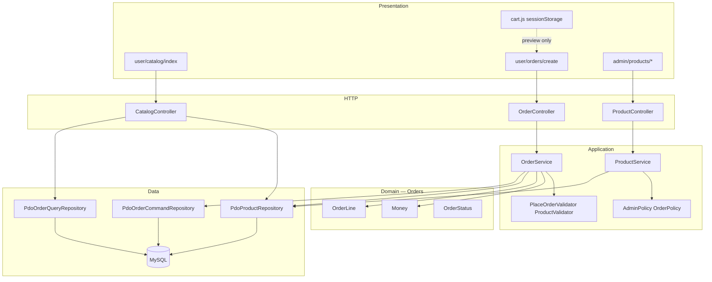
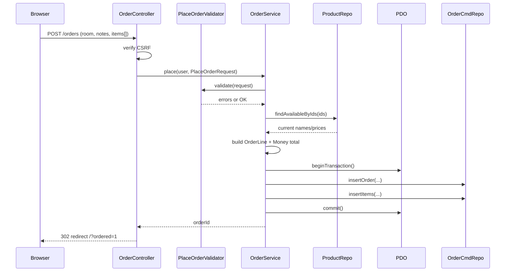

# Cafeteria Management System — Day 3 Catalog & Ordering Guide

**Version:** 1.0  
**Date:** 2 September 2026  
**Audience:** Beginners on the team (BEG1/BEG2/BEG3) and reviewers  
**Scope:** Everything delivered in Day 3 (P2 phase) on `main`  
**Related issues:** [Master #1](https://github.com/M9nx/Cafeteria/issues/1) · [Phase P2 #26](https://github.com/M9nx/Cafeteria/issues/26) · Leaf issues [#27–#31](https://github.com/M9nx/Cafeteria/issues/27)

> This document is the **full** explanation of what Day 3 built on top of Day 1 and Day 2, how catalogue browsing and order placement work, how server-authoritative pricing protects the system, and how data moves through domain objects, services, repositories, JavaScript cart state, and views. It is not a summary.

---

## Table of contents

1. [Glossary — new Day 3 terms](#1-glossary--new-day-3-terms)
2. [What Day 3 set out to do](#2-what-day-3-set-out-to-do)
3. [Day 3 delivery review (all five packages)](#3-day-3-delivery-review-all-five-packages)
4. [Repository map after Day 3](#4-repository-map-after-day-3)
5. [Architecture after Day 3](#5-architecture-after-day-3)
6. [Bootstrap composition root — ordering wiring](#6-bootstrap-composition-root--ordering-wiring)
7. [Order domain — Money, OrderLine, OrderStatus](#7-order-domain--money-orderline-orderstatus)
8. [Order placement flow — server-authoritative totals](#8-order-placement-flow--server-authoritative-totals)
9. [Catalogue, cart JavaScript, and order form UI](#9-catalogue-cart-javascript-and-order-form-ui)
10. [Product admin CRUD and safe uploads](#10-product-admin-crud-and-safe-uploads)
11. [Admin layout integration and upload hardening](#11-admin-layout-integration-and-upload-hardening)
12. [View layer — catalogue, cart, order form, admin products](#12-view-layer--catalogue-cart-order-form-admin-products)
13. [DTOs and validators (ordering)](#13-dtos-and-validators-ordering)
14. [Repository implementations added in P2](#14-repository-implementations-added-in-p2)
15. [Testing and CI after Day 3](#15-testing-and-ci-after-day-3)
16. [Documentation delivered](#16-documentation-delivered)
17. [What is NOT built yet (Day 4+)](#17-what-is-not-built-yet-day-4)
18. [How to run and verify locally](#18-how-to-run-and-verify-locally)
19. [Diagram index](#19-diagram-index)

---

## 1. Glossary — new Day 3 terms

| Term | Plain-English meaning | In this project |
|------|----------------------|-----------------|
| **Catalogue** | List of products a logged-in user can order | `GET /` via `CatalogController` |
| **Cart (client-side)** | Browser-only list of selected products and quantities | `sessionStorage` in `public/assets/js/cart.js` |
| **Server-authoritative pricing** | Server recalculates every total; browser preview is not trusted | `OrderService::place()` ignores client totals |
| **Price snapshot** | Copy of product name/price stored on the order line at placement time | `product_name_snapshot`, `unit_price_snapshot` columns |
| **Order line** | One product row inside an order (qty × unit price) | `OrderLine` value object |
| **Money** | Safe decimal money type without float math | `Money` — stores integer cents internally |
| **Transaction** | All-or-nothing database writes | `PDO::beginTransaction()` in `OrderService` |
| **Tampering** | User changes hidden fields or POST data to cheat totals/qty | Blocked by server recalculation + validation |
| **Soft delete (product)** | Mark product deleted without breaking old orders | `deleted_at` on products; history uses snapshots |
| **Availability** | Whether a product can be ordered right now | `is_available` flag; checked at placement |
| **Latest order** | Most recent order for the signed-in user | `OrderQueryRepository::findLatestForUser()` |
| **Progressive enhancement** | Basic HTML works; JavaScript improves UX | Cart +/- is JS; form still posts item arrays |
| **PRG** | POST → redirect → GET after successful mutation | After `POST /orders`, redirect to `/?ordered=1` |
| **SafeUploader** | Final gate for image files before storage | finfo MIME + `getimagesize` content check |
| **OrderFeatureTestCase** | Test helper that exercises real `OrderService` | `tests/Support/OrderFeatureTestCase.php` |

---

## 2. What Day 3 set out to do

Day 3 is phase **P2 — Catalog and Ordering**. The exit gate (from issue [#26](https://github.com/M9nx/Cafeteria/issues/26)) was:

> Product administration and correct transactional order creation using server totals, price/name snapshots, responsive catalogue/cart UI, and tampering tests.

Five team packages (5 hours each = 25 hours):

| WBS ID | Owner | Leaf issue | Merged PR |
|--------|-------|------------|-----------|
| P2-LEAD | Mounir Sabry | [#27](https://github.com/M9nx/Cafeteria/issues/27) | [#32](https://github.com/M9nx/Cafeteria/pull/32) |
| P2-INTR | Salma Fathy | [#28](https://github.com/M9nx/Cafeteria/issues/28) | [#33](https://github.com/M9nx/Cafeteria/pull/33) |
| P2-BEG1 | Taghreed Mohamed | [#29](https://github.com/M9nx/Cafeteria/issues/29) | [#35](https://github.com/M9nx/Cafeteria/pull/35) |
| P2-BEG2 | Basha Wahed | [#30](https://github.com/M9nx/Cafeteria/issues/30) | [#36](https://github.com/M9nx/Cafeteria/pull/36) |
| P2-BEG3 | Hana Elsayed | [#31](https://github.com/M9nx/Cafeteria/issues/31) | [#34](https://github.com/M9nx/Cafeteria/pull/34) |

All five **leaf issues are closed**. Phase issue [#26](https://github.com/M9nx/Cafeteria/issues/26) may remain open until the lead closes the phase after integrated sign-off.

**Dependency chain:**

```text
P1 (Day 2 auth + admin skeleton)
  └── P2-LEAD (#27) — order domain, OrderService, ADR snapshots
        └── P2-INTR (#28) — product CRUD, order repositories, routes
              ├── P2-BEG1 (#29) — catalogue/cart UI + order form
              └── P2-BEG3 (#31) — ordering feature tests
        └── P2-BEG2 (#30) — admin layout integration + upload hardening (also depends P1-BEG2)
```

**Business outcome after Day 3:**

- A logged-in user opens `/`, browses available products, builds a cart, and submits `POST /orders`.
- The server validates room/items, reloads product prices from the database, calculates totals, and persists order + line snapshots in one transaction.
- An admin manages products at `/admin/products` with image upload, pagination, and shared app layout.
- Automated tests prove tampering, rollback, snapshots, and invalid quantities fail safely.

---

## 3. Day 3 delivery review (all five packages)

### 3.1 P2-LEAD — Order service, transactional placement, pricing snapshots

**Purpose:** Define the order domain and implement the authoritative placement use case before any catalogue UI ships.

**Delivered:**

| Area | Key files |
|------|-----------|
| Order statuses | `app/Domain/Orders/OrderStatus.php` — `PROCESSING`, `OUT_FOR_DELIVERY`, `DONE`, `CANCELLED` |
| Money rules | `app/Domain/Orders/Money.php` — string decimals, integer cents, no floats |
| Line calculation | `app/Domain/Orders/OrderLine.php` — productId, name, unit price, qty, line total |
| Place-order input | `app/DTO/PlaceOrderRequest.php`, `app/DTO/OrderItemInput.php` |
| Validation | `app/Validation/PlaceOrderValidator.php` |
| Use case | `app/Services/OrderService.php` — `place()` with transaction |
| Persistence | `app/Repositories/Pdo/PdoOrderCommandRepository.php` — insert order + items |
| Architecture decision | `docs/adr/0004-order-pricing-snapshots.md` |
| Wiring | `bootstrap/app.php` — `OrderService` + command repository |

**Why it matters:** Without this package, the cart UI could display totals but nothing trustworthy would be saved. Client tampering would corrupt business data.

**Core rule (from ADR 0004):**

1. Request carries **room**, **notes**, **items** only — never a trusted total.
2. Service loads **available** products by ID from the repository.
3. Service builds `OrderLine` objects and sums with `Money`.
4. Service writes header + items inside **one PDO transaction**.

---

### 3.2 P2-INTR — Product CRUD, order repositories, catalogue persistence

**Purpose:** Provide admin product management and read/write repositories so LEAD’s service and BEG1’s UI have real data.

**Delivered:**

| Area | Key files |
|------|-----------|
| Product DTOs | `CreateProductRequest.php`, `UpdateProductRequest.php` |
| Product validation | `ProductValidator.php` |
| Product service | `ProductService.php` — list/create/update/deactivate |
| Product repository | `PdoProductRepository.php` — pagination, availability queries, soft delete |
| Order query repository | `PdoOrderQueryRepository.php` — latest order, paginated history scaffold, queue scaffold |
| User catalogue | `CatalogController.php` — `GET /` |
| User ordering | `OrderController.php` — `GET /orders/new`, `POST /orders` |
| Admin products | `ProductController.php` |
| Routes | `routes/orders.php`, extended `routes/admin.php` |
| Upload directory | `storage/uploads/products/` via separate `SafeUploader` instance |

**Why it matters:** Day 2 admin could manage users/categories but had no product catalogue or order persistence path for normal users.

---

### 3.3 P2-BEG1 — Catalogue cards, cart JavaScript, order form UI

**Purpose:** Deliver the user-facing ordering experience required by the project brief (screen 2).

**Delivered:**

| Area | Key files |
|------|-----------|
| Catalogue page | `resources/views/user/catalog/index.php` |
| Product card | `resources/views/components/product-card.php` |
| Cart summary | `resources/views/components/cart-summary.php` |
| Order form | `resources/views/user/orders/create.php` |
| Asset loader | `resources/views/components/catalog-assets.php` |
| Cart behaviour | `public/assets/js/cart.js` |
| Responsive styles | `public/assets/css/catalog.css` |
| View contract | `docs/ui/view-contract.md` — catalogue section |
| Manual checklist | `docs/test-plan/manual-ui-checklist.md` — Day 3 rows |

**Why it matters:** Users need click-to-add, +/- quantity, room selection, notes, and a total **preview** — while the server remains authoritative at submission.

**Client vs server authority:**

| Concern | Owner |
|---------|--------|
| Cart state in browser | `cart.js` + `sessionStorage` |
| Displayed preview total | JavaScript only |
| Final price, availability, persistence | `OrderService` on server |

---

### 3.4 P2-BEG2 — Admin integration, layout, upload hardening

**Purpose:** Integrate all admin screens (users, categories, products) into the shared authenticated shell and harden image uploads.

**Delivered:**

| Area | Key files |
|------|-----------|
| Shared admin render helper | `app/Controllers/Admin/RendersAdminView.php` |
| Controllers refactored | `CategoryController`, `UserController`, `ProductController` → `layouts.app` |
| Admin UI components | `admin-flash.php`, `admin-pagination.php` |
| Admin views rewritten | Bootstrap tables/forms with `$csrfField`, `form-errors` |
| Upload content check | `ImageContentValidator.php` — `getimagesize` after finfo |
| Hardened pipeline | `SafeUploader`, `UserValidator`, `ProductValidator` |
| Abuse checklist | `docs/test-plan/admin-abuse-checklist.md` |

**Defects fixed during integration:**

- Product forms used wrong CSRF field name (`_token` → shared `_csrf_token` via `$csrfField`).
- Stray markdown fence in product form template removed.
- User avatar upload read from `$request->files()['image']` instead of `$request->input('image')`.
- Product index flash format aligned with `FlashBag::pullAll()`.

---

### 3.5 P2-BEG3 — Ordering critical tests and fixture refresh

**Purpose:** Prove ordering rules with automated tests and link them to the acceptance matrix.

**Delivered:**

| Test class | What it proves |
|------------|----------------|
| `PlaceOrderTest.php` | Valid placement, empty cart, bad quantity, unavailable product |
| `OrderTotalTest.php` | Server totals match `Money` rules; client total ignored |
| `OrderSnapshotTest.php` | Name/price snapshots persist even if catalog changes later |
| `OrderTransactionTest.php` | Failure mid-insert rolls back — no orphan orders |
| `ClientTamperingTest.php` | Tampered totals/qty/product IDs rejected or recalculated safely |
| `OrderFeatureTestCase.php` | Shared harness calling real `OrderService` with test doubles |
| Fixtures | `tests/Fixtures/orders.php`, `products.php` refreshed |
| Evidence docs | `acceptance-matrix.md`, `security-regression.md` updated |

**Why it matters:** Ordering is the financial core of the app. These tests guard against regressions before Day 4 lifecycle work.

---

## 4. Repository map after Day 3

New and materially changed areas compared to Day 2:

```text
Cafeteria/
├── app/
│   ├── Controllers/
│   │   ├── Admin/
│   │   │   ├── RendersAdminView.php      ← NEW (P2-BEG2)
│   │   │   └── ProductController.php     ← NEW (P2-INTR)
│   │   └── User/
│   │       ├── CatalogController.php     ← NEW (P2-INTR)
│   │       └── OrderController.php       ← NEW (P2-INTR)
│   ├── Core/Upload/
│   │   └── ImageContentValidator.php     ← NEW (P2-BEG2)
│   ├── Domain/Orders/                    ← NEW (P2-LEAD)
│   │   ├── Money.php
│   │   ├── OrderLine.php
│   │   └── OrderStatus.php
│   ├── DTO/
│   │   ├── PlaceOrderRequest.php         ← NEW
│   │   ├── OrderItemInput.php            ← NEW
│   │   ├── CreateProductRequest.php      ← NEW
│   │   └── UpdateProductRequest.php      ← NEW
│   ├── Repositories/Pdo/
│   │   ├── PdoProductRepository.php      ← NEW
│   │   ├── PdoOrderCommandRepository.php ← NEW
│   │   └── PdoOrderQueryRepository.php   ← NEW
│   ├── Services/
│   │   ├── OrderService.php              ← NEW
│   │   └── ProductService.php            ← NEW
│   └── Validation/
│       ├── PlaceOrderValidator.php       ← NEW
│       └── ProductValidator.php          ← NEW
├── public/assets/
│   ├── css/catalog.css                   ← NEW (P2-BEG1)
│   └── js/cart.js                        ← NEW (P2-BEG1)
├── resources/views/
│   ├── components/
│   │   ├── catalog-assets.php            ← NEW
│   │   ├── product-card.php              ← NEW
│   │   ├── cart-summary.php              ← NEW
│   │   ├── admin-flash.php               ← NEW (P2-BEG2)
│   │   └── admin-pagination.php          ← NEW (P2-BEG2)
│   ├── user/
│   │   ├── catalog/index.php             ← NEW
│   │   └── orders/create.php             ← NEW
│   └── admin/products/                   ← NEW / integrated
├── routes/
│   └── orders.php                        ← NEW
├── docs/
│   ├── adr/0004-order-pricing-snapshots.md
│   └── test-plan/admin-abuse-checklist.md
└── tests/
    ├── Feature/Order/                    ← NEW (5 classes)
    └── Support/OrderFeatureTestCase.php  ← NEW
```

---

## 5. Architecture after Day 3

Day 3 completes the **Ordering** and **Catalog** modules:



### Updated responsibility rules

| Layer | Day 3 responsibility |
|-------|----------------------|
| **cart.js** | UX only: add/remove/qty, preview total, serialize hidden fields |
| **CatalogController** | Load paginated available products + latest order; render layout |
| **OrderController** | CSRF, build `PlaceOrderRequest`, call `OrderService`, PRG redirect |
| **OrderService** | Validate, load products, calculate money, transaction, persist |
| **ProductService** | Admin product CRUD rules, category check, image upload |
| **PdoOrderCommandRepository** | INSERT order + items; conditional cancel/transition stubs for P3 |
| **PdoOrderQueryRepository** | Read models: latest, paginated lists, queue scaffold |
| **View** | Escape output; show server errors; never compute authoritative totals |

---

## 6. Bootstrap composition root — ordering wiring

`bootstrap/app.php` grows on Day 3. Important additions:

```text
1. PdoProductRepository, PdoOrderCommandRepository, PdoOrderQueryRepository
2. PlaceOrderValidator, ProductValidator
3. SafeUploader × 2:
      - profiles/  (user avatars — from P1)
      - products/  (product images — P2-INTR)
4. ProductService(category repo, product repo, validator, admin policy, uploader)
5. OrderService(product repo, order command repo, place validator, PDO)
6. CatalogController, OrderController, ProductController registered on Router
7. routes/orders.php loaded via routes/web.php
```

**Two upload directories matter:** product images and profile images must not share the same folder. P2-INTR introduced `productUploader` pointing at `storage/uploads/products/`.

---

## 7. Order domain — Money, OrderLine, OrderStatus

### 7.1 `OrderStatus`

Backed enum in `app/Domain/Orders/OrderStatus.php`:

| Case | DB value | Day 3 usage |
|------|----------|-------------|
| `Processing` | `PROCESSING` | Default status on new orders |
| `OutForDelivery` | `OUT_FOR_DELIVERY` | Reserved for P3 transitions |
| `Done` | `DONE` | Reserved for P3 |
| `Cancelled` | `CANCELLED` | Reserved for P3 cancellation |

Day 3 focuses on **creating** orders in `PROCESSING`. Lifecycle changes are Day 4 (P3).

### 7.2 `Money`

**Problem:** PHP floats (`15.1 + 0.2`) cause rounding bugs.

**Solution:** Store amounts as integer **cents** internally; expose two-decimal strings at boundaries.

```php
$unit = Money::fromString('15.00');
$line = $unit->multiply(3);      // 45.00
$total = $line->add($otherLine);
$total->toString();              // "45.00"
```

Rules enforced:

- Regex validates `^\d+(?:\.\d{1,2})?$`
- Amount must be **> 0**
- No float math in order calculations

### 7.3 `OrderLine`

Value object representing one persisted line before SQL:

- `productId`, `productName`, `unitPrice` (`Money`), `quantity`
- `lineTotal()` = unit price × quantity (via `Money`)
- `toPersistenceArray()` → keys expected by `PdoOrderCommandRepository::insertItems()`

---

## 8. Order placement flow — server-authoritative totals

### 8.1 Sequence diagram



### 8.2 `PlaceOrderRequest` shape

Built from POST body by `PlaceOrderRequest::fromArray()`:

| Field | Source | Notes |
|-------|--------|-------|
| `roomId` | `room_id` | Must exist in `rooms` table |
| `notes` | `notes` | Optional, trimmed, length bounded by validator |
| `items` | `items[]` with `product_id`, `quantity` | Duplicates aggregated in service |

**Explicitly ignored:** any client `total` field (see tampering tests).

### 8.3 Transaction and rollback

Inside `OrderService::place()`:

```php
$this->pdo->beginTransaction();
try {
    $orderId = $this->orders->insertOrder(...);
    $this->orders->insertItems($orderId, $persistedItems);
    $this->pdo->commit();
} catch (Throwable $e) {
    if ($this->pdo->inTransaction()) {
        $this->pdo->rollBack();
    }
    throw $e;
}
```

If `insertItems()` fails after the header insert, **no order remains** — verified by `OrderTransactionTest`.

### 8.4 Snapshots

For each line, persistence stores:

- `product_id` — FK to catalog
- `product_name_snapshot` — name at order time
- `unit_price_snapshot` — price at order time
- `quantity`, `line_total`

If an admin later changes the product price, old orders still show historical values (`OrderSnapshotTest`).

---

## 9. Catalogue, cart JavaScript, and order form UI

### 9.1 Catalogue page (`GET /`)

**Controller:** `CatalogController::index()`

**Data passed to view:**

| Variable | Purpose |
|----------|---------|
| `$products` | Paginated available products |
| `$latestOrder` | Most recent order for signed-in user |
| `$currentUser` | Navbar + admin links |
| `$title` | Page title |

**User actions:**

1. Browse product cards.
2. Click **Add to cart** → handled by `cart.js`.
3. Open **New order** → `GET /orders/new`.

### 9.2 Cart storage model

`cart.js` uses `sessionStorage` key `cafeteria.cart`:

```json
{
  "1": { "name": "Tea", "price": "10.00", "quantity": 2 },
  "3": { "name": "Coffee", "price": "15.00", "quantity": 1 }
}
```

Functions:

- **Add** from product card (`data-product-*` attributes)
- **Increase/decrease** quantity buttons
- **Remove** when quantity hits zero
- **Render** cart summary and preview total
- **Serialize** hidden `<input>` fields into the order form before submit
- **Clear** cart when URL has `?ordered=1` after successful placement

### 9.3 Order form (`GET /orders/new`, `POST /orders`)

**View:** `resources/views/user/orders/create.php`

Contains:

- CSRF field (`$csrfField`)
- Room `<select>` from `$rooms`
- Notes textarea
- Cart summary component
- Hidden item fields generated by JavaScript
- Server validation errors via `form-errors`

On validation failure, controller re-renders form with `$old` sticky values (not passwords — N/A here).

---

## 10. Product admin CRUD and safe uploads

### 10.1 Admin product routes

All under `$adminMiddleware`:

| Method | Path | Action |
|--------|------|--------|
| GET | `/admin/products` | Paginated list |
| GET | `/admin/products/create` | Create form |
| POST | `/admin/products` | Store |
| GET | `/admin/products/{id}/edit` | Edit form |
| POST | `/admin/products/{id}/update` | Update |
| POST | `/admin/products/{id}/deactivate` | Soft delete |

### 10.2 `ProductService` rules

1. `AdminPolicy::canManageProducts()` — every method.
2. Validator runs on create/update.
3. Category must exist and be active.
4. Optional image → `SafeUploader` → stores relative path `storage/uploads/products/{random}.ext`.
5. Deactivate = soft delete (`deleted_at`), preserving order history via snapshots.

### 10.3 Upload hardening pipeline

| Step | Check |
|------|--------|
| 1 | PHP upload error code OK |
| 2 | `is_uploaded_file()` |
| 3 | Size ≤ 2 MB |
| 4 | finfo MIME in allowlist (`jpeg`, `png`, `webp`) |
| 5 | `ImageContentValidator::matchesDeclaredMime()` via `getimagesize` |
| 6 | Random hex filename — never trust client name |

Validators (`UserValidator`, `ProductValidator`) repeat early checks; `SafeUploader` is the final gate before bytes hit disk.

---

## 11. Admin layout integration and upload hardening

Day 2 admin pages for users/categories were standalone HTML. Day 3 (P2-BEG2) unifies **all** admin modules:

### 11.1 `RendersAdminView` trait

```php
protected function renderAdmin(
    AuthenticatedUser $user,
    string $template,
    string $title,
    array $data = [],
): Response {
    return View::render(
        $template,
        array_merge($data, ['title' => $title, 'currentUser' => $user]),
        'layouts.app',
    );
}
```

Every admin controller method returns through this helper so:

- Navbar appears with CSRF logout
- `$currentUser` is available to components
- Flash and pagination components behave consistently

### 11.2 Shared admin components

| Component | Role |
|-----------|------|
| `admin-flash.php` | Bootstrap alerts from `FlashBag::pullAll()` |
| `admin-pagination.php` | Page navigation for list screens |
| `form-errors.php` | Validation summary on forms |
| `$csrfField` | Global hidden input from `View::share()` |

---

## 12. View layer — catalogue, cart, order form, admin products

### 12.1 Layout contract

Authenticated user/admin pages use `layouts/app.php`:

| Variable | Required | Purpose |
|----------|----------|---------|
| `$title` | yes | `<title>` |
| `$content` | yes | Inner view HTML |
| `$currentUser` | yes on Day 3 user/admin pages | Navbar |
| `$csrfField` | shared globally | Forms + logout |

Guest auth screens still use `layouts/guest.php` from Day 2.

### 12.2 Catalogue components

| File | Role |
|------|------|
| `product-card.php` | One product: image, name, price, Add button |
| `cart-summary.php` | Cart table + total preview mount points |
| `catalog-assets.php` | Loads `catalog.css` + `cart.js` once |

See `docs/ui/view-contract.md` — **Catalogue and Order Views** and **Admin views** sections.

### 12.3 Escaping rules (unchanged from Day 1–2)

All dynamic text:

```php
htmlspecialchars($value, ENT_QUOTES, 'UTF-8')
```

Views never call repositories or enforce authorization — controllers/services already did.

---

## 13. DTOs and validators (ordering)

### 13.1 Pipeline pattern

```text
HTTP POST body
  → Request::body()
  → PlaceOrderRequest::fromArray()
  → PlaceOrderValidator::validate()
  → OrderService::place()
```

Same pattern as Day 2 login/admin DTOs.

### 13.2 `PlaceOrderValidator` rules (summary)

| Rule | Failure message (examples) |
|------|----------------------------|
| At least one line item | Empty cart rejected |
| Valid room ID | Missing/invalid room |
| Quantity integer ≥ 1 | Invalid quantity |
| Notes length cap | Bounded notes |
| Product IDs present | Malformed items skipped or rejected |

Exact messages live in the validator source — tests assert behaviour, not exact copy.

### 13.3 `ProductValidator` rules (summary)

| Rule | Applies to |
|------|------------|
| Name required, max length | create/update |
| Category required | create/update |
| Price > 0, two decimals | create/update |
| Image MIME/size/content | when file uploaded |

---

## 14. Repository implementations added in P2

### 14.1 `PdoProductRepository` (highlights)

| Method | Use case |
|--------|----------|
| `paginateAvailable()` | User catalogue |
| `paginate()` | Admin list |
| `findAvailableByIds()` | Order placement pricing |
| `findById()` | Admin edit |
| `create()` / `update()` / `softDelete()` | Admin CRUD |

Availability respects `is_available = 1` and `deleted_at IS NULL`.

### 14.2 `PdoOrderCommandRepository`

| Method | Use case |
|--------|----------|
| `insertOrder()` | New order header in `PROCESSING` |
| `insertItems()` | Snapshot lines |
| `cancelIfProcessing()` | Scaffold for P3 — conditional UPDATE |
| `transitionIfCurrent()` | Scaffold for P3 — writes `order_status_history` |

### 14.3 `PdoOrderQueryRepository`

| Method | Use case |
|--------|----------|
| `findLatestForUser()` | Catalogue “Latest order” panel |
| `paginateForUser()` | Scaffold for P3 order history |
| `findOwnedDetail()` | Scaffold for P3 detail view |
| `listCurrentQueue()` | Scaffold for P3 admin queue |

Day 3 **uses** latest-order reads; full history/queue UI arrives in P3.

---

## 15. Testing and CI after Day 3

### 15.1 Order feature suite

| Class | Assertions focus |
|-------|------------------|
| `PlaceOrderTest` | Happy path + validation failures |
| `OrderTotalTest` | Decimal totals, ignored client total |
| `OrderSnapshotTest` | Snapshot immutability vs catalog changes |
| `OrderTransactionTest` | Rollback leaves no partial order |
| `ClientTamperingTest` | Tampered payload still safe |

All extend or use `OrderFeatureTestCase` which constructs a **real** `OrderService` with in-memory/fake repositories and SQLite room table — not just fixture file equality.

### 15.2 Upload unit test

`ImageContentValidatorTest` — rejects non-image bytes with JPEG MIME; accepts minimal valid PNG bytes.

### 15.3 CI (from Day 1, still applies)

GitHub Actions on push/PR:

1. `composer lint`
2. Migrate test database
3. Seed
4. `composer test`

Ordering tests run in CI when MySQL/SQLite test env is configured in `phpunit.xml`.

### 15.4 Manual UI checklist

`docs/test-plan/manual-ui-checklist.md` — Day 3 rows cover:

- Product card click → cart
- +/- quantity
- Room select + submit
- Mobile layout
- Admin product create with image

`docs/test-plan/admin-abuse-checklist.md` — upload spoofing, CSRF, non-admin access.

---

## 16. Documentation delivered

| Document | Content |
|----------|---------|
| `docs/adr/0004-order-pricing-snapshots.md` | Authoritative pricing + snapshots + transactions |
| `docs/ui/view-contract.md` | Catalogue, cart, order form, admin view variables |
| `docs/test-plan/acceptance-matrix.md` | ORDER-* requirements linked to tests |
| `docs/test-plan/security-regression.md` | Tampering cases |
| `docs/test-plan/admin-abuse-checklist.md` | Admin integration + upload abuse |
| `docs/test-plan/manual-ui-checklist.md` | Browser verification rows |

---

## 17. What is NOT built yet (Day 4+)

| Missing piece | Planned phase |
|---------------|---------------|
| User order history list + date filter UI | P3-BEG1 ([#40](https://github.com/M9nx/Cafeteria/issues/40)) |
| Order detail + cancel button | P3-LEAD / P3-BEG1 ([#38](https://github.com/M9nx/Cafeteria/issues/38), #40) |
| Admin current-order queue UI | P3-BEG1 (#40) |
| Status transitions `PROCESSING → OUT_FOR_DELIVERY → DONE` | P3-LEAD (#38) |
| Admin order-on-behalf (`POST /admin/orders`) | P3-BEG2 ([#41](https://github.com/M9nx/Cafeteria/issues/41)) |
| Checks/report screen | P4 |
| Full HTTP feature tests for order history IDOR | P3-BEG3 ([#42](https://github.com/M9nx/Cafeteria/issues/42)) |
| Email delivery of password reset links | P4 bonus |

Day 3 = **browse catalogue + place orders + admin products**. Lifecycle and reporting are Day 4–5.

---

## 18. How to run and verify locally

### 18.1 Setup

```bash
cd Cafeteria
composer install
cp .env.example .env
# set DB_NAME=cafeteria_dev and credentials

mysql -e "CREATE DATABASE cafeteria_dev CHARACTER SET utf8mb4 COLLATE utf8mb4_0900_ai_ci;"
composer migrate
composer seed
composer verify
```

### 18.2 Start server

```bash
php -S 127.0.0.1:8080 -t public
```

### 18.3 Manual smoke checklist — ordering

| Step | URL / action | Expected |
|------|--------------|----------|
| Login | POST `/login` as `user@example.test` | Session created |
| Catalogue | GET `/` | Product cards + latest order panel |
| Add to cart | Click Add on a product | Cart summary updates (JS) |
| Order form | GET `/orders/new` | Room select + cart items |
| Place order | POST `/orders` with valid room/items | Redirect `/?ordered=1`; cart cleared |
| Latest order | GET `/` after place | Shows new order total/status |
| Admin products | GET `/admin/products` as admin | Bootstrap table in app layout |
| Create product | POST `/admin/products` with image | Product appears in catalogue if available |
| Bad upload | Upload `.txt` renamed `.jpg` | Safe validation error |
| Tamper total | DevTools: add hidden `total=0.01` | Server ignores; real total persisted |

Demo credentials: `docs/database/seeding.md`.

### 18.4 Automated tests

```bash
composer migrate
composer seed
composer test
php vendor/bin/phpunit tests/Feature/Order/
php vendor/bin/phpunit tests/Unit/Core/Upload/ImageContentValidatorTest.php
```

---

## 19. Diagram index

| Diagram | Section | Shows |
|---------|---------|-------|
| P2 dependency chain | §2 | Package order LEAD → INTR → BEG* |
| Architecture modules | §5 | Catalogue + ordering + admin products |
| Place-order sequence | §8.1 | Full POST `/orders` path |
| DTO/validator pipeline | §13.1 | Input boundary before service |

---

## Appendix A — Day 3 merged pull requests

| PR | Title | Closes |
|----|-------|--------|
| [#32](https://github.com/M9nx/Cafeteria/pull/32) | Order service, transactional placement, pricing snapshots | #27 |
| [#33](https://github.com/M9nx/Cafeteria/pull/33) | Product CRUD, order repositories, catalogue persistence | #28 |
| [#35](https://github.com/M9nx/Cafeteria/pull/35) | Catalogue cards, cart JavaScript, order form UI | #29 |
| [#36](https://github.com/M9nx/Cafeteria/pull/36) | Admin CRUD app layout integration and upload hardening | #30 |
| [#34](https://github.com/M9nx/Cafeteria/pull/34) | Ordering critical tests and fixture refresh | #31 |

---

## Appendix B — Route reference (Day 3)

### User ordering (`routes/orders.php`)

| Method | Path | Controller@method | Middleware |
|--------|------|-------------------|------------|
| GET | `/` | `CatalogController@index` | Auth |
| GET | `/orders/new` | `OrderController@create` | Auth |
| POST | `/orders` | `OrderController@store` | Auth |

### Admin products (`routes/admin.php` — excerpt)

| Method | Path | Controller@method |
|--------|------|-------------------|
| GET | `/admin/products` | `ProductController@index` |
| GET | `/admin/products/create` | `ProductController@create` |
| POST | `/admin/products` | `ProductController@store` |
| GET | `/admin/products/{id}/edit` | `ProductController@edit` |
| POST | `/admin/products/{id}/update` | `ProductController@update` |
| POST | `/admin/products/{id}/deactivate` | `ProductController@deactivate` |

Day 2 category/user admin routes are unchanged but now render through `layouts.app` after P2-BEG2.

---

## Appendix C — Key classes quick reference

| Class | Method | Responsibility |
|-------|--------|----------------|
| `CatalogController` | `index()` | Catalogue + latest order view |
| `OrderController` | `store()` | CSRF + delegate to `OrderService` |
| `OrderService` | `place()` | Authoritative placement transaction |
| `ProductService` | `create()` | Admin product + optional image |
| `Money` | `fromString()`, `add()`, `multiply()` | Safe decimal math |
| `OrderLine` | `lineTotal()`, `toPersistenceArray()` | One order row |
| `PdoProductRepository` | `findAvailableByIds()` | Pricing source at order time |
| `PdoOrderCommandRepository` | `insertOrder()`, `insertItems()` | Persistence |
| `cart.js` | `renderCart()`, `saveCart()` | Browser cart UX only |

---

## Appendix D — Export this document to PDF

**Recommended:** Open in VS Code / Cursor → Markdown Preview → Print → Save as PDF.

**Command line (if `pandoc` is installed):**

```bash
pandoc docs/day-3-catalog-ordering-guide.md -o docs/day-3-catalog-ordering-guide.pdf --toc -V geometry:margin=1in
```

---

*End of Day 3 Catalog & Ordering Guide*
