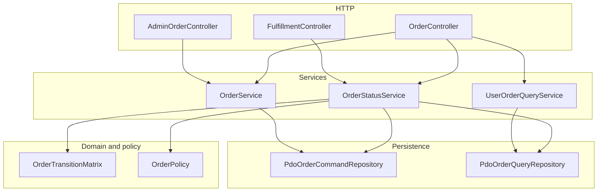
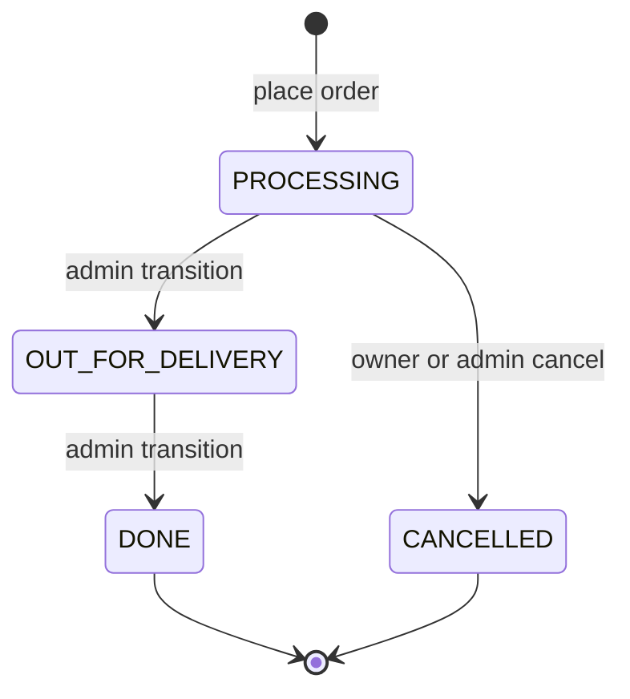
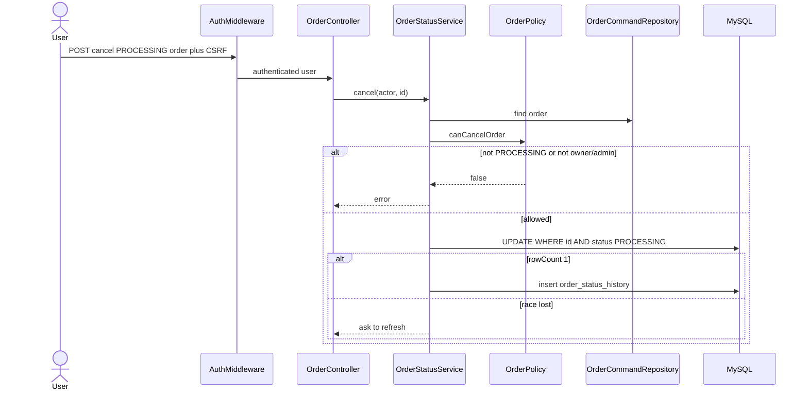
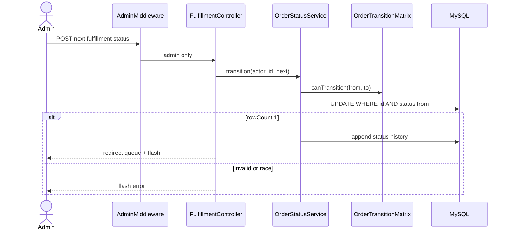
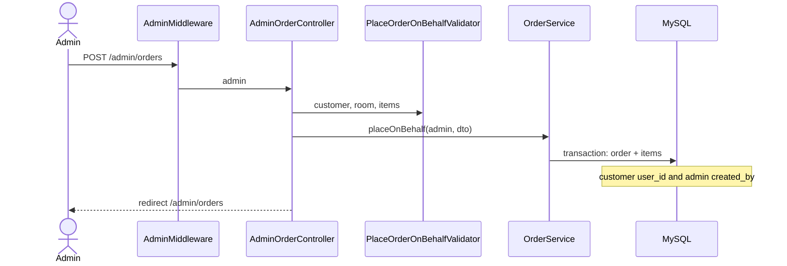

# Cafeteria Management System — Day 4 Order Lifecycle Guide

**Version:** 1.0  
**Date:** 3 September 2026  
**Audience:** Beginners on the team (BEG1/BEG2/BEG3) and reviewers  
**Scope:** Everything delivered in Day 4 (P3 phase) on `main`  
**Related issues:** [Master #1](https://github.com/M9nx/Cafeteria/issues/1) · [Phase P3 #37](https://github.com/M9nx/Cafeteria/issues/37) (closed)

> This document is the **full** explanation of what Day 4 built on top of Day 3 placement: how orders move through fulfillment, how cancellation works, how the current queue is filtered, and how an admin places an order on behalf of a user. It is not a summary.

---

## Table of contents

1. [Glossary — new Day 4 terms](#1-glossary--new-day-4-terms)
2. [What Day 4 set out to do](#2-what-day-4-set-out-to-do)
3. [Day 4 delivery review (all five packages)](#3-day-4-delivery-review-all-five-packages)
4. [Repository map after Day 4](#4-repository-map-after-day-4)
5. [Architecture after Day 4](#5-architecture-after-day-4)
6. [Order state machine and cancellation](#6-order-state-machine-and-cancellation)
7. [Fulfillment queue and status transitions](#7-fulfillment-queue-and-status-transitions)
8. [User history, detail, and cancel UI](#8-user-history-detail-and-cancel-ui)
9. [Admin order-on-behalf](#9-admin-order-on-behalf)
10. [Policies and authorization](#10-policies-and-authorization)
11. [Repositories and history audit](#11-repositories-and-history-audit)
12. [DTOs and validators](#12-dtos-and-validators)
13. [View layer](#13-view-layer)
14. [Testing after Day 4](#14-testing-after-day-4)
15. [Documentation delivered](#15-documentation-delivered)
16. [What is NOT built yet (Day 5+)](#16-what-is-not-built-yet-day-5)
17. [How to run and verify locally](#17-how-to-run-and-verify-locally)
18. [Diagram index](#18-diagram-index)

---

## 1. Glossary — new Day 4 terms

| Term | Plain-English meaning | In this project |
|------|----------------------|-----------------|
| **Lifecycle** | Everything after an order is placed until it is done or cancelled | P3 / Day 4 |
| **State machine** | Allowed next statuses only; illegal jumps fail | `OrderTransitionMatrix` |
| **Fulfillment transition** | Admin advancing kitchen/delivery | `PROCESSING → OUT_FOR_DELIVERY → DONE` |
| **Conditional update** | SQL `UPDATE … WHERE status = expected` so races lose safely | `cancelIfProcessing()`, `transitionIfCurrent()` |
| **Current queue** | Active orders only, not terminal ones | `listCurrentQueue()` excludes `DONE` and `CANCELLED` |
| **Order history** | Paginated list of a user's own orders, optional date filter | `GET /orders` |
| **On-behalf order** | Admin places an order for a selected customer | `POST /admin/orders` |
| **created_by_user_id** | Who clicked submit (the admin) | Distinct from `user_id` (the customer) |
| **Status history** | Audit row for each successful change | `order_status_history` |
| **IDOR** | Using another user's order id to view or cancel | Blocked by `OrderPolicy` |

---

## 2. What Day 4 set out to do

Day 4 is phase **P3 — Order Lifecycle**. The exit gate (from issue [#37](https://github.com/M9nx/Cafeteria/issues/37)) was:

> Users can review and cancel processing orders; admins can fulfill the current queue and place orders for a selected user; transitions are matrix-validated and race-safe.

Five team packages (5 hours each = 25 hours):

| WBS ID | Owner | Leaf issue | Merged PR |
|--------|-------|------------|-----------|
| P3-LEAD | Mounir Sabry | [#38](https://github.com/M9nx/Cafeteria/issues/38) | [#44](https://github.com/M9nx/Cafeteria/pull/44), [#45](https://github.com/M9nx/Cafeteria/pull/45) |
| P3-INTR | Salma Fathy | [#39](https://github.com/M9nx/Cafeteria/issues/39) | [#47](https://github.com/M9nx/Cafeteria/pull/47) |
| P3-BEG2 | Basha Wahed | [#41](https://github.com/M9nx/Cafeteria/issues/41) | [#46](https://github.com/M9nx/Cafeteria/pull/46) |
| P3-BEG1 | Taghreed Mohamed | [#40](https://github.com/M9nx/Cafeteria/issues/40) | [#49](https://github.com/M9nx/Cafeteria/pull/49) |
| P3-BEG3 | Hana Elsayed | [#42](https://github.com/M9nx/Cafeteria/issues/42) | [#48](https://github.com/M9nx/Cafeteria/pull/48) |

Phase issue [#37](https://github.com/M9nx/Cafeteria/issues/37) is **closed**. All five leaf issues are **closed**.

**Dependency chain:**

```text
P2 (Day 3 placement + catalogue)
  └── P3-LEAD (#38) — matrix, OrderStatusService, cancel/transition routes
        └── P3-INTR (#39) — history/queue query services + report read base
              ├── P3-BEG1 (#40) — history, detail, queue UI
              ├── P3-BEG2 (#41) — admin on-behalf placement
              └── P3-BEG3 (#42) — lifecycle tests and evidence
```

---

## 3. Day 4 delivery review (all five packages)

### 3.1 P3-LEAD — State machine, cancellation, fulfillment transitions

**Purpose:** Make status changes impossible unless they match the matrix and the row still has the expected status.

**Delivered:**

| Area | Key files |
|------|-----------|
| Matrix | `app/Domain/Orders/OrderTransitionMatrix.php` |
| Status enum | `app/Domain/Orders/OrderStatus.php` (already from P2) |
| Use case | `app/Services/OrderStatusService.php` |
| Policy | `app/Policies/OrderPolicy.php` — view, cancel, transition |
| HTTP | `OrderController::show`, `cancel`; `FulfillmentController::updateStatus` |
| ADR | `docs/adr/0005-order-state-machine.md` |
| Routes | `POST /orders/{id}/cancel`, `POST /admin/orders/{id}/status` |

**Core rules (from ADR 0005):**

1. Fulfillment pairs are only `PROCESSING → OUT_FOR_DELIVERY` and `OUT_FOR_DELIVERY → DONE`.
2. Cancellation is **not** a matrix edge. It uses `cancelIfProcessing()` so `cancelled_at` is set correctly.
3. If `rowCount !== 1`, the actor sees a refresh/error message; history is not written.

---

### 3.2 P3-INTR — History, queue queries, report read base

**Purpose:** Give UI packages trustworthy reads: owned history with dates, current queue, and the first report query service later used on Day 5.

**Delivered:**

| Area | Key files |
|------|-----------|
| History DTO | `app/DTO/OrderHistoryFilter.php` |
| History validation | `app/Validation/OrderHistoryValidator.php` |
| History use case | `app/Services/UserOrderQueryService.php` |
| Queue read | `PdoOrderQueryRepository::listCurrentQueue()` |
| Report scaffold | `ReportQueryService`, `PdoReportRepository` (completed on Day 5) |

**Why it matters:** LEAD defined writes. INTR defined **who may read what** so BEG1 does not query SQL from templates.

---

### 3.3 P3-BEG1 — Lifecycle views and queue UI

**Purpose:** Screens for “My orders”, order detail, cancel button, and admin current queue.

**Delivered:**

| Area | Key files |
|------|-----------|
| History | `resources/views/user/orders/index.php` |
| Detail | `resources/views/user/orders/show.php` |
| Queue | `resources/views/admin/orders/current.php` (and related) |
| Styles | `public/assets/css/orders.css` |
| Scripts | `public/assets/js/order-details.js` |
| Checklist | `docs/test-plan/manual-ui-checklist.md` — Day 4 rows |

Cancel is shown only when status is `PROCESSING`. Queue actions POST the next allowed status with CSRF.

---

### 3.4 P3-BEG2 — Admin order-on-behalf

**Purpose:** Kitchen/admin can order for a colleague who cannot reach the kiosk.

**Delivered:**

| Area | Key files |
|------|-----------|
| Controller | `app/Controllers/Admin/AdminOrderController.php` |
| DTO | `app/DTO/PlaceOrderOnBehalfRequest.php` |
| Validator | `app/Validation/PlaceOrderOnBehalfValidator.php` |
| Service | `OrderService::placeOnBehalf()` |
| Routes | `GET /admin/orders/create`, `POST /admin/orders` |
| Tests | `tests/Feature/Order/AdminOnBehalfOrderTest.php` |

Persisted identity:

| Column | Meaning |
|--------|---------|
| `user_id` | Selected customer |
| `created_by_user_id` | Logged-in admin |

Inactive customers, inactive rooms, empty carts, and client totals are rejected the same way as user placement.

---

### 3.5 P3-BEG3 — Lifecycle tests and evidence

**Purpose:** Prove IDOR, invalid transitions, date boundaries, and queue filtering.

**Delivered:**

| Test class | What it proves |
|------------|----------------|
| `OrderCancellationTest.php` | Owner cancel; IDOR; non-PROCESSING denied |
| `OrderStatusTransitionTest.php` | Matrix, non-admin, race |
| `OrderHistoryTest.php` | Date filter validation; IDOR on history |
| `OrderQueueTest.php` | Terminal orders excluded |
| `OrderDateBoundaryTest.php` | Inclusive `from`/`to` day bounds |
| `OrderLifecycleHttpTest.php` | HTTP CSRF + redirects |
| `LifecycleOrdersFixture.php` | Shared order rows for tests |
| Docs | `docs/test-plan/security-regression.md` extended |

---

## 4. Repository map after Day 4

New and materially changed areas compared to Day 3:

```text
Cafeteria/
├── app/
│   ├── Controllers/
│   │   ├── Admin/
│   │   │   ├── AdminOrderController.php
│   │   │   └── FulfillmentController.php
│   │   └── User/
│   │       └── OrderController.php          ← history, show, cancel
│   ├── Domain/Orders/
│   │   └── OrderTransitionMatrix.php
│   ├── Services/
│   │   ├── OrderStatusService.php
│   │   └── UserOrderQueryService.php
│   ├── DTO/
│   │   ├── OrderHistoryFilter.php
│   │   └── PlaceOrderOnBehalfRequest.php
│   └── Validation/
│       ├── OrderHistoryValidator.php
│       └── PlaceOrderOnBehalfValidator.php
├── resources/views/
│   ├── user/orders/index.php
│   ├── user/orders/show.php
│   └── admin/orders/…
├── docs/adr/0005-order-state-machine.md
└── tests/Feature/Order/
    ├── OrderCancellationTest.php
    ├── OrderStatusTransitionTest.php
    ├── OrderHistoryTest.php
    ├── OrderQueueTest.php
    └── AdminOnBehalfOrderTest.php
```

---

## 5. Architecture after Day 4

Placement from Day 3 stays in `OrderService`. Lifecycle is a **second** service so cancel/transition cannot accidentally re-price items.



---

## 6. Order state machine and cancellation

### 6.1 Allowed edges



`OrderTransitionMatrix::canTransition()` returns false for `CANCELLED` as a `to` status. Cancel always goes through `OrderStatusService::cancel()`.

### 6.2 Cancel sequence



### 6.3 Concurrent lost update

Two tabs both cancel the same `PROCESSING` order. The first `UPDATE` wins (`rowCount = 1`). The second matches zero rows. No double history, no flip from `CANCELLED` to something else.

---

## 7. Fulfillment queue and status transitions

`GET /admin/orders/current` (also registered as `GET /admin/orders`) lists active work. SQL excludes `DONE` and `CANCELLED`.



Queue is **not** a message broker. It is a filtered SQL list plus POST actions.

---

## 8. User history, detail, and cancel UI

| Route | Controller | Notes |
|-------|------------|--------|
| `GET /orders` | `OrderController::index` | Date `from`/`to`, page; owned rows only |
| `GET /orders/{id}` | `OrderController::show` | Owner or admin; snapshots on lines |
| `POST /orders/{id}/cancel` | `OrderController::cancel` | CSRF; PROCESSING only |

`UserOrderQueryService::getUserWithOrders()` refuses a USER reading another user's id (IDOR). Admins may use the same service for a selected user in reporting later.

Malformed dates fail in `OrderHistoryValidator` **before** SQL.

---

## 9. Admin order-on-behalf



Server totals still win. Hidden `total` fields from the browser are ignored.

---

## 10. Policies and authorization

`OrderPolicy` answers three questions:

| Method | USER | ADMIN |
|--------|------|-------|
| `canViewOrder` | Own `user_id` only | Any order |
| `canCancelOrder` | Own + `PROCESSING` | Same + `PROCESSING` |
| `canTransitionOrder` | Never | Matrix pair only |

Controllers still require `AuthMiddleware` or `AdminMiddleware`. Policy is the second gate inside the service so tests can call services without HTML.

---

## 11. Repositories and history audit

`PdoOrderCommandRepository`:

- `cancelIfProcessing($id, $at)` — sets `CANCELLED` and `cancelled_at`
- `transitionIfCurrent($id, $from, $to)` — one allowed hop
- Inserts `order_status_history` (`from_status`, `to_status`, `changed_by_user_id`, `changed_at`) on success

`PdoOrderQueryRepository`:

- `paginateForUser` — history
- `listCurrentQueue` — active fulfillment
- `findById` / latest order (Day 3)

Never select `password_hash` on user joins used for display names.

---

## 12. DTOs and validators

| DTO | Validator | Used by |
|-----|-----------|---------|
| `OrderHistoryFilter` | `OrderHistoryValidator` | `GET /orders` |
| `PlaceOrderOnBehalfRequest` | `PlaceOrderOnBehalfValidator` | `POST /admin/orders` |
| `PlaceOrderRequest` | `PlaceOrderValidator` | User `POST /orders` (Day 3) |

History validator rejects `from` after `to`, bad `YYYY-MM-DD`, and out-of-range pages.

---

## 13. View layer

Templates stay presentation-only: escaped output, CSRF hidden fields, no SQL.

Navbar after Day 4: **My orders**, **Current queue**, **New order** (admin also sees create-on-behalf).

Cancel confirm is a POST form, not a GET link.

---

## 14. Testing after Day 4

Run lifecycle-focused tests:

```bash
vendor/bin/phpunit tests/Feature/Order/OrderCancellationTest.php \
  tests/Feature/Order/OrderStatusTransitionTest.php \
  tests/Feature/Order/OrderHistoryTest.php \
  tests/Feature/Order/OrderQueueTest.php \
  tests/Feature/Order/AdminOnBehalfOrderTest.php
```

CI still runs `composer migrate`, `composer seed`, then `composer test` on `cafeteria_test`.

---

## 15. Documentation delivered

| Document | Role |
|----------|------|
| `docs/adr/0005-order-state-machine.md` | Canonical transitions |
| `docs/test-plan/manual-ui-checklist.md` | Day 4 UI rows |
| `docs/test-plan/security-regression.md` | IDOR / race cases |

---

## 16. What is NOT built yet (Day 5+)

| Missing piece | Planned phase |
|---------------|---------------|
| Checks summary, drill-down, CSV export | P4 ([#50](https://github.com/M9nx/Cafeteria/issues/50)) |
| Report filter hardening and formula-safe CSV | P4-BEG2 ([#54](https://github.com/M9nx/Cafeteria/issues/54)) |
| Reporting UI polish | P4-BEG1 ([#53](https://github.com/M9nx/Cafeteria/issues/53)) |
| Security audit / release gate write-up | P4-LEAD ([#51](https://github.com/M9nx/Cafeteria/issues/51)) |
| KPI dashboard / dark mode | Day 6 extras in `docs/scope.md` |

Day 4 = **history + cancel + queue + on-behalf**. Money reports are Day 5.

---

## 17. How to run and verify locally

### 17.1 Setup

```bash
composer install
cp .env.example .env
composer migrate
composer seed
php -S 127.0.0.1:8000 -t public
```

### 17.2 Manual smoke — lifecycle

| Step | Action | Expected |
|------|--------|----------|
| Login user | `user@example.test` | Catalogue |
| Place order | Checkout with room | Status `PROCESSING` |
| My orders | `GET /orders` | Row appears; date filter works |
| Detail | Open order | Snapshots + cancel if PROCESSING |
| Cancel | POST cancel | Status `CANCELLED`; button gone |
| Login admin | `admin@example.test` | Current queue |
| Advance | PROCESSING → OUT_FOR_DELIVERY → DONE | Illegal skip blocked |
| On-behalf | `/admin/orders/create` | Order belongs to selected user |

Demo passwords: `docs/database/seeding.md`.

---

## 18. Diagram index

| Diagram | Section | Shows |
|---------|---------|-------|
| P3 dependency chain | §2 | LEAD → INTR → BEG* |
| Architecture modules | §5 | Status vs placement services |
| State machine | §6.1 | Allowed edges |
| Cancel sequence | §6.2 | Policy + conditional UPDATE |
| Admin transition | §7 | Queue POST |
| On-behalf sequence | §9 | Dual user ids |

---

## Appendix A — Day 4 merged pull requests

| PR | Title | Closes |
|----|-------|--------|
| [#44](https://github.com/M9nx/Cafeteria/pull/44) | Order state machine, cancellation and fulfillment transitions | #38 |
| [#45](https://github.com/M9nx/Cafeteria/pull/45) | Wire lifecycle routes and cart form indexing | #38 follow-up |
| [#47](https://github.com/M9nx/Cafeteria/pull/47) | History, queue, and report read base | #39 |
| [#46](https://github.com/M9nx/Cafeteria/pull/46) | Admin order-on-behalf | #41 |
| [#49](https://github.com/M9nx/Cafeteria/pull/49) | History, detail, and queue views | #40 |
| [#48](https://github.com/M9nx/Cafeteria/pull/48) | Order lifecycle tests | #42 |

---

## Appendix B — Route reference (Day 4)

| Method | Path | Middleware | Action |
|--------|------|------------|--------|
| GET | `/orders` | Auth | History |
| GET | `/orders/{id}` | Auth | Detail |
| POST | `/orders/{id}/cancel` | Auth | Cancel PROCESSING |
| GET | `/admin/orders` | Admin | Current queue |
| GET | `/admin/orders/current` | Admin | Current queue |
| GET | `/admin/orders/create` | Admin | On-behalf form |
| POST | `/admin/orders` | Admin | On-behalf store |
| POST | `/admin/orders/{id}/status` | Admin | Fulfillment hop |

All POST routes require `_csrf_token`.

---

## Appendix C — Key classes quick reference

| Class | Responsibility |
|-------|----------------|
| `OrderTransitionMatrix` | Allowed fulfillment pairs |
| `OrderStatusService` | Cancel and transition use cases |
| `UserOrderQueryService` | Owned history reads |
| `FulfillmentController` | Queue UI + status POST |
| `AdminOrderController` | On-behalf HTTP |
| `OrderPolicy` | View / cancel / transition |

---

## Appendix D — Export this document to PDF

Open in Cursor Markdown Preview → Print → Save as PDF, or:

```bash
pandoc docs/day-4-order-lifecycle-guide.md -o docs/day-4-order-lifecycle-guide.pdf --toc -V geometry:margin=1in
```

---

*End of Day 4 Order Lifecycle Guide*
