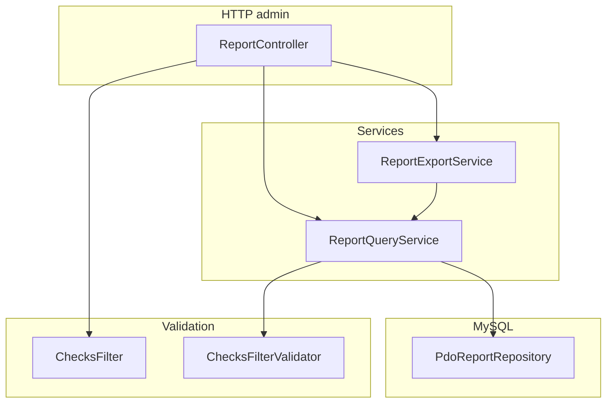
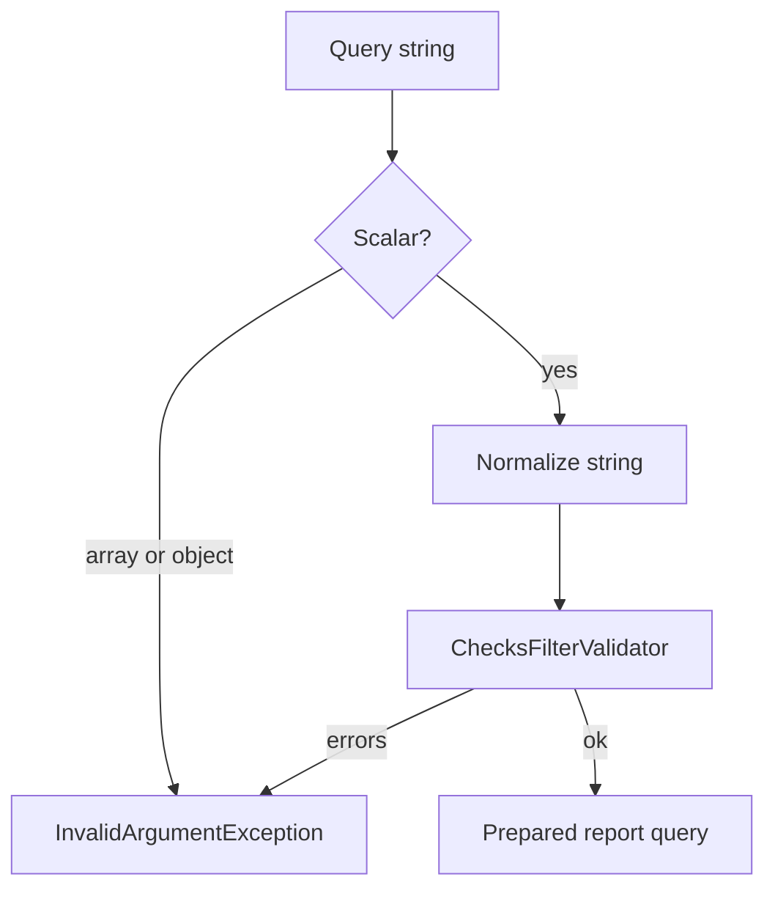
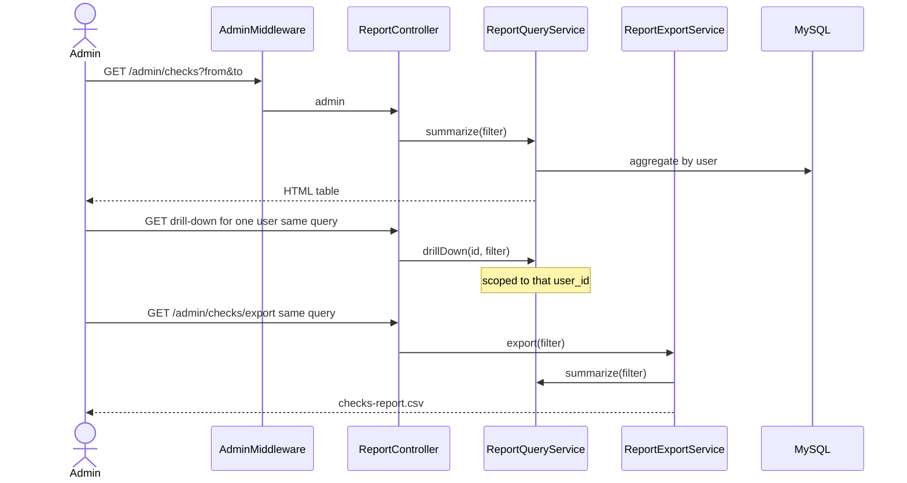
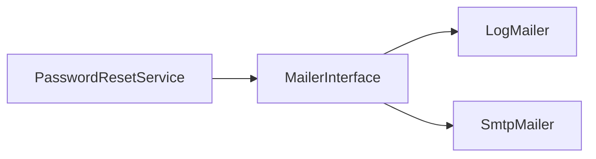

# Cafeteria Management System — Day 5 Reporting & Security Guide

**Version:** 1.0  
**Date:** 3 September 2026  
**Audience:** Beginners on the team (BEG1/BEG2/BEG3) and reviewers  
**Scope:** Everything delivered in Day 5 (P4 phase) as implemented on the current codebase  
**Related issues:** [Master #1](https://github.com/M9nx/Cafeteria/issues/1) · [Phase P4 #50](https://github.com/M9nx/Cafeteria/issues/50) (closed)

> This document is the **full** explanation of what Day 5 built on top of Day 4: admin checks (reports), user drill-down, CSV export, filter validation, mailer abstraction, and the security contract in ADR 0006. It describes **the code as it runs now**, not the blocked rows from the original P4-LEAD audit before those packages merged.

---

## Table of contents

1. [Glossary — new Day 5 terms](#1-glossary--new-day-5-terms)
2. [What Day 5 set out to do](#2-what-day-5-set-out-to-do)
3. [Day 5 delivery review (all five packages)](#3-day-5-delivery-review-all-five-packages)
4. [Repository map after Day 5](#4-repository-map-after-day-5)
5. [Architecture after Day 5](#5-architecture-after-day-5)
6. [Checks filters and validation](#6-checks-filters-and-validation)
7. [Summary, drill-down, and export flows](#7-summary-drill-down-and-export-flows)
8. [SQL, cancelled orders, and server totals](#8-sql-cancelled-orders-and-server-totals)
9. [CSV formula safety](#9-csv-formula-safety)
10. [Mailer abstraction](#10-mailer-abstraction)
11. [View layer — reporting UI](#11-view-layer--reporting-ui)
12. [Testing after Day 5](#12-testing-after-day-5)
13. [Security documentation](#13-security-documentation)
14. [What is NOT built yet (Day 6 extras)](#14-what-is-not-built-yet-day-6-extras)
15. [How to run and verify locally](#15-how-to-run-and-verify-locally)
16. [Diagram index](#16-diagram-index)

---

## 1. Glossary — new Day 5 terms

| Term | Plain-English meaning | In this project |
|------|----------------------|-----------------|
| **Checks** | Admin report of order counts and money by user | `GET /admin/checks` |
| **Drill-down** | One user's orders inside the same date/filter window | `GET /admin/checks/users/{id}` |
| **Export** | Same summary as CSV download | `GET /admin/checks/export` |
| **ChecksFilter** | Typed `user_id`, `from`, `to`, `include_cancelled` | `app/DTO/ChecksFilter.php` |
| **Scalar filter** | Query value must be a single string/int, not an array | `ReportController::scalarQueryValue()` |
| **Formula injection** | CSV cell starting with `= + - @` executed by Excel | Neutralized in `ReportExportService::safeCsvCell()` |
| **Server-authoritative totals** | Money comes from SQL aggregates, not JavaScript | `ReportQueryService` |
| **Mailer abstraction** | Password reset does not talk SMTP directly | `MailerInterface`, `LogMailer`, `SmtpMailer` |
| **Authorization-by-UI** | Hiding a link and calling that “secure” | Forbidden; middleware + service still apply |

---

## 2. What Day 5 set out to do

Day 5 is phase **P4 — Reporting and Hardening**. The exit gate (from issue [#50](https://github.com/M9nx/Cafeteria/issues/50)) was:

> Admins can filter checks, open a user drill-down, and export CSV using the same validated filters; guests and normal users cannot; malformed filters never become SQL; optional SMTP is configuration-driven.

Five team packages (5 hours each = 25 hours):

| WBS ID | Owner | Leaf issue | Merged PR |
|--------|-------|------------|-----------|
| P4-LEAD | Mounir Sabry | [#51](https://github.com/M9nx/Cafeteria/issues/51) | [#56](https://github.com/M9nx/Cafeteria/pull/56), [#57](https://github.com/M9nx/Cafeteria/pull/57) |
| P4-INTR | Salma Fathy | [#52](https://github.com/M9nx/Cafeteria/issues/52) | [#58](https://github.com/M9nx/Cafeteria/pull/58) |
| P4-BEG1 | Taghreed Mohamed | [#53](https://github.com/M9nx/Cafeteria/issues/53) | [#59](https://github.com/M9nx/Cafeteria/pull/59) |
| P4-BEG2 | Basha Wahed | [#54](https://github.com/M9nx/Cafeteria/issues/54) | [#60](https://github.com/M9nx/Cafeteria/pull/60) |
| P4-BEG3 | Hana Elsayed | [#55](https://github.com/M9nx/Cafeteria/issues/55) | [#61](https://github.com/M9nx/Cafeteria/pull/61) |

Phase issue [#50](https://github.com/M9nx/Cafeteria/issues/50) is **closed**. All five leaf issues are **closed**.

**Dependency chain:**

```text
P3 (Day 4 lifecycle + report read scaffold)
  └── P4-LEAD (#51) — ADR 0006 + audit / release-gate docs
        └── P4-INTR (#52) — drill-down, mailer, query tuning
              ├── P4-BEG1 (#53) — reporting UI polish
              ├── P4-BEG2 (#54) — filter integration, CSV export, remaining defects
              └── P4-BEG3 (#55) — reconciliation + abuse regression tests
```

The first LEAD audit ([docs/security/day-5-security-audit.md](security/day-5-security-audit.md)) recorded gaps **before** INTR/BEG packages landed. Those gaps (missing drill-down/export, filter coercion) were the work items for #52–#55. This guide documents the **merged** behaviour.

---

## 3. Day 5 delivery review (all five packages)

### 3.1 P4-LEAD — Security audit and ADR 0006

**Purpose:** Write the contract everyone else must implement; record what was already true on the lifecycle surface.

**Delivered:**

| Area | Key files |
|------|-----------|
| ADR | `docs/adr/0006-reporting-security-hardening.md` |
| Audit | `docs/security/day-5-security-audit.md` |
| Abuse checklist | `docs/test-plan/admin-abuse-checklist.md` Day 5 rows |

**Contract highlights:**

- Report routes are admin-only (`AdminMiddleware`).
- `user_id` is a single positive integer or empty; arrays fail.
- `from`/`to` are `YYYY-MM-DD`; `from` ≤ `to`.
- `include_cancelled` is explicit `'1'` or off; arrays fail.
- Export reuses the same `ChecksFilter` as the HTML summary.
- Totals are not computed in the browser.
- Mail secrets stay in `.env`; log mailer must not print credentials.

---

### 3.2 P4-INTR — Drill-down, mailer, query tuning

**Purpose:** Implement drill-down HTTP and swap password-reset sending onto `MailerInterface`.

**Delivered:**

| Area | Key files |
|------|-----------|
| Drill-down | `ReportController::userDrillDown`, `ReportQueryService::drillDown` |
| Mail | `app/Mail/MailerInterface.php`, `LogMailer.php`, `SmtpMailer.php` |
| Reset | `PasswordResetService` depends on the interface |
| Indexes | `database/migrations/008_report_query_indexes.sql` (plus status history migration from P3) |

`MAIL_DRIVER=log` writes to logs in local/dev. `MAIL_DRIVER=smtp` uses host/user/password from environment.

---

### 3.3 P4-BEG1 — Reporting UI polish

**Purpose:** Make summary and drill-down usable: empty states, sort/search affordances, preserve query string on links.

**Delivered:**

| Area | Key files |
|------|-----------|
| Summary | `resources/views/admin/reports/index.php` |
| Drill-down | `resources/views/admin/reports/user.php` |
| CSS/JS | `public/assets/css/reports.css`, `public/assets/js/reports.js` |

JavaScript may sort or highlight rows. It must not invent totals or authorize access.

---

### 3.4 P4-BEG2 — Filters, CSV export, defect fixes

**Purpose:** Close ADR 0006 validation/export holes and remaining P4 defects found in review.

**Delivered:**

| Area | Key files |
|------|-----------|
| Export | `ReportExportService`, `GET /admin/checks/export` |
| Filter parse | `ReportController::buildFilter()` — scalar-only helpers |
| CSV | UTF-8 BOM + `safeCsvCell()` prefix `'` for formula starters |
| Related admin fixes | Malformed report filters; product deactivate CSRF; self-deactivation blocked in `UserService` |

Export is hidden or not offered when the current filter set is invalid (no download of a 500).

---

### 3.5 P4-BEG3 — Reconciliation and abuse tests

**Purpose:** Prove HTML, drill-down, and CSV agree, and that guests/users cannot export.

**Delivered:**

| Test class | What it proves |
|------------|----------------|
| `ReportHttpTest.php` | Admin 200; USER 403; guest redirect |
| `ReportExportTest.php` | CSV headers, same filters, formula prefix |
| `ReportSecurityTest.php` | Array filters, bad user ids |
| `ReportReconciliationTest.php` | Summary totals match drill-down aggregates |

---

## 4. Repository map after Day 5

```text
Cafeteria/
├── app/
│   ├── Controllers/Admin/ReportController.php
│   ├── Services/ReportQueryService.php
│   ├── Services/ReportExportService.php
│   ├── DTO/ChecksFilter.php
│   ├── Validation/ChecksFilterValidator.php
│   ├── Repositories/Pdo/PdoReportRepository.php
│   └── Mail/
│       ├── MailerInterface.php
│       ├── LogMailer.php
│       └── SmtpMailer.php
├── resources/views/admin/reports/
├── public/assets/css/reports.css
├── public/assets/js/reports.js
├── docs/adr/0006-reporting-security-hardening.md
├── docs/security/day-5-security-audit.md
└── tests/Feature/Admin/Report*.php
```

---

## 5. Architecture after Day 5



`ReportExportService` does not run a second ad-hoc query language. It calls `summarize()` so CSV cannot diverge from the table.

---

## 6. Checks filters and validation

### 6.1 DTO fields

| Field | Rule |
|-------|------|
| `userId` | `null` or integer matching `/^[1-9][0-9]*$/` and an existing user |
| `from` / `to` | `null` or `YYYY-MM-DD`; from ≤ to |
| `includeCancelled` | `true` only when the query value is exactly `'1'` |

### 6.2 Reject arrays before SQL



`user_id=abc`, `user_id=1abc`, `include_cancelled[]=1`, and duplicate/coerced arrays fail in the controller helpers instead of being silently cast by PHP.

---

## 7. Summary, drill-down, and export flows



Drill-down `{id}` is the customer, not a way to widen the date window. Parent `from`/`to`/`include_cancelled` stay on the query string.

---

## 8. SQL, cancelled orders, and server totals

`PdoReportRepository` binds dates and user id. Dynamic fragments (if any) come from a **server allowlist**, not from raw `$_GET`.

**Default:** cancelled orders are **out** of monetary totals. `include_cancelled=1` is the explicit opt-in.

Footer / summary totals in the HTML are the same numbers the repository returned. `reports.js` must not re-sum independently as a source of truth.

---

## 9. CSV formula safety

`ReportExportService::safeCsvCell()` prefixes a single quote when the first character is `=`, `+`, `-`, or `@`.

Headers are fixed (`User ID`, `User`, `Orders`, `Total amount`). Filename is the constant `checks-report.csv`. Content-Type is `text/csv; charset=UTF-8` with a UTF-8 BOM for Excel.

---

## 10. Mailer abstraction



`bootstrap/app.php` picks the driver from config. Reset tokens remain hashed at rest; the raw token appears only in the link body for delivery. Log driver must not dump `MAIL_PASSWORD`.

Generic forgot-password response still applies whether the email exists (Day 2 rule, unchanged).

---

## 11. View layer — reporting UI

| View | Purpose |
|------|---------|
| `admin.reports.index` | Filter form, summary rows, link to drill-down and export |
| `admin.reports.user` | One user, order list, back to summary with query preserved |

Empty states explain “no rows for these filters” instead of a blank table. Export control is not shown when `$errors` is non-empty.

Navbar **Reports** → `/admin/checks` (admin only).

---

## 12. Testing after Day 5

```bash
vendor/bin/phpunit tests/Feature/Admin/ReportHttpTest.php \
  tests/Feature/Admin/ReportExportTest.php \
  tests/Feature/Admin/ReportSecurityTest.php \
  tests/Feature/Admin/ReportReconciliationTest.php
```

Need `cafeteria_test` migrated and seeded (see README).

---

## 13. Security documentation

| Document | Role |
|----------|------|
| ADR 0006 | Required rules |
| `docs/security/day-5-security-audit.md` | LEAD evidence (read alongside later PRs) |
| `docs/test-plan/admin-abuse-checklist.md` | Manual abuse cases |
| This guide | How the merged code implements the contract |

---

## 14. What is NOT built yet (Day 6 extras)

From [docs/scope.md](scope.md), still out of the six-day stable version unless separately approved:

- KPI dashboard or dark mode
- Public REST API
- Inventory, payments, coupons

Reporting itself **is** in the stable version after P4.

---

## 15. How to run and verify locally

```bash
composer migrate
composer seed
php -S 127.0.0.1:8000 -t public
```

| Step | Action | Expected |
|------|--------|----------|
| Guest | `GET /admin/checks` | Redirect `/login` |
| User | same URL as `user@example.test` | 403 |
| Admin | `/admin/checks` | Table or empty state |
| Bad id | `?user_id=abc` | Validation error, no SQL crash |
| Drill-down | Open a user link | Only that user's orders |
| Export | Download CSV | Same totals; formula cells prefixed |
| Include cancelled | `include_cancelled=1` | Cancelled money appears only then |

---

## 16. Diagram index

| Diagram | Section | Shows |
|---------|---------|-------|
| P4 dependency chain | §2 | LEAD → INTR → BEG* |
| Report architecture | §5 | Controller → services → repo |
| Filter gate | §6.2 | Arrays rejected |
| Summary / drill / export | §7 | Shared filter |
| Mailer | §10 | Interface + drivers |

---

## Appendix A — Day 5 merged pull requests

| PR | Title | Closes |
|----|-------|--------|
| [#56](https://github.com/M9nx/Cafeteria/pull/56) | Security regression gate | #51 |
| [#57](https://github.com/M9nx/Cafeteria/pull/57) | ADR 0006 reporting security contract | #51 |
| [#58](https://github.com/M9nx/Cafeteria/pull/58) | Mailer abstraction and checks drill-down | #52 |
| [#59](https://github.com/M9nx/Cafeteria/pull/59) | Reporting UI polish | #53 |
| [#60](https://github.com/M9nx/Cafeteria/pull/60) | Report filters, export, remaining defects | #54 |
| [#61](https://github.com/M9nx/Cafeteria/pull/61) | Report tests and security coverage | #55 |

---

## Appendix B — Route reference (Day 5)

| Method | Path | Middleware | Action |
|--------|------|------------|--------|
| GET | `/admin/checks` | Admin | Summary |
| GET | `/admin/checks/users/{id}` | Admin | Drill-down |
| GET | `/admin/checks/export` | Admin | CSV |

Query parameters: `user_id`, `from`, `to`, `include_cancelled`.

---

## Appendix C — Key classes quick reference

| Class | Responsibility |
|-------|----------------|
| `ChecksFilter` | Typed report window |
| `ChecksFilterValidator` | Dates and existing user |
| `ReportQueryService` | Summarize + drill-down + totals |
| `ReportExportService` | CSV + formula prefix |
| `PdoReportRepository` | Bound SQL aggregates |
| `MailerInterface` | Reset delivery port |

---

## Appendix D — Export this document to PDF

```bash
pandoc docs/day-5-reporting-security-guide.md -o docs/day-5-reporting-security-guide.pdf --toc -V geometry:margin=1in
```

---

*End of Day 5 Reporting & Security Guide*
