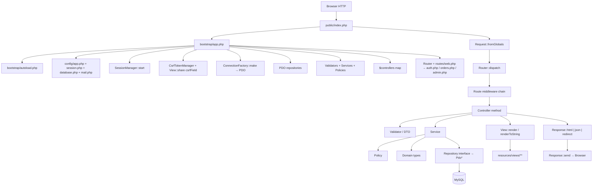
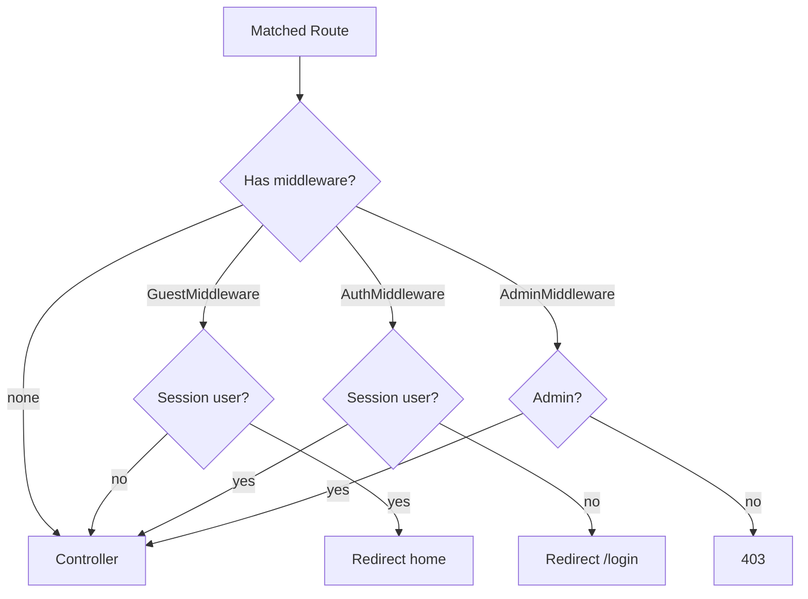
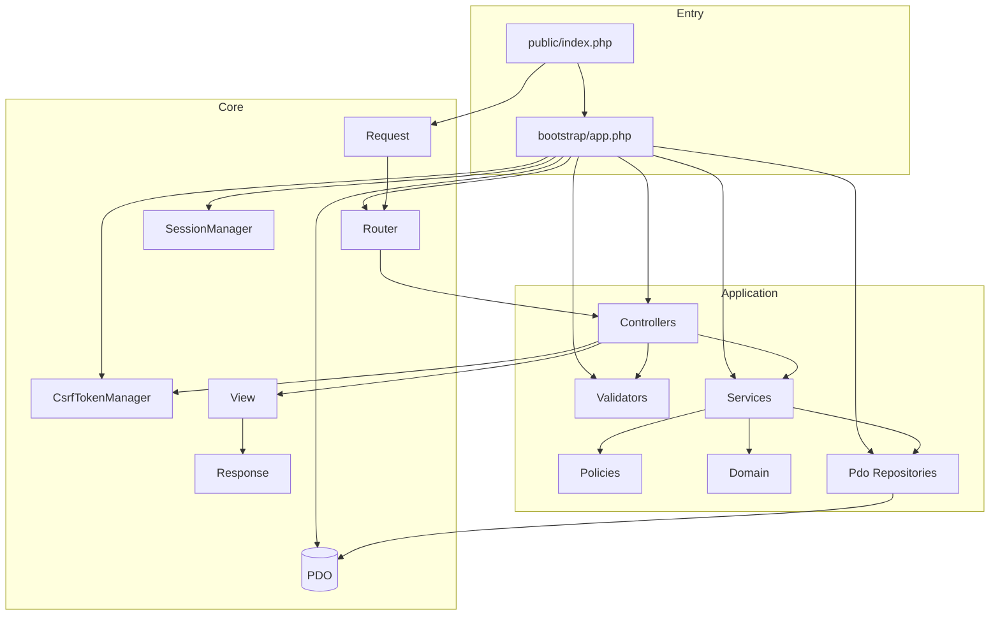
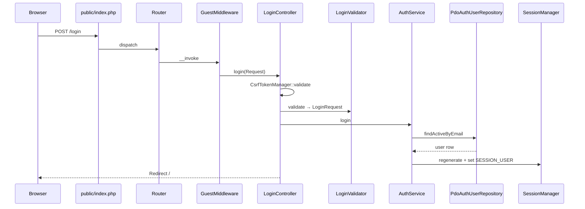
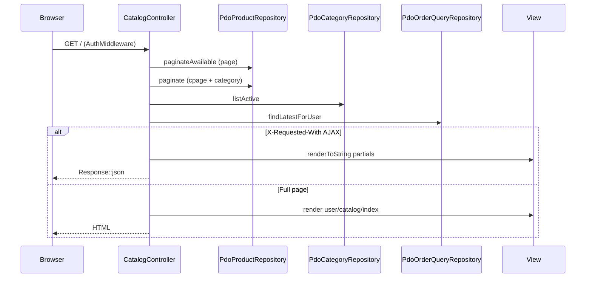
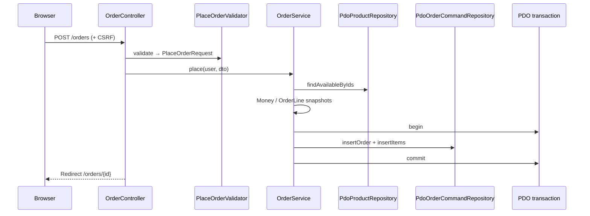
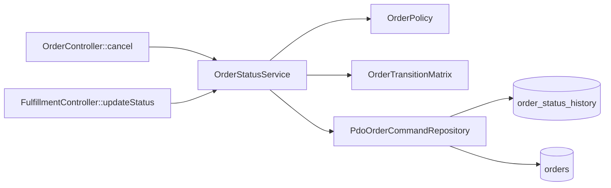
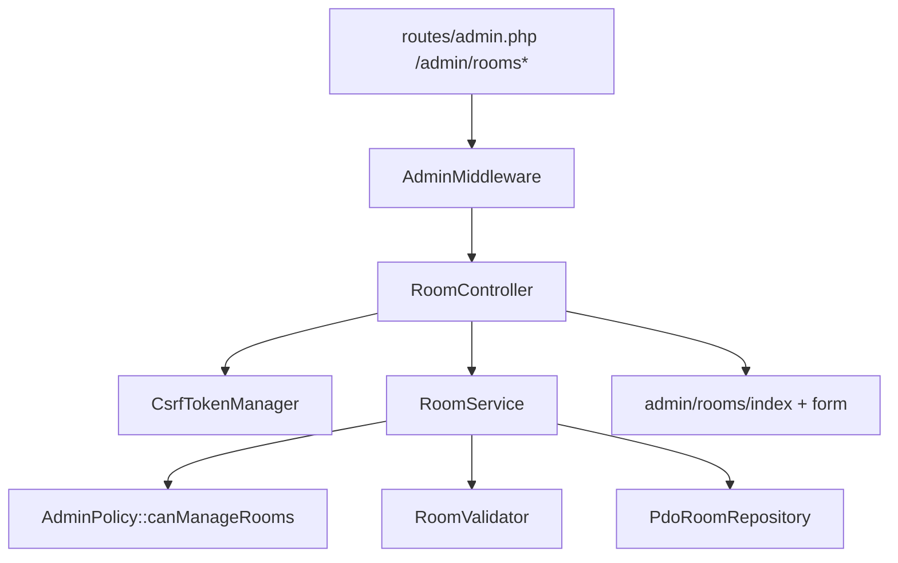
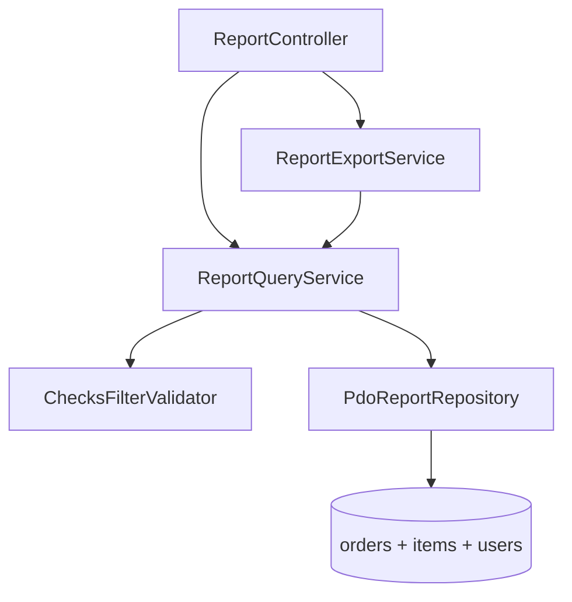
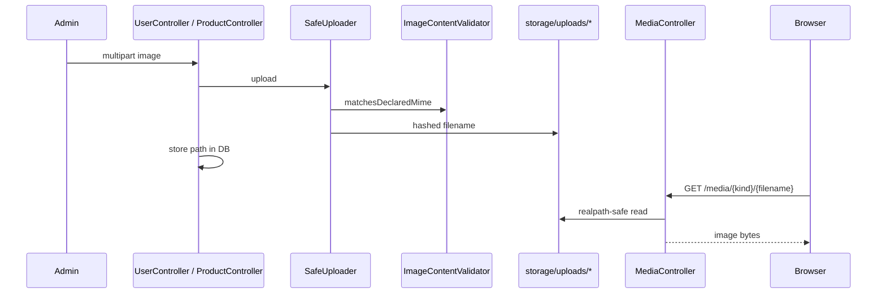

# Request lifecycle & codebase atlas

**Version:** 1.0  
**Date:** 5 September 2026  
**Branch snapshot:** `main` (post [PR #62](https://github.com/M9nx/Cafeteria/pull/62))  
**Companion:** [Architecture atlas (Day 5)](system-through-day-5-architecture-guide.md) · [Database & schema guide](database-schema-guide.md)

This document walks **every HTTP request** through named files, shows what **bootstrap dependencies** do, then inventories **file purposes**, **classes**, and **methods**.

---

## Table of contents

1. [Universal HTTP lifecycle (named files)](#1-universal-http-lifecycle-named-files)
2. [What bootstrap dependencies do](#2-what-bootstrap-dependencies-do)
3. [Dependency graph (composition root)](#3-dependency-graph-composition-root)
4. [Middleware gates](#4-middleware-gates)
5. [Request lifecycles by feature](#5-request-lifecycles-by-feature)
6. [Router → controller → service map](#6-router--controller--service-map)
7. [Purpose of every application file](#7-purpose-of-every-application-file)
8. [Complete class & method inventory](#8-complete-class--method-inventory)

---

## 1. Universal HTTP lifecycle (named files)

Every browser hit that is not a static asset under `public/assets/` enters here.

**Figure 1 — Universal request path (file names)**

Static CSS/JS/SVG under `public/assets/` are served by the PHP built-in server (or any web server) **without** entering `index.php` logic beyond file serving.

---

## 2. What bootstrap dependencies do

Wired once in `bootstrap/app.php` (no Laravel/Symfony container).

| Dependency | File(s) | Role |
|------------|---------|------|
| Environment / config | `config/*.php` (+ `.env` via `Environment` where used) | Settings |
| `SessionManager` | `app/Core/Session/SessionManager.php` | PHP session cookie + get/set |
| `FlashBag` | `app/Core/Session/FlashBag.php` | One-shot success/error messages |
| `CsrfTokenManager` | `app/Core/Auth/CsrfTokenManager.php` | Synchronizer token `_csrf_token` |
| `AuthMiddleware` | `app/Core/Auth/AuthMiddleware.php` | Require logged-in user |
| `AdminMiddleware` | `app/Core/Auth/AdminMiddleware.php` | Require `ADMIN` role |
| `GuestMiddleware` | `app/Core/Auth/GuestMiddleware.php` | Redirect if already logged in |
| `AdminPolicy` / `OrderPolicy` | `app/Policies/*` | Fine-grained authz inside services |
| `ConnectionFactory` → `PDO` | `app/Core/Database/ConnectionFactory.php` | MySQL connection |
| `Pdo*Repository` | `app/Repositories/Pdo/*` | SQL |
| `*Validator` | `app/Validation/*` | Input rules |
| `*Service` | `app/Services/*` | Use cases |
| `SafeUploader` ×2 | `app/Core/Upload/SafeUploader.php` | Profile + product uploads under `storage/uploads/` |
| `MailerInterface` | `LogMailer` or `SmtpMailer` | Password-reset delivery |
| `Router` | `app/Core/Routing/Router.php` | Match method+path, run middleware, invoke controller |
| Controller instances | `app/Controllers/**` | HTTP adapters |

**Figure 2 — Middleware decision**

---

## 3. Dependency graph (composition root)

**Figure 3 — Who depends on whom (simplified)**

---

## 4. Middleware gates

| Gate | Applied in | Blocks |
|------|------------|--------|
| Guest | `routes/auth.php` login/forgot/reset | Authenticated users leaving auth pages |
| Auth | `routes/orders.php`, logout | Anonymous catalogue/orders |
| Admin | `routes/admin.php` | Non-admin users from admin + checks |
| CSRF | Controllers on POST | Cross-site form posts (session token) |
| Policy | Services | Capability beyond role gate (e.g. cancel only Processing) |

`MediaController` and `HealthController` have **no** auth middleware by design.

---

## 5. Request lifecycles by feature

### 5.1 Login

**Figure 4 — Login POST**

Files touched: `routes/auth.php` → `LoginController.php` → `LoginValidator.php` → `LoginRequest.php` → `AuthService.php` → `PdoAuthUserRepository.php` → `AuthenticatedUser.php` → `layouts/guest.php` / `auth/login.php` (GET).

### 5.2 Catalogue (HTML + AJAX)

**Figure 5 — Catalogue GET /**

Client: `public/assets/js/catalog.js` swaps partials from `resources/views/user/catalog/partials/*`.

### 5.3 Place order

**Figure 6 — Place order POST /orders**

Cart JS (`cart.js`, `order-create.js`) is **preview only**; server recomputes prices.

### 5.4 Cancel / fulfill

**Figure 7 — Status change**

### 5.5 Admin Rooms CRUD

**Figure 8 — Rooms admin**

### 5.6 Checks / export

**Figure 9 — Reports**

### 5.7 Uploads & media

**Figure 10 — Upload then serve**

### 5.8 Password reset

Files: `ForgotPasswordController` / `ResetPasswordController` → `PasswordResetService` → `PdoPasswordResetTokenRepository` + `PdoAuthUserRepository` → `PasswordResetMailBuilder` → `LogMailer`|`SmtpMailer`.

---

## 6. Router → controller → service map

| Route file | Path pattern | Controller::method | Primary collaborators |
|------------|--------------|--------------------|------------------------|
| bootstrap | GET `/health` | `HealthController::show` | — |
| web | GET `/media/{kind}/{filename}` | `MediaController::show` | filesystem |
| auth | GET/POST `/login` | `LoginController::show|login` | AuthService, LoginValidator, CSRF |
| auth | POST `/logout` | `LogoutController::logout` | AuthService, CSRF |
| auth | GET/POST `/forgot-password` | `ForgotPasswordController::*` | PasswordResetService |
| auth | GET/POST `/reset-password` | `ResetPasswordController::*` | PasswordResetService |
| orders | GET `/` | `CatalogController::index` | Product/Category/OrderQuery repos |
| orders | GET `/orders/new` | `OrderController::create` | Product repo, rooms SQL |
| orders | POST `/orders` | `OrderController::store` | OrderService |
| orders | GET `/orders` | `OrderController::index` | UserOrderQueryService |
| orders | GET `/orders/{id}` | `OrderController::show` | OrderQuery + OrderPolicy |
| orders | POST `/orders/{id}/cancel` | `OrderController::cancel` | OrderStatusService |
| admin | `/admin/categories*` | `CategoryController::*` | CategoryService |
| admin | `/admin/rooms*` | `RoomController::*` | RoomService |
| admin | `/admin/users*` | `UserController::*` | UserService, RoomRepository |
| admin | `/admin/products*` | `ProductController::*` | ProductService |
| admin | GET `/admin/orders` `/current` | `FulfillmentController::current` | OrderQueryRepository |
| admin | POST `/admin/orders/{id}/status` | `FulfillmentController::updateStatus` | OrderStatusService |
| admin | GET/POST `/admin/orders/create` `/admin/orders` | `AdminOrderController::*` | OrderService |
| admin | GET `/admin/checks*` | `ReportController::*` | ReportQuery/Export services |

---

## 7. Purpose of every application file

### 7.1 Entry, bootstrap, config, routes, CLI

| File | Purpose |
|------|---------|
| `public/index.php` | HTTP front controller: builds Request, dispatches Router, sends Response. |
| `bootstrap/autoload.php` | PSR-4-style autoloader for Cafeteria\ and seed namespaces. |
| `bootstrap/app.php` | Composition root: session, CSRF, PDO, repos, services, controllers map, Router, shared view CSRF field. |
| `config/app.php` | App name, timezone, URL, env-driven app settings. |
| `config/database.php` | MySQL DSN credentials and PDO options. |
| `config/session.php` | Session cookie name, lifetime, SameSite, secure flags. |
| `config/mail.php` | MAIL_DRIVER (log|smtp) and SMTP settings for password reset. |
| `routes/web.php` | Loads media route and includes auth/orders/admin route files. |
| `routes/auth.php` | Guest login/forgot/reset and authenticated logout routes. |
| `routes/orders.php` | Authenticated catalogue home and user order routes. |
| `routes/admin.php` | Admin CRUD, rooms, fulfillment, on-behalf, checks/export routes. |
| `database/migrate.php` | CLI entry to run SQL migrations via Migrator. |
| `database/seed.php` | CLI entry to run SeedRunner demo data. |
| `database/verify.php` | CLI sanity checks against schema/data expectations. |
| `database/rebuild.php` | Drop/recreate DB + migrate + seed helper for local reset. |

### 7.2 Controllers

| File | Purpose |
|------|---------|
| `app/Controllers/Admin/AdminOrderController.php` | HTTP controller `AdminOrderController` — handles routed actions and returns Response/View. |
| `app/Controllers/Admin/CategoryController.php` | HTTP controller `CategoryController` — handles routed actions and returns Response/View. |
| `app/Controllers/Admin/FulfillmentController.php` | HTTP controller `FulfillmentController` — handles routed actions and returns Response/View. |
| `app/Controllers/Admin/ProductController.php` | HTTP controller `ProductController` — handles routed actions and returns Response/View. |
| `app/Controllers/Admin/RendersAdminView.php` | HTTP controller `RendersAdminView` — handles routed actions and returns Response/View. |
| `app/Controllers/Admin/ReportController.php` | HTTP controller `ReportController` — handles routed actions and returns Response/View. |
| `app/Controllers/Admin/RoomController.php` | HTTP controller `RoomController` — handles routed actions and returns Response/View. |
| `app/Controllers/Admin/UserController.php` | HTTP controller `UserController` — handles routed actions and returns Response/View. |
| `app/Controllers/Auth/ForgotPasswordController.php` | HTTP controller `ForgotPasswordController` — handles routed actions and returns Response/View. |
| `app/Controllers/Auth/LoginController.php` | HTTP controller `LoginController` — handles routed actions and returns Response/View. |
| `app/Controllers/Auth/LogoutController.php` | HTTP controller `LogoutController` — handles routed actions and returns Response/View. |
| `app/Controllers/Auth/ResetPasswordController.php` | HTTP controller `ResetPasswordController` — handles routed actions and returns Response/View. |
| `app/Controllers/HealthController.php` | HTTP controller `HealthController` — handles routed actions and returns Response/View. |
| `app/Controllers/MediaController.php` | HTTP controller `MediaController` — handles routed actions and returns Response/View. |
| `app/Controllers/User/CatalogController.php` | HTTP controller `CatalogController` — handles routed actions and returns Response/View. |
| `app/Controllers/User/OrderController.php` | HTTP controller `OrderController` — handles routed actions and returns Response/View. |

### 7.3 Core

| File | Purpose |
|------|---------|
| `app/Core/Auth/AdminMiddleware.php` | Framework core `AdminMiddleware` — HTTP/session/routing/upload/view plumbing. |
| `app/Core/Auth/AuthMiddleware.php` | Framework core `AuthMiddleware` — HTTP/session/routing/upload/view plumbing. |
| `app/Core/Auth/AuthenticatedUser.php` | Framework core `AuthenticatedUser` — HTTP/session/routing/upload/view plumbing. |
| `app/Core/Auth/CsrfTokenManager.php` | Framework core `CsrfTokenManager` — HTTP/session/routing/upload/view plumbing. |
| `app/Core/Auth/GuestMiddleware.php` | Framework core `GuestMiddleware` — HTTP/session/routing/upload/view plumbing. |
| `app/Core/Config/Environment.php` | Framework core `Environment` — HTTP/session/routing/upload/view plumbing. |
| `app/Core/Database/ConnectionFactory.php` | Framework core `ConnectionFactory` — HTTP/session/routing/upload/view plumbing. |
| `app/Core/Database/Migrator.php` | Framework core `Migrator` — HTTP/session/routing/upload/view plumbing. |
| `app/Core/Http/Request.php` | Framework core `Request` — HTTP/session/routing/upload/view plumbing. |
| `app/Core/Http/Response.php` | Framework core `Response` — HTTP/session/routing/upload/view plumbing. |
| `app/Core/Routing/Route.php` | Framework core `Route` — HTTP/session/routing/upload/view plumbing. |
| `app/Core/Routing/Router.php` | Framework core `Router` — HTTP/session/routing/upload/view plumbing. |
| `app/Core/Session/FlashBag.php` | Framework core `FlashBag` — HTTP/session/routing/upload/view plumbing. |
| `app/Core/Session/SessionManager.php` | Framework core `SessionManager` — HTTP/session/routing/upload/view plumbing. |
| `app/Core/Upload/ImageContentValidator.php` | Framework core `ImageContentValidator` — HTTP/session/routing/upload/view plumbing. |
| `app/Core/Upload/SafeUploader.php` | Framework core `SafeUploader` — HTTP/session/routing/upload/view plumbing. |
| `app/Core/View/View.php` | Framework core `View` — HTTP/session/routing/upload/view plumbing. |

### 7.4 Domain

| File | Purpose |
|------|---------|
| `app/Domain/Orders/Money.php` | Domain type `Money` — pure business rules (no PDO/HTTP). |
| `app/Domain/Orders/OrderLine.php` | Domain type `OrderLine` — pure business rules (no PDO/HTTP). |
| `app/Domain/Orders/OrderStatus.php` | Domain type `OrderStatus` — pure business rules (no PDO/HTTP). |
| `app/Domain/Orders/OrderTransitionMatrix.php` | Domain type `OrderTransitionMatrix` — pure business rules (no PDO/HTTP). |
| `app/Domain/Users/Role.php` | Domain type `Role` — pure business rules (no PDO/HTTP). |
| `app/Domain/Users/User.php` | Domain type `User` — pure business rules (no PDO/HTTP). |

### 7.5 DTOs

| File | Purpose |
|------|---------|
| `app/DTO/ChecksFilter.php` | Validated checks/report date+user filter DTO. |
| `app/DTO/CreateCategoryRequest.php` | Create-category input DTO. |
| `app/DTO/CreateProductRequest.php` | Create-product input DTO (price, category, image meta). |
| `app/DTO/CreateRoomRequest.php` | Create-room input DTO. |
| `app/DTO/CreateUserRequest.php` | Create-user input DTO (role, room, extension, image). |
| `app/DTO/ForgotPasswordRequest.php` | Forgot-password email DTO. |
| `app/DTO/LoginRequest.php` | Login credentials DTO. |
| `app/DTO/OrderHistoryFilter.php` | User order-history date filter DTO. |
| `app/DTO/OrderItemInput.php` | Single cart line (product id + qty) DTO. |
| `app/DTO/PlaceOrderOnBehalfRequest.php` | Admin on-behalf place-order DTO. |
| `app/DTO/PlaceOrderRequest.php` | User place-order DTO (room, notes, items). |
| `app/DTO/ResetPasswordRequest.php` | Reset-password token + new password DTO. |
| `app/DTO/UpdateCategoryRequest.php` | Update-category input DTO. |
| `app/DTO/UpdateProductRequest.php` | Update-product input DTO. |
| `app/DTO/UpdateRoomRequest.php` | Update-room input DTO. |
| `app/DTO/UpdateUserRequest.php` | Update-user input DTO. |

### 7.6 Mail

| File | Purpose |
|------|---------|
| `app/Mail/LogMailer.php` | Mail component `LogMailer` — reset-mail send or build. |
| `app/Mail/MailerInterface.php` | Mail component `MailerInterface` — reset-mail send or build. |
| `app/Mail/PasswordResetMailBuilder.php` | Mail component `PasswordResetMailBuilder` — reset-mail send or build. |
| `app/Mail/SmtpMailer.php` | Mail component `SmtpMailer` — reset-mail send or build. |

### 7.7 Policies

| File | Purpose |
|------|---------|
| `app/Policies/AdminPolicy.php` | Authorization policy `AdminPolicy` — boolean capability checks. |
| `app/Policies/OrderPolicy.php` | Authorization policy `OrderPolicy` — boolean capability checks. |

### 7.8 Repositories

| File | Purpose |
|------|---------|
| `app/Repositories/Contracts/AdminUserRepositoryInterface.php` | Persistence contract `AdminUserRepositoryInterface` — repository interface for services. |
| `app/Repositories/Contracts/AuthUserRepositoryInterface.php` | Persistence contract `AuthUserRepositoryInterface` — repository interface for services. |
| `app/Repositories/Contracts/CategoryRepositoryInterface.php` | Persistence contract `CategoryRepositoryInterface` — repository interface for services. |
| `app/Repositories/Contracts/OrderCommandRepositoryInterface.php` | Persistence contract `OrderCommandRepositoryInterface` — repository interface for services. |
| `app/Repositories/Contracts/OrderQueryRepositoryInterface.php` | Persistence contract `OrderQueryRepositoryInterface` — repository interface for services. |
| `app/Repositories/Contracts/PasswordResetTokenRepositoryInterface.php` | Persistence contract `PasswordResetTokenRepositoryInterface` — repository interface for services. |
| `app/Repositories/Contracts/ProductRepositoryInterface.php` | Persistence contract `ProductRepositoryInterface` — repository interface for services. |
| `app/Repositories/Contracts/ReportRepositoryInterface.php` | Persistence contract `ReportRepositoryInterface` — repository interface for services. |
| `app/Repositories/Contracts/RoomRepositoryInterface.php` | Persistence contract `RoomRepositoryInterface` — repository interface for services. |
| `app/Repositories/Pdo/PdoAdminUserRepository.php` | PDO repository `PdoAdminUserRepository` — MySQL implementation of its contract. |
| `app/Repositories/Pdo/PdoAuthUserRepository.php` | PDO repository `PdoAuthUserRepository` — MySQL implementation of its contract. |
| `app/Repositories/Pdo/PdoCategoryRepository.php` | PDO repository `PdoCategoryRepository` — MySQL implementation of its contract. |
| `app/Repositories/Pdo/PdoOrderCommandRepository.php` | PDO repository `PdoOrderCommandRepository` — MySQL implementation of its contract. |
| `app/Repositories/Pdo/PdoOrderQueryRepository.php` | PDO repository `PdoOrderQueryRepository` — MySQL implementation of its contract. |
| `app/Repositories/Pdo/PdoPasswordResetTokenRepository.php` | PDO repository `PdoPasswordResetTokenRepository` — MySQL implementation of its contract. |
| `app/Repositories/Pdo/PdoProductRepository.php` | PDO repository `PdoProductRepository` — MySQL implementation of its contract. |
| `app/Repositories/Pdo/PdoReportRepository.php` | PDO repository `PdoReportRepository` — MySQL implementation of its contract. |
| `app/Repositories/Pdo/PdoRoomRepository.php` | PDO repository `PdoRoomRepository` — MySQL implementation of its contract. |

### 7.9 Services

| File | Purpose |
|------|---------|
| `app/Services/AuthService.php` | Application service `AuthService` — use-case orchestration, authz, transactions. |
| `app/Services/CategoryService.php` | Application service `CategoryService` — use-case orchestration, authz, transactions. |
| `app/Services/OrderService.php` | Application service `OrderService` — use-case orchestration, authz, transactions. |
| `app/Services/OrderStatusService.php` | Application service `OrderStatusService` — use-case orchestration, authz, transactions. |
| `app/Services/PasswordResetService.php` | Application service `PasswordResetService` — use-case orchestration, authz, transactions. |
| `app/Services/ProductService.php` | Application service `ProductService` — use-case orchestration, authz, transactions. |
| `app/Services/ReportExportService.php` | Application service `ReportExportService` — use-case orchestration, authz, transactions. |
| `app/Services/ReportQueryService.php` | Application service `ReportQueryService` — use-case orchestration, authz, transactions. |
| `app/Services/RoomService.php` | Application service `RoomService` — use-case orchestration, authz, transactions. |
| `app/Services/UserOrderQueryService.php` | Application service `UserOrderQueryService` — use-case orchestration, authz, transactions. |
| `app/Services/UserService.php` | Application service `UserService` — use-case orchestration, authz, transactions. |

### 7.10 Support

| File | Purpose |
|------|---------|
| `app/Support/PublicFileUrl.php` | Support helper `PublicFileUrl`. |

### 7.11 Validation

| File | Purpose |
|------|---------|
| `app/Validation/CategoryValidator.php` | Input validator `CategoryValidator` — builds errors / validated DTOs or filters. |
| `app/Validation/ChecksFilterValidator.php` | Input validator `ChecksFilterValidator` — builds errors / validated DTOs or filters. |
| `app/Validation/LoginValidator.php` | Input validator `LoginValidator` — builds errors / validated DTOs or filters. |
| `app/Validation/OrderHistoryValidator.php` | Input validator `OrderHistoryValidator` — builds errors / validated DTOs or filters. |
| `app/Validation/PasswordResetValidator.php` | Input validator `PasswordResetValidator` — builds errors / validated DTOs or filters. |
| `app/Validation/PlaceOrderOnBehalfValidator.php` | Input validator `PlaceOrderOnBehalfValidator` — builds errors / validated DTOs or filters. |
| `app/Validation/PlaceOrderValidator.php` | Input validator `PlaceOrderValidator` — builds errors / validated DTOs or filters. |
| `app/Validation/ProductValidator.php` | Input validator `ProductValidator` — builds errors / validated DTOs or filters. |
| `app/Validation/RoomValidator.php` | Input validator `RoomValidator` — builds errors / validated DTOs or filters. |
| `app/Validation/UserValidator.php` | Input validator `UserValidator` — builds errors / validated DTOs or filters. |

### 7.12 Seeders

| File | Purpose |
|------|---------|
| `database/seeds/CategoriesSeeder.php` | Demo seeder `CategoriesSeeder`. |
| `database/seeds/ProductsSeeder.php` | Demo seeder `ProductsSeeder`. |
| `database/seeds/RoomsSeeder.php` | Demo seeder `RoomsSeeder`. |
| `database/seeds/SeedRunner.php` | Demo seeder `SeedRunner`. |
| `database/seeds/UsersSeeder.php` | Demo seeder `UsersSeeder`. |

### 7.13 Migrations

| File | Purpose |
|------|---------|
| `database/migrations/001_create_rooms_table.sql` | Creates `rooms` delivery locations. |
| `database/migrations/002_create_users_table.sql` | Creates `users` with role, room FK, profile image. |
| `database/migrations/003_create_password_reset_tokens_table.sql` | Creates hashed password-reset tokens. |
| `database/migrations/004_create_categories_table.sql` | Creates product `categories`. |
| `database/migrations/005_create_products_table.sql` | Creates `products` with soft-delete and price. |
| `database/migrations/006_create_orders_table.sql` | Creates `orders` header with status and totals. |
| `database/migrations/007_create_order_items_table.sql` | Creates `order_items` with price/name snapshots. |
| `database/migrations/008_create_order_status_history_table.sql` | Creates `order_status_history` audit trail. |
| `database/migrations/008_report_query_indexes.sql` | Adds `order_items(order_id)` lookup index for reports. |

### 7.14 Views

| File | Purpose |
|------|---------|
| `resources/views/admin/categories/form.php` | Create/edit category form. |
| `resources/views/admin/categories/index.php` | Admin categories list. |
| `resources/views/admin/orders/create.php` | Admin place-order-on-behalf form. |
| `resources/views/admin/orders/queue.php` | Fulfillment current-orders queue. |
| `resources/views/admin/products/form.php` | Create/edit product form + image upload. |
| `resources/views/admin/products/index.php` | Admin products list. |
| `resources/views/admin/reports/index.php` | Checks summary table + filters/export. |
| `resources/views/admin/reports/user.php` | Per-user drill-down orders report. |
| `resources/views/admin/rooms/form.php` | Create/edit room form. |
| `resources/views/admin/rooms/index.php` | Admin rooms list + deactivate confirms. |
| `resources/views/admin/users/form.php` | Create/edit user (room select, profile image, extension). |
| `resources/views/admin/users/index.php` | Admin users list. |
| `resources/views/auth/forgot-password.php` | Request password-reset form. |
| `resources/views/auth/login.php` | Login form (Fondo2na staged UI). |
| `resources/views/auth/reset-password.php` | Set new password with token. |
| `resources/views/components/admin-flash.php` | Admin flash wrapper. |
| `resources/views/components/admin-pagination.php` | Admin list pagination. |
| `resources/views/components/alerts.php` | Session flash banners. |
| `resources/views/components/cart-summary.php` | Cart/order lines summary panel. |
| `resources/views/components/catalog-assets.php` | Links catalog.css + catalog.js. |
| `resources/views/components/catalog-pagination.php` | Catalogue section pagination (page/cpage). |
| `resources/views/components/confirm-modal.php` | Bootstrap confirm dialog for destructive POSTs. |
| `resources/views/components/csrf-field.php` | Hidden CSRF input partial. |
| `resources/views/components/field-error.php` | Per-field validation message. |
| `resources/views/components/form-errors.php` | Validation error banner. |
| `resources/views/components/form-input.php` | Shared labeled form input helper. |
| `resources/views/components/navbar.php` | Floating frosted navbar + avatar. |
| `resources/views/components/order-assets.php` | Links orders.css + order JS. |
| `resources/views/components/order-detail-panel.php` | Expandable order lines panel. |
| `resources/views/components/order-status-badge.php` | Status pill/badge. |
| `resources/views/components/pagination.php` | Generic pagination bar. |
| `resources/views/components/product-card.php` | Product card for catalogue grids. |
| `resources/views/components/report-assets.php` | Links reports.css + reports.js. |
| `resources/views/components/report-summary-table.php` | Checks summary rows table. |
| `resources/views/layouts/app.php` | Authenticated layout: navbar, flash, confirm modal, main content. |
| `resources/views/layouts/guest.php` | Guest layout for login/reset (no app navbar). |
| `resources/views/user/catalog/index.php` | Catalogue dashboard shell (Available + Curated sections). |
| `resources/views/user/catalog/partials/available.php` | Available-now product grid partial (AJAX). |
| `resources/views/user/catalog/partials/curated.php` | Curated/category-filtered grid partial (AJAX). |
| `resources/views/user/catalog/partials/query.php` | Shared query-string helpers for catalog URLs. |
| `resources/views/user/orders/create.php` | Place-order page (navbar-less product picker + panel). |
| `resources/views/user/orders/index.php` | User order history with date filters. |
| `resources/views/user/orders/show.php` | Single order detail for owner. |

### 7.15 Public assets (CSS/JS)

| File | Purpose |
|------|---------|
| `public/assets/css/app.css` | Global Fondo2na theme, navbar, forms, admin chrome. |
| `public/assets/css/catalog.css` | Catalogue dashboard / product grid styles. |
| `public/assets/css/notifications.css` | Flash banner / toast notification styles. |
| `public/assets/css/orders.css` | Order create/history/fulfillment page styles. |
| `public/assets/css/reports.css` | Checks/report page styles. |
| `public/assets/js/app.js` | Confirm-modal binding and shared UI helpers. |
| `public/assets/js/cart.js` | sessionStorage cart preview; order-line helpers. |
| `public/assets/js/catalog.js` | AJAX catalogue pagination/filter partial swaps. |
| `public/assets/js/order-create.js` | New-order page category chips / search UX. |
| `public/assets/js/order-details.js` | Expandable order detail panel behaviour. |
| `public/assets/js/reports.js` | Checks page presentation helpers. |

---

## 8. Complete class & method inventory

Generated from `app/`, `bootstrap/`-related types, and `database/seeds/` on current `main`. Constructors included. Enum cases listed where applicable.

| Kind | FQCN | File | Methods / cases |
|------|------|------|-----------------|
| class | `Cafeteria\Controllers\Admin\AdminOrderController` | `app/Controllers/Admin/AdminOrderController.php` | `__construct, create, store, formData, listActiveCustomers, listActiveRooms, verifyCsrf` |
| class | `Cafeteria\Controllers\Admin\CategoryController` | `app/Controllers/Admin/CategoryController.php` | `__construct, index, create, store, edit, update, deactivate, verifyCsrf` |
| class | `Cafeteria\Controllers\Admin\FulfillmentController` | `app/Controllers/Admin/FulfillmentController.php` | `__construct, current, updateStatus, verifyCsrf` |
| class | `Cafeteria\Controllers\Admin\ProductController` | `app/Controllers/Admin/ProductController.php` | `__construct, index, create, store, edit, update, deactivate, createRequestFrom, updateRequestFrom, availabilityFlag, normalizedPrice, uploadedImage, verifyCsrf` |
| trait | `Cafeteria\Controllers\Admin\RendersAdminView` | `app/Controllers/Admin/RendersAdminView.php` | `renderAdmin` |
| class | `Cafeteria\Controllers\Admin\ReportController` | `app/Controllers/Admin/ReportController.php` | `__construct, index, export, userDrillDown, buildFilter, rawFilters, optionalUserId, scalarQueryValue, includeCancelledFlag` |
| class | `Cafeteria\Controllers\Admin\RoomController` | `app/Controllers/Admin/RoomController.php` | `__construct, index, create, store, edit, update, deactivate, verifyCsrf` |
| class | `Cafeteria\Controllers\Admin\UserController` | `app/Controllers/Admin/UserController.php` | `__construct, index, create, store, edit, update, deactivate, refreshSessionUser, uploadedImage, verifyCsrf, nullableInt, nullableString` |
| class | `Cafeteria\Controllers\Auth\ForgotPasswordController` | `app/Controllers/Auth/ForgotPasswordController.php` | `__construct, show, requestReset` |
| class | `Cafeteria\Controllers\Auth\LoginController` | `app/Controllers/Auth/LoginController.php` | `__construct, show, login` |
| class | `Cafeteria\Controllers\Auth\LogoutController` | `app/Controllers/Auth/LogoutController.php` | `__construct, logout` |
| class | `Cafeteria\Controllers\Auth\ResetPasswordController` | `app/Controllers/Auth/ResetPasswordController.php` | `__construct, show, reset` |
| class | `Cafeteria\Controllers\HealthController` | `app/Controllers/HealthController.php` | `show` |
| class | `Cafeteria\Controllers\MediaController` | `app/Controllers/MediaController.php` | `__construct, show` |
| class | `Cafeteria\Controllers\User\CatalogController` | `app/Controllers/User/CatalogController.php` | `__construct, index, wantsAjax, buildCatalogUrl` |
| class | `Cafeteria\Controllers\User\OrderController` | `app/Controllers/User/OrderController.php` | `__construct, index, show, cancel, create, store, formData, listActiveRooms, verifyCsrf` |
| class | `Cafeteria\Core\Auth\AdminMiddleware` | `app/Core/Auth/AdminMiddleware.php` | `__construct, __invoke` |
| class | `Cafeteria\Core\Auth\AuthMiddleware` | `app/Core/Auth/AuthMiddleware.php` | `__construct, __invoke, currentUser, isSafeInternalPath` |
| class | `Cafeteria\Core\Auth\AuthenticatedUser` | `app/Core/Auth/AuthenticatedUser.php` | `__construct, fromSession, toSessionArray, id, email, name, role, profileImagePath, isAdmin` |
| class | `Cafeteria\Core\Auth\CsrfTokenManager` | `app/Core/Auth/CsrfTokenManager.php` | `__construct, generate, token, validate, rotate` |
| class | `Cafeteria\Core\Auth\GuestMiddleware` | `app/Core/Auth/GuestMiddleware.php` | `__construct, __invoke` |
| class | `Cafeteria\Core\Config\Environment` | `app/Core/Config/Environment.php` | `load, get, required, bool, int` |
| class | `Cafeteria\Core\Database\ConnectionFactory` | `app/Core/Database/ConnectionFactory.php` | `make` |
| class | `Cafeteria\Core\Database\Migrator` | `app/Core/Database/Migrator.php` | `__construct, up, ensureMigrationTable, appliedChecksum` |
| class | `Cafeteria\Core\Http\Request` | `app/Core/Http/Request.php` | `__construct, fromGlobals, method, path, query, body, input, header, files` |
| class | `Cafeteria\Core\Http\Response` | `app/Core/Http/Response.php` | `__construct, html, json, redirect, send` |
| class | `Cafeteria\Core\Routing\Route` | `app/Core/Routing/Route.php` | `__construct, method, pattern, handler, middleware, parameterNames, regex` |
| class | `Cafeteria\Core\Routing\Router` | `app/Core/Routing/Router.php` | `setControllerFactory, setCurrentUserResolver, get, post, add, dispatch, runRoute, invokeAction` |
| class | `Cafeteria\Core\Session\FlashBag` | `app/Core/Session/FlashBag.php` | `__construct, flash, pull, pullAll` |
| class | `Cafeteria\Core\Session\SessionManager` | `app/Core/Session/SessionManager.php` | `__construct, start, regenerate, get, set, has, remove, destroy, ensureStarted` |
| class | `Cafeteria\Core\Upload\ImageContentValidator` | `app/Core/Upload/ImageContentValidator.php` | `matchesDeclaredMime` |
| class | `Cafeteria\Core\Upload\SafeUploader` | `app/Core/Upload/SafeUploader.php` | `__construct, upload` |
| class | `Cafeteria\Core\View\View` | `app/Core/View/View.php` | `share, __construct, renderTemplate, capture, resolveTemplate, render, renderToString` |
| class | `Cafeteria\Database\Seeds\CategoriesSeeder` | `database/seeds/CategoriesSeeder.php` | `__construct, name, run` |
| class | `Cafeteria\Database\Seeds\ProductsSeeder` | `database/seeds/ProductsSeeder.php` | `__construct, name, run, categoryId` |
| class | `Cafeteria\Database\Seeds\RoomsSeeder` | `database/seeds/RoomsSeeder.php` | `__construct, name, run` |
| class | `Cafeteria\Database\Seeds\SeedRunner` | `database/seeds/SeedRunner.php` | `__construct, run` |
| class | `Cafeteria\Database\Seeds\UsersSeeder` | `database/seeds/UsersSeeder.php` | `__construct, name, run, upsertUser, roomId` |
| class | `Cafeteria\Domain\Orders\Money` | `app/Domain/Orders/Money.php` | `__construct, fromString, add, multiply, toString` |
| class | `Cafeteria\Domain\Orders\OrderLine` | `app/Domain/Orders/OrderLine.php` | `__construct, productId, productName, unitPrice, quantity, lineTotal, toPersistenceArray` |
| enum | `Cafeteria\Domain\Orders\OrderStatus` | `app/Domain/Orders/OrderStatus.php` | `fromString; cases: Processing, OutForDelivery, Done, Cancelled` |
| class | `Cafeteria\Domain\Orders\OrderTransitionMatrix` | `app/Domain/Orders/OrderTransitionMatrix.php` | `canTransition, allowedNextStatuses` |
| enum | `Cafeteria\Domain\Users\Role` | `app/Domain/Users/Role.php` | `isAdmin, fromString; cases: User, Admin` |
| class | `Cafeteria\Domain\Users\User` | `app/Domain/Users/User.php` | `__construct, fromArray, isAdmin` |
| class | `Cafeteria\Mail\LogMailer` | `app/Mail/LogMailer.php` | `__construct, send` |
| interface | `Cafeteria\Mail\MailerInterface` | `app/Mail/MailerInterface.php` | `send` |
| class | `Cafeteria\Mail\PasswordResetMailBuilder` | `app/Mail/PasswordResetMailBuilder.php` | `build` |
| class | `Cafeteria\Mail\SmtpMailer` | `app/Mail/SmtpMailer.php` | `__construct, send, command, expectResponse, buildMessage` |
| class | `Cafeteria\Policies\AdminPolicy` | `app/Policies/AdminPolicy.php` | `canAccessAdminPanel, canManageUsers, canManageCategories, canManageRooms, canManageProducts` |
| class | `Cafeteria\Policies\OrderPolicy` | `app/Policies/OrderPolicy.php` | `canViewOrder, canCancelOrder, canTransitionOrder` |
| interface | `Cafeteria\Repositories\Contracts\AdminUserRepositoryInterface` | `app/Repositories/Contracts/AdminUserRepositoryInterface.php` | `paginate, findById, create, update, deactivate, countActiveAdmins` |
| interface | `Cafeteria\Repositories\Contracts\AuthUserRepositoryInterface` | `app/Repositories/Contracts/AuthUserRepositoryInterface.php` | `findActiveByEmail, updatePassword` |
| interface | `Cafeteria\Repositories\Contracts\CategoryRepositoryInterface` | `app/Repositories/Contracts/CategoryRepositoryInterface.php` | `listActive, paginate, findById, create, update, deactivate` |
| interface | `Cafeteria\Repositories\Contracts\OrderCommandRepositoryInterface` | `app/Repositories/Contracts/OrderCommandRepositoryInterface.php` | `insertOrder, insertItems, cancelIfProcessing, transitionIfCurrent` |
| interface | `Cafeteria\Repositories\Contracts\OrderQueryRepositoryInterface` | `app/Repositories/Contracts/OrderQueryRepositoryInterface.php` | `findLatestForUser, paginateForUser, findOwnedDetail, findDetailForAdmin, listCurrentQueue` |
| interface | `Cafeteria\Repositories\Contracts\PasswordResetTokenRepositoryInterface` | `app/Repositories/Contracts/PasswordResetTokenRepositoryInterface.php` | `create, findValidByHash, markUsed, invalidateForUser` |
| interface | `Cafeteria\Repositories\Contracts\ProductRepositoryInterface` | `app/Repositories/Contracts/ProductRepositoryInterface.php` | `paginate, paginateAvailable, findById, findAvailableByIds, create, update, softDelete` |
| interface | `Cafeteria\Repositories\Contracts\ReportRepositoryInterface` | `app/Repositories/Contracts/ReportRepositoryInterface.php` | `summarize, ordersForUser, orderDetailsForReport, findReportUser` |
| interface | `Cafeteria\Repositories\Contracts\RoomRepositoryInterface` | `app/Repositories/Contracts/RoomRepositoryInterface.php` | `listActive, listForAssignment, paginate, findById, create, update, deactivate` |
| class | `Cafeteria\Repositories\Pdo\PdoAdminUserRepository` | `app/Repositories/Pdo/PdoAdminUserRepository.php` | `__construct, paginate, findById, create, update, deactivate, countActiveAdmins, normalizedRole` |
| class | `Cafeteria\Repositories\Pdo\PdoAuthUserRepository` | `app/Repositories/Pdo/PdoAuthUserRepository.php` | `__construct, findActiveByEmail, updatePassword` |
| class | `Cafeteria\Repositories\Pdo\PdoCategoryRepository` | `app/Repositories/Pdo/PdoCategoryRepository.php` | `__construct, listActive, paginate, findById, create, update, deactivate` |
| class | `Cafeteria\Repositories\Pdo\PdoOrderCommandRepository` | `app/Repositories/Pdo/PdoOrderCommandRepository.php` | `__construct, insertOrder, insertItems, cancelIfProcessing, transitionIfCurrent, recordStatusChange` |
| class | `Cafeteria\Repositories\Pdo\PdoOrderQueryRepository` | `app/Repositories/Pdo/PdoOrderQueryRepository.php` | `__construct, findLatestForUser, paginateForUser, findOwnedDetail, findDetailForAdmin, listCurrentQueue, findDetail` |
| class | `Cafeteria\Repositories\Pdo\PdoPasswordResetTokenRepository` | `app/Repositories/Pdo/PdoPasswordResetTokenRepository.php` | `__construct, create, findValidByHash, markUsed, invalidateForUser` |
| class | `Cafeteria\Repositories\Pdo\PdoProductRepository` | `app/Repositories/Pdo/PdoProductRepository.php` | `__construct, paginate, paginateAvailable, findById, findAvailableByIds, create, update, softDelete` |
| class | `Cafeteria\Repositories\Pdo\PdoReportRepository` | `app/Repositories/Pdo/PdoReportRepository.php` | `__construct, summarize, ordersForUser, orderDetailsForReport, findReportUser, applyFilters` |
| class | `Cafeteria\Repositories\Pdo\PdoRoomRepository` | `app/Repositories/Pdo/PdoRoomRepository.php` | `__construct, listActive, listForAssignment, paginate, findById, create, update, deactivate` |
| class | `Cafeteria\Services\AuthService` | `app/Services/AuthService.php` | `__construct, login, remember, logout, currentUser` |
| class | `Cafeteria\Services\CategoryService` | `app/Services/CategoryService.php` | `__construct, list, find, create, update, deactivate, authorize, isDuplicateKey` |
| class | `Cafeteria\Services\OrderService` | `app/Services/OrderService.php` | `__construct, place, placeOnBehalf, persistOrder, aggregateQuantities, assertRoomExists` |
| class | `Cafeteria\Services\OrderStatusService` | `app/Services/OrderStatusService.php` | `__construct, cancel, transition, findOrderForActor` |
| class | `Cafeteria\Services\PasswordResetService` | `app/Services/PasswordResetService.php` | `__construct, requestReset, resetPassword, sendResetMail` |
| class | `Cafeteria\Services\ProductService` | `app/Services/ProductService.php` | `__construct, list, find, create, update, setAvailability, deactivate, authorize, validateCategory` |
| class | `Cafeteria\Services\ReportExportService` | `app/Services/ReportExportService.php` | `__construct, export, safeCsvCell` |
| class | `Cafeteria\Services\ReportQueryService` | `app/Services/ReportQueryService.php` | `__construct, summarize, ordersForUser, orderDetailsForReport, drillDown` |
| class | `Cafeteria\Services\RoomService` | `app/Services/RoomService.php` | `__construct, list, find, create, update, deactivate, authorize, isDuplicateKey` |
| class | `Cafeteria\Services\UserOrderQueryService` | `app/Services/UserOrderQueryService.php` | `__construct, getUserWithOrders, parseDate, parseEndDate` |
| class | `Cafeteria\Services\UserService` | `app/Services/UserService.php` | `__construct, list, findById, create, update, deactivate, authorize, assertRoomExists, isDuplicateKey` |
| class | `Cafeteria\Support\PublicFileUrl` | `app/Support/PublicFileUrl.php` | `fromStoredPath` |
| class | `Cafeteria\Validation\CategoryValidator` | `app/Validation/CategoryValidator.php` | `validateCreate, validateUpdate` |
| class | `Cafeteria\Validation\ChecksFilterValidator` | `app/Validation/ChecksFilterValidator.php` | `__construct, validate, userExists, parseDate` |
| class | `Cafeteria\Validation\LoginValidator` | `app/Validation/LoginValidator.php` | `validate` |
| class | `Cafeteria\Validation\OrderHistoryValidator` | `app/Validation/OrderHistoryValidator.php` | `__construct, validate, parseDate` |
| class | `Cafeteria\Validation\PasswordResetValidator` | `app/Validation/PasswordResetValidator.php` | `validateForgot, validateReset` |
| class | `Cafeteria\Validation\PlaceOrderOnBehalfValidator` | `app/Validation/PlaceOrderOnBehalfValidator.php` | `__construct, validate, customerExistsAndIsActive, roomExistsAndIsActive` |
| class | `Cafeteria\Validation\PlaceOrderValidator` | `app/Validation/PlaceOrderValidator.php` | `validate` |
| class | `Cafeteria\Validation\ProductValidator` | `app/Validation/ProductValidator.php` | `validateCreate, validateUpdate, validate, validateImage` |
| class | `Cafeteria\Validation\RoomValidator` | `app/Validation/RoomValidator.php` | `validateCreate, validateUpdate, validateName` |
| class | `Cafeteria\Validation\UserValidator` | `app/Validation/UserValidator.php` | `validateCreate, validateUpdate, validateCommon, validateImage` |

### 8.1 Notes

- DTOs are mostly `readonly` property bags (often no methods beyond constructor promotion); see §7.5.
- `RendersAdminView` is a **trait** used by admin controllers.
- Full HTTP atlas figures: [system-through-day-5-architecture-guide.md](system-through-day-5-architecture-guide.md) Figures 1–23.
- Schema detail: [database-schema-guide.md](database-schema-guide.md).

---

*End of request lifecycle & codebase atlas*
