# Cafeteria Management System — Architecture Atlas (through Day 5)

**Version:** 1.0  
**Date:** 3 September 2026  
**Audience:** Reviewers, new team members, and anyone who needs the live system in pictures  
**Scope:** The application **as it exists after Days 1–5**, including later small fixes (public media URLs, users list showing USER and ADMIN)  
**Prose companions:** [Day 1](day-1-foundation-guide.md) · [Day 2](day-2-authentication-admin-guide.md) · [Day 3](day-3-catalog-ordering-guide.md) · [Day 4](day-4-order-lifecycle-guide.md) · [Day 5](day-5-reporting-security-guide.md)

> This is a **visual system atlas**, not a repeat of the day guides. Every diagram matches code under `app/`, `public/`, `routes/`, and `bootstrap/app.php`.

---

## Table of contents

1. [How to read this atlas](#1-how-to-read-this-atlas)
2. [C4 context](#2-c4-context)
3. [C4 containers](#3-c4-containers)
4. [C4 components — HTTP container](#4-c4-components--http-container)
5. [C4 code — selected internals](#5-c4-code--selected-internals)
6. [Layer atlas](#6-layer-atlas)
7. [Composition root (the PHP container)](#7-composition-root-the-php-container)
8. [DFD level 0 — whole system](#8-dfd-level-0--whole-system)
9. [DFD level 1 — major processes](#9-dfd-level-1--major-processes)
10. [DFD level 2 — place order and export](#10-dfd-level-2--place-order-and-export)
11. [Queue and state graphs](#11-queue-and-state-graphs)
12. [HTTP dispatch pipeline](#12-http-dispatch-pipeline)
13. [Sequence — authentication](#13-sequence--authentication)
14. [Sequence — catalogue and place order](#14-sequence--catalogue-and-place-order)
15. [Sequence — history, detail, cancel](#15-sequence--history-detail-cancel)
16. [Sequence — fulfillment queue](#16-sequence--fulfillment-queue)
17. [Sequence — admin on-behalf](#17-sequence--admin-on-behalf)
18. [Sequence — CRUD, uploads, media](#18-sequence--crud-uploads-media)
19. [Sequence — checks, drill-down, export](#19-sequence--checks-drill-down-export)
20. [Sequence — authorization boundaries](#20-sequence--authorization-boundaries)
21. [Trust boundaries](#21-trust-boundaries)
22. [Route atlas](#22-route-atlas)
23. [Data model](#23-data-model)
24. [Class inventory](#24-class-inventory)
25. [Diagram index](#25-diagram-index)

---

## 1. How to read this atlas

C4 levels used here:

| Level | Question | Section |
|-------|----------|---------|
| Context | Who talks to the system? | §2 |
| Container | What processes and stores run? | §3 |
| Component | What is inside the PHP HTTP process? | §4 |
| Code | Which classes implement a hot path? | §5 |

DFDs show **data**, not HTTP methods. Sequences show **time**. State diagrams show **order status**.

There is **no message queue product** (no Redis/RabbitMQ). “Queue” in this product means the **admin current-order list**.

---

## 2. C4 context

People and systems that talk to Cafeteria. Cursor Markdown Preview does not support Mermaid `C4Context`, so this is a C4 **context** view drawn as a flowchart.

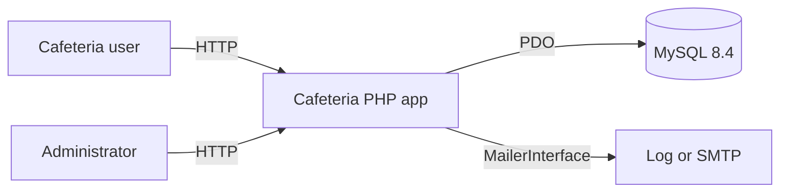

External systems we do **not** have: payment gateway, inventory ERP, public REST clients.

---

## 3. C4 containers

This is the “go into container” view: runnable units, not Docker (the course app is PHP CLI + built-in server).

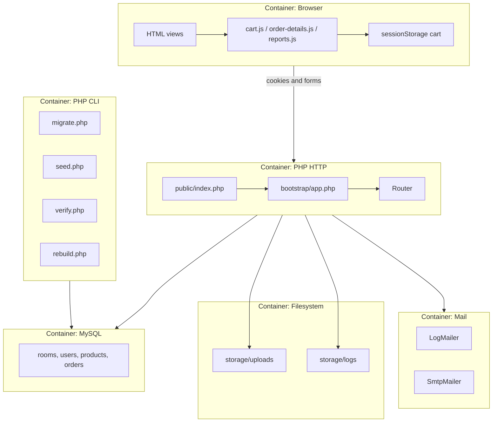

| Container | Technology | Responsibility |
|-----------|------------|----------------|
| Browser | HTML + Bootstrap 5 + small JS | Presentation, cart preview only |
| PHP HTTP | PHP 8.4, `php -S -t public` | All use cases |
| PHP CLI | Same app classes | Schema and demo data |
| MySQL | 8.4 utf8mb4 | Source of truth |
| Filesystem | `storage/` outside document root | Hashed uploads, logs |
| Mail | `MAIL_DRIVER` | Reset links |

**Document root:** only [public/](../public/). See [ADR 0002](adr/0002-public-document-root.md).

---

## 4. C4 components — HTTP container

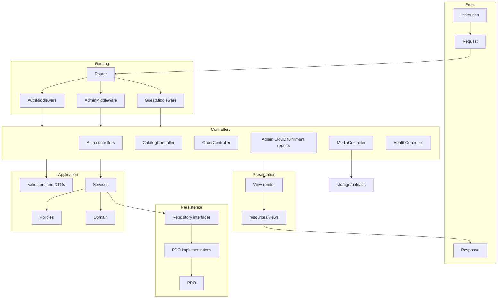

`MediaController` is intentionally **not** behind auth so `` can load. Filenames are 32-hex plus a safe extension; path traversal is rejected.

---

## 5. C4 code — selected internals

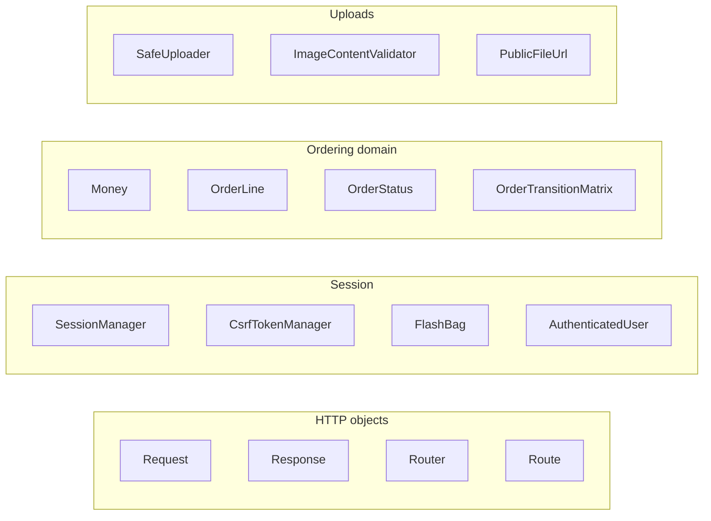

Hot-path rules:

- **Money** stores integer cents; no floats ([ADR 0004](adr/0004-order-pricing-snapshots.md)).
- **CSRF** synchronizer token `_csrf_token` ([ADR 0003](adr/0003-session-csrf-policy.md)).
- **Transitions** only via the matrix ([ADR 0005](adr/0005-order-state-machine.md)).
- **Reports** share one filter object ([ADR 0006](adr/0006-reporting-security-hardening.md)).

---

## 6. Layer atlas

Dependency direction is **inward**: controllers → services → contracts → PDO. Views receive arrays, never PDO.

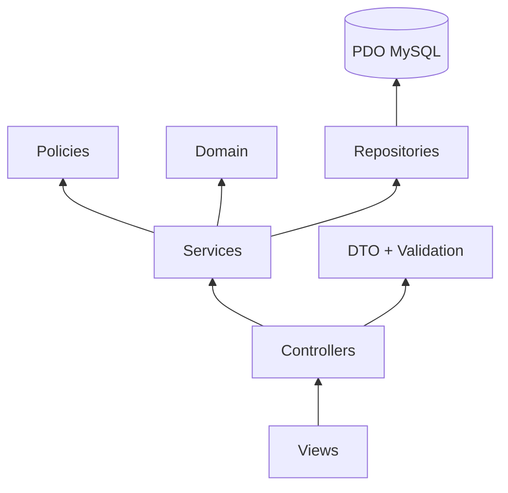

### 6.1 Controllers

| Class | Module |
|-------|--------|
| `HealthController` | Ops |
| `MediaController` | Files |
| `LoginController`, `LogoutController`, `ForgotPasswordController`, `ResetPasswordController` | Auth |
| `CatalogController` | Catalogue |
| `OrderController` | User orders |
| `UserController`, `CategoryController`, `ProductController` | Admin CRUD |
| `FulfillmentController`, `AdminOrderController` | Fulfillment / on-behalf |
| `ReportController` | Checks |

Admin HTML goes through `RendersAdminView` + `layouts.app`.

### 6.2 Services

`AuthService`, `PasswordResetService`, `UserService`, `CategoryService`, `ProductService`, `OrderService`, `OrderStatusService`, `UserOrderQueryService`, `ReportQueryService`, `ReportExportService`.

### 6.3 Domain

`Role`, `User`, `Money`, `OrderLine`, `OrderStatus`, `OrderTransitionMatrix`.

### 6.4 Policies

`AdminPolicy` (manage users/catalog/reports), `OrderPolicy` (view/cancel/transition).

### 6.5 Views and assets

Layouts: `layouts.app`, `layouts.guest`. User: catalog, orders. Admin: users, categories, products, orders queue/create, reports. JS: `cart.js` (preview only), `order-details.js`, `reports.js` (presentation), `app.js`.

---

## 7. Composition root (the PHP container)

There is **no** Symfony/Laravel container. [bootstrap/app.php](../bootstrap/app.php) builds a `$controllers` map of `class-string => object` and a `Router::setControllerFactory`.

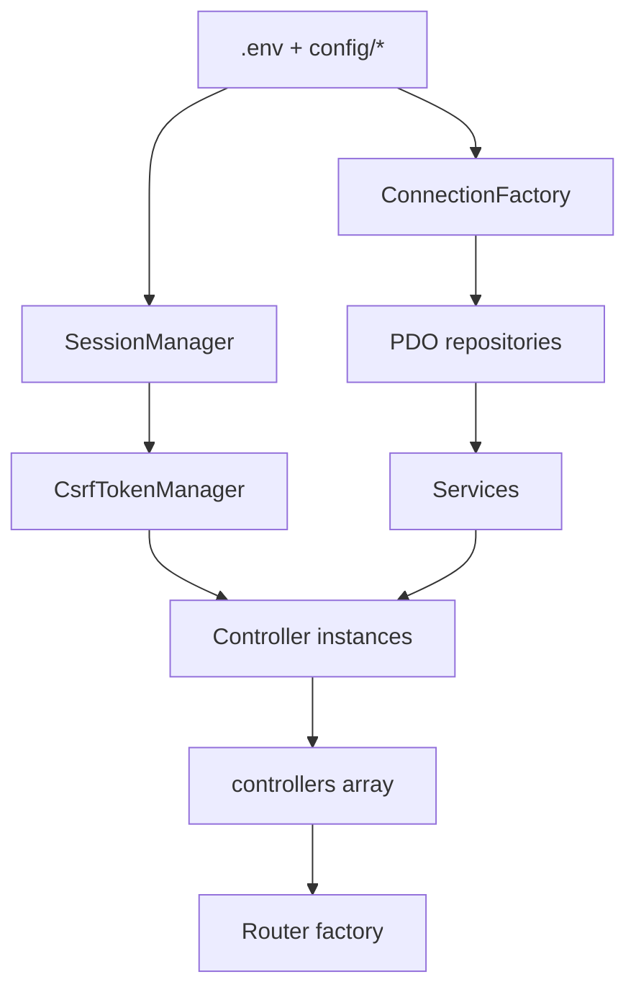

CLI scripts (`migrate.php`, `seed.php`) load Environment + PDO themselves; they do not dispatch HTTP.

---

## 8. DFD level 0 — whole system

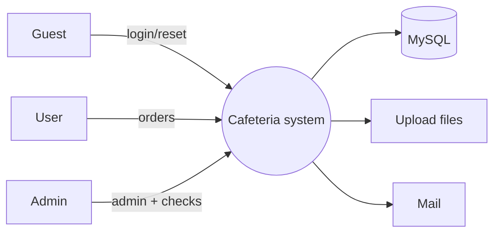

---

## 9. DFD level 1 — major processes

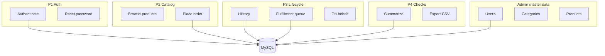

Processes talk to **one** logical data store (MySQL). Uploads are a second store used only by product/profile images.

---

## 10. DFD level 2 — place order and export

### 10.1 Place order

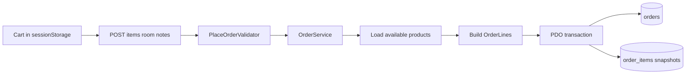

Client total is **not** an input to `OrderService`.

### 10.2 Report export

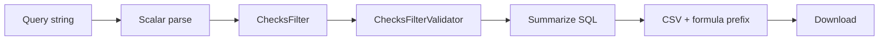

---

## 11. Queue and state graphs

### 11.1 Order status machine

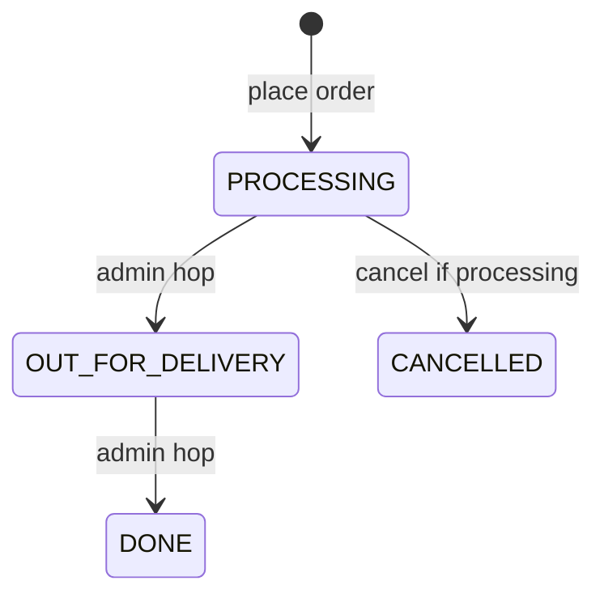

Current queue includes `PROCESSING` and `OUT_FOR_DELIVERY` only. `DONE` and `CANCELLED` are excluded from the queue; cancelled orders are excluded from default money reports.

### 11.2 Current queue as a set

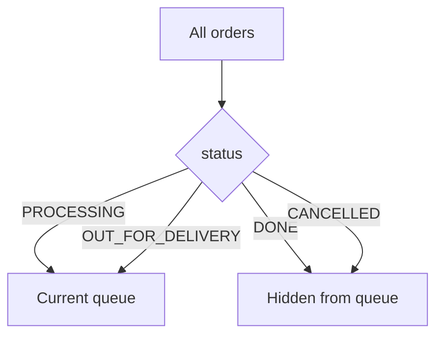

Admin POST `/admin/orders/{id}/status` only for rows still in Q.

### 11.3 Status history

Each successful cancel or hop appends `order_status_history`. Failed races write **nothing**.

---

## 12. HTTP dispatch pipeline

Not a job queue — one request, one response.

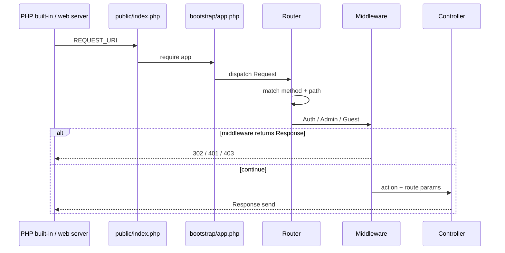

404 = no path. 405 = path exists, method does not.

---

## 13. Sequence — authentication

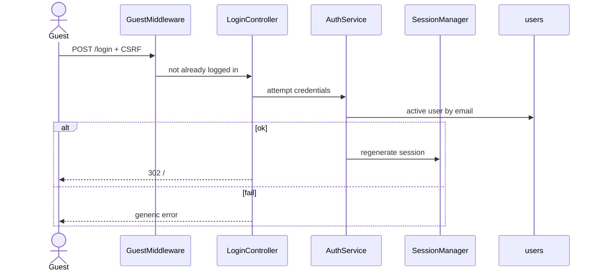

Forgot/reset: `PasswordResetService` stores **SHA-256 of token**, sends via `MailerInterface`, consumes token once.

Logout: `POST /logout` + CSRF → session destroy → login.

---

## 14. Sequence — catalogue and place order

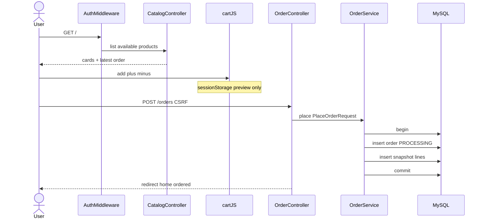

---

## 15. Sequence — history, detail, cancel

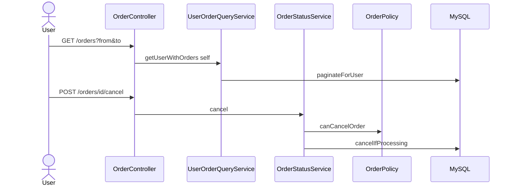

---

## 16. Sequence — fulfillment queue

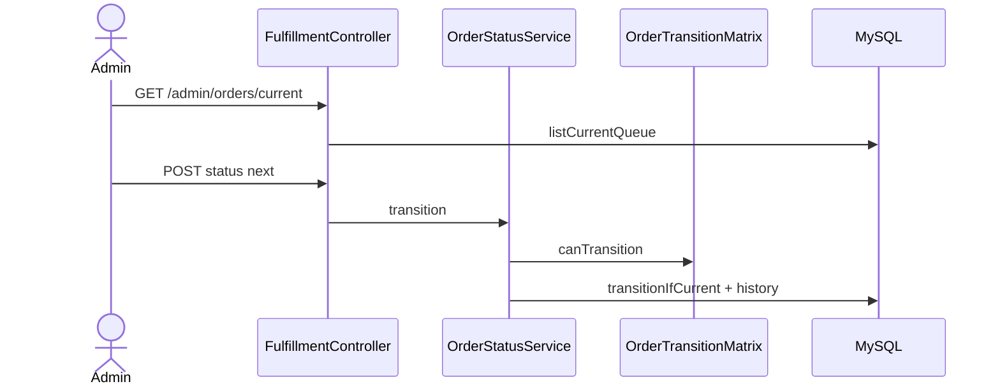

---

## 17. Sequence — admin on-behalf

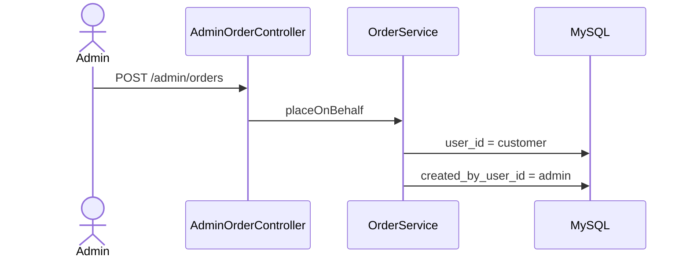

---

## 18. Sequence — CRUD, uploads, media

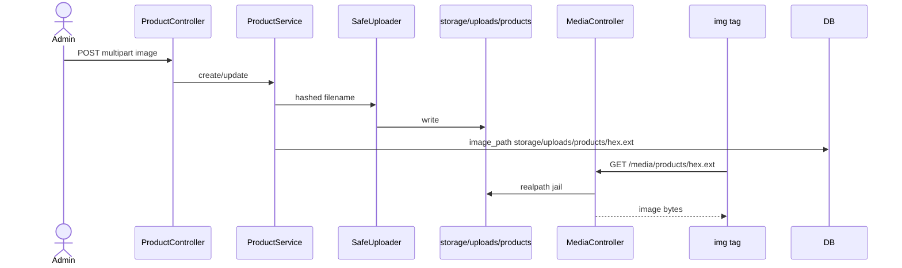

`PublicFileUrl` maps stored paths to `/media/...` or keeps `/assets/...` seed art. Admin **users** page lists both `USER` and `ADMIN` because there is no public signup.

---

## 19. Sequence — checks, drill-down, export

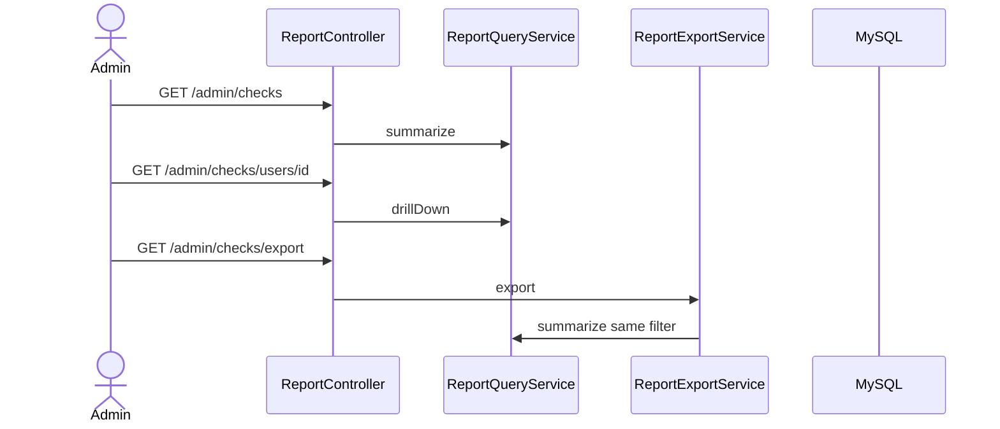

---

## 20. Sequence — authorization boundaries

```mermaid
sequenceDiagram
  actor Guest
  actor User
  actor Admin
  participant Auth as AuthMiddleware
  participant Adm as AdminMiddleware
  Guest->>Auth: GET /admin/checks
  Auth-->>Guest: 302 /login
  User->>Adm: GET /admin/checks
  Adm-->>User: 403
  Admin->>Adm: GET /admin/checks
  Adm-->>Admin: 200 HTML
```

Hiding the navbar link is **not** the control. Middleware is.

---

## 21. Trust boundaries

```mermaid
flowchart TB
  subgraph publicNet [Untrusted]
    Browser
  end
  subgraph publicDir [Document root]
    Index[public/index.php]
    Assets[public/assets]
  end
  subgraph privateCode [Not web-served]
    App[app/]
    Boot[bootstrap/]
    Env[.env]
    Storage[storage/]
  end
  subgraph dbTrust [Database]
    MySQL
  end
  Browser --> Index
  Browser --> Assets
  Index --> App
  App --> Storage
  App --> MySQL
```

| Boundary | Control |
|----------|---------|
| Browser → app | CSRF on POST, escaped HTML, session cookie HttpOnly/SameSite |
| Query → SQL | PDO bound parameters; scalar report filters |
| Upload → disk | MIME + content check, generated names, not under `public/` |
| Media URL → disk | Hex filename regex + `realpath` prefix |
| USER → ADMIN data | `AdminMiddleware` + policies |

---

## 22. Route atlas

Registered from [routes/web.php](../routes/web.php) (`/media`, `/health` in bootstrap), [routes/auth.php](../routes/auth.php), [routes/orders.php](../routes/orders.php), [routes/admin.php](../routes/admin.php). Optional `reports.php` is not present; checks live in `admin.php`.

### 22.1 Public / guest

| Method | Path | Middleware |
|--------|------|------------|
| GET | `/health` | none |
| GET | `/media/{kind}/{filename}` | none |
| GET/POST | `/login` | Guest |
| GET/POST | `/forgot-password` | Guest |
| GET/POST | `/reset-password` | Guest |

### 22.2 Authenticated user

| Method | Path | Notes |
|--------|------|-------|
| POST | `/logout` | CSRF |
| GET | `/` | Catalogue |
| GET | `/orders/new` | Cart form |
| POST | `/orders` | Place |
| GET | `/orders` | History |
| GET | `/orders/{id}` | Detail |
| POST | `/orders/{id}/cancel` | CSRF |

### 22.3 Admin

| Method | Path | Notes |
|--------|------|-------|
| CRUD | `/admin/users`, categories, products | List includes both roles for users |
| GET | `/admin/orders`, `/admin/orders/current` | Queue |
| GET/POST | `/admin/orders/create`, `/admin/orders` | On-behalf |
| POST | `/admin/orders/{id}/status` | Fulfillment |
| GET | `/admin/checks` | Summary |
| GET | `/admin/checks/users/{id}` | Drill-down |
| GET | `/admin/checks/export` | CSV |

---

## 23. Data model

Canonical picture: [docs/diagrams/erd.svg](diagrams/erd.svg).

```mermaid
erDiagram
  ROOMS ||--o{ USERS : has
  USERS ||--o{ ORDERS : places
  USERS ||--o{ ORDERS : creates
  CATEGORIES ||--o{ PRODUCTS : contains
  ORDERS ||--|{ ORDER_ITEMS : lines
  ORDERS ||--o{ ORDER_STATUS_HISTORY : audit
  USERS ||--o{ PASSWORD_RESET_TOKENS : reset
  ROOMS {
    int id
    string name
  }
  USERS {
    int id
    string email
    string role
    tinyint is_active
  }
  PRODUCTS {
    int id
    string name
    decimal price
    string image_path
    datetime deleted_at
  }
  ORDERS {
    int id
    string status
    decimal total_amount
    datetime cancelled_at
  }
  ORDER_ITEMS {
    int id
    string product_name_snapshot
    decimal unit_price_snapshot
    int quantity
  }
  ORDER_STATUS_HISTORY {
    int id
    string from_status
    string to_status
  }
```

Seeds: 3 rooms, 3 categories, 4 products, 2 users (`docs/database/seeding.md`).

---

## 24. Class inventory

### 24.1 Repository contracts

`AuthUserRepositoryInterface`, `AdminUserRepositoryInterface`, `PasswordResetTokenRepositoryInterface`, `CategoryRepositoryInterface`, `ProductRepositoryInterface`, `OrderCommandRepositoryInterface`, `OrderQueryRepositoryInterface`, `ReportRepositoryInterface`.

### 24.2 PDO implementations

Matching `app/Repositories/Pdo/Pdo*.php` for each contract.

### 24.3 DTOs

`LoginRequest`, `ForgotPasswordRequest`, `ResetPasswordRequest`, `CreateUserRequest`, `UpdateUserRequest`, `CreateCategoryRequest`, `UpdateCategoryRequest`, `CreateProductRequest`, `UpdateProductRequest`, `PlaceOrderRequest`, `OrderItemInput`, `PlaceOrderOnBehalfRequest`, `OrderHistoryFilter`, `ChecksFilter`.

---

## 25. Diagram index

| Diagram | Section | Type |
|---------|---------|------|
| System context | §2 | C4 / flowchart |
| Containers | §3 | Architecture |
| HTTP components | §4 | Architecture |
| Code clusters | §5 | Architecture |
| Layer dependencies | §6 | Architecture |
| Composition root | §7 | Architecture |
| DFD L0 | §8 | DFD |
| DFD L1 | §9 | DFD |
| Place-order DFD L2 | §10.1 | DFD |
| Export DFD L2 | §10.2 | DFD |
| Order state | §11.1 | State / queue |
| Queue set | §11.2 | Queue |
| HTTP pipeline | §12 | Sequence |
| Login | §13 | Sequence |
| Place order | §14 | Sequence |
| History/cancel | §15 | Sequence |
| Fulfillment | §16 | Sequence |
| On-behalf | §17 | Sequence |
| Upload/media | §18 | Sequence |
| Checks | §19 | Sequence |
| Authz | §20 | Sequence |
| Trust | §21 | Architecture |
| ER | §23 | Data |

---

## Appendix A — Day guides

| Day | Phase | Guide |
|-----|-------|--------|
| 1 | P0 | [day-1-foundation-guide.md](day-1-foundation-guide.md) |
| 2 | P1 | [day-2-authentication-admin-guide.md](day-2-authentication-admin-guide.md) |
| 3 | P2 | [day-3-catalog-ordering-guide.md](day-3-catalog-ordering-guide.md) |
| 4 | P3 | [day-4-order-lifecycle-guide.md](day-4-order-lifecycle-guide.md) |
| 5 | P4 | [day-5-reporting-security-guide.md](day-5-reporting-security-guide.md) |

## Appendix B — ADRs

| ADR | Topic |
|-----|--------|
| 0001 | Modular monolith MVC |
| 0002 | Public document root |
| 0003 | Session / CSRF |
| 0004 | Price snapshots |
| 0005 | Order state machine |
| 0006 | Reporting security |

## Appendix C — Export to PDF

```bash
pandoc docs/system-through-day-5-architecture-guide.md -o docs/system-through-day-5-architecture-guide.pdf --toc -V geometry:margin=1in
```

GitHub and Cursor Markdown Preview render standard Mermaid (`flowchart`, `sequenceDiagram`, `stateDiagram-v2`, `erDiagram`). C4 plugin syntax is not used.

---

*End of Architecture Atlas (through Day 5)*
